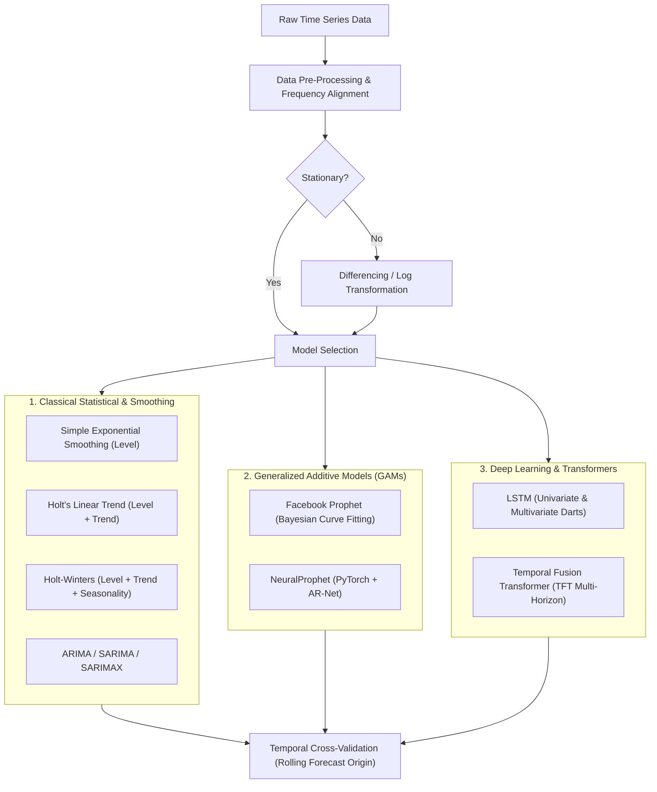

# Time Series Forecasting

**Time series forecasting** involves predicting future values by analyzing chronological sequences of past observations. Unlike standard supervised regression problems where observations are independent and identically distributed (i.i.d.), time series data contains temporal dependencies, trends, cyclical patterns, and autocorrelation.

This guide provides a comprehensive summary of the [`RNN-practices`](https://github.com/jinyongnan810/RNN-practices) repository, tracing the evolution of forecasting methodologies from classical statistical methods to modern deep learning and attention-based transformer architectures.

https://github.com/jinyongnan810/RNN-practices



---

## 1. Essential Time Series Pre-Processing Tips

Data pre-processing in time series forecasting requires strict discipline. Standard machine learning pre-processing steps—such as random train-test splitting or global mean imputation—introduce catastrophic **data leakage** and ruin model validity.

Here are the critical pre-processing rules and patterns highlighted across the `RNN-practices` repository:

### 1. Explicit Datetime Indexing & Frequency Alignment

Autoregressive models (ARIMA, Holt-Winters, SARIMA) and sequence models require regular time intervals without missing periods.

- **Parse Dates Accurately**: Always convert string timestamps with `pd.to_datetime()`.
- **Set the Datetime Index**: Make the parsed timestamp column the index with `df.set_index('Date', inplace=True)`.
- **Enforce Regular Frequency**: Use `.asfreq()` to ensure a consistent sampling rate (e.g., `'D'` for daily, `'W'` for weekly, `'MS'` for month start, `'h'` for hourly). This exposes implicit missing timestamps as explicit `NaN` rows.

```python
# Convert, index, and set explicit monthly-start frequency
df['Date'] = pd.to_datetime(df['Date'])
df.set_index('Date', inplace=True)
df = df.asfreq('MS')
```

### 2. Handling Missing Values Without Lookahead Bias

Standard forward and backward imputation techniques must be used cautiously:

- **Forward Fill (`ffill`)**: Propagates the last observed value forward (`df.fillna(method='ffill')`). Safe for streaming and online inference because it only relies on past data.
- **Time Interpolation (`interpolate(method='time')`)**: Computes values based on the time interval between adjacent points. Suitable for historical feature cleaning, but cannot be used for the latest target points right at the forecast origin.
- **Backward Fill (`bfill`)**: Fills backwards using future values.

> [!WARNING]
> **Avoid Future Leakage with `bfill` or Global Mean**:
> Never use `bfill` or dataset-wide mean/median values across train-test boundaries. Imputing a missing value in the training set using values from a future period leaks future signals into the past, artificially inflating evaluation metrics.

### 3. Anomaly & Outlier Treatment

Extreme historical anomalies (such as extreme weather events, server outages, or economic crises) can distort parameter estimation for trend and seasonal cycles.

- In `bike_sharing_analysis.ipynb`, Hurricane Sandy (October 29, 2012) caused bike rental counts to drop to near zero. Leaving this extreme outlier unaddressed biased the recurring seasonal pattern and inflated variance estimates.
- **Remediation**:
  - Replace extreme black swan outliers with locally interpolated values or rolling medians.
  - Or model the anomaly explicitly as a custom one-off event/holiday regressor so the model isolates the shock rather than absorbing it into baseline seasonality.

```python
# Replace extreme black-swan event with a representative local value or NaN for interpolation
df.loc['2012-10-29', 'cnt'] = np.nan
df['cnt'] = df['cnt'].interpolate(method='linear')
```

### 4. Stationarity & Differencing

A time series is **stationary** if its statistical properties (mean, variance, and autocorrelation) remain constant over time. Classical statistical models like ARIMA strictly require stationary input.

1. **Check Stationarity with the ADF Test**: Use the Augmented Dickey-Fuller (ADF) test (`adfuller`). A $p\text{-value} < 0.05$ rejects the null hypothesis of a unit root, indicating stationarity.
2. **First-Order Differencing ($\Delta y_t$)**: Removes linear trends:
   $$\Delta y_t = y_t - y_{t-1}$$
   Implemented via `df['y'].diff()`.
3. **Seasonal Differencing ($\Delta_s y_t$)**: Removes repeating seasonal patterns (e.g., $s = 7$ for weekly cycles in daily data):
   $$\Delta_s y_t = y_t - y_{t-s}$$
   Implemented via `df['y'].diff(7)`.
4. **Variance Stabilization**: If fluctuations grow proportionally with the series level (heteroscedasticity), apply a log transform ($\log(y_t)$) or percent change (`df['y'].pct_change()`).

### 5. Feature Engineering: Lags & Rolling Statistics

- **Lagged Features**: Prior values $y_{t-1}, y_{t-2}, \dots, y_{t-k}$ capture short- and long-term memory:
  ```python
  df['lag_1'] = df['target'].shift(1)
  df['lag_7'] = df['target'].shift(7)
  ```
- **Rolling Windows**: Capture recent momentum and volatility:
  ```python
  # 7-day rolling mean and standard deviation
  df['rolling_mean_7'] = df['target'].rolling(window=7).mean()
  df['rolling_std_7'] = df['target'].rolling(window=7).std()
  ```
- **Correlation Filtering**: When generating multiple lags and exogenous features, inspect the correlation matrix to remove redundant and highly collinear features before fitting models.

### 6. Covariate Classification: Past, Future, and Static

When transitioning to advanced libraries like **Darts** or deep architectures like **TFT**, classify your features strictly:

| Covariate Type        | Definition                                                                                    | Examples                                                                               |
| :-------------------- | :-------------------------------------------------------------------------------------------- | :------------------------------------------------------------------------------------- |
| **Past Covariates**   | Variables only observed up to the current timestamp $t$. Cannot be known ahead in the future. | Measured temperature, sensor readings, actual web traffic, stock trading volume.       |
| **Future Covariates** | Variables known in advance for the entire forecast horizon $t+1, \dots, t+H$.                 | Day of week, month, holidays, scheduled marketing campaigns, planned price promotions. |
| **Static Covariates** | Invariant metadata describing the specific time series.                                       | Store ID, geographic region, product category, sensor model.                           |

### 7. Deep Learning Preprocessing: Scaling & Data Types

Neural networks (LSTM, TFT, NeuralProphet) are sensitive to input feature magnitude.

- **Fit Scalers Strictly on Training Splits**: Fit `MinMaxScaler` or `StandardScaler` only on the training set:

  ```python
  from darts.dataprocessing.transformers import Scaler

  scaler = Scaler()
  train_scaled = scaler.fit_transform(train_series)
  val_scaled = scaler.transform(val_series)
  ```

- **Cast to `float32`**: Convert 64-bit floating-point series to 32-bit floats (`df.astype('float32')`). PyTorch models operate natively on single-precision floats, which cuts memory footprint in half and accelerates training on GPUs and Apple Silicon (MPS).

### 8. Temporal Cross-Validation (Never Random K-Fold!)

Standard random $k$-fold cross-validation is completely invalid for time series because it shuffles future data into the past.

Use **Rolling Forecast Origin (Expanding Window)**:

```mermaid
gantt
    title Rolling Forecast Origin (Expanding Window)
    dateFormat X
    axisFormat %s
    section Fold 1
    Train (Origin 1) :done, 0, 60
    Forecast Horizon 1 :active, 60, 75
    section Fold 2
    Train (Origin 2) :done, 0, 75
    Forecast Horizon 2 :active, 75, 90
    section Fold 3
    Train (Origin 3) :done, 0, 90
    Forecast Horizon 3 :active, 90, 105
```



- **Metrics**:
  - **MAE (Mean Absolute Error)**: $\frac{1}{n}\sum |y_t - \hat{y}_t|$ (robust to outliers).
  - **RMSE (Root Mean Squared Error)**: $\sqrt{\frac{1}{n}\sum (y_t - \hat{y}_t)^2}$ (penalizes large errors heavily).
  - **MAPE (Mean Absolute Percentage Error)**: $\frac{100\%}{n}\sum \left|\frac{y_t - \hat{y}_t}{y_t}\right|$ (scale-independent percentage).

---

## 2. Walkthrough of Repository Practices

The [`RNN-practices`](https://github.com/jinyongnan810/RNN-practices) repository is organized into 7 distinct hands-on modules:

### Practice 1: Time Series Forecasting 101 ([`bitcoin_analysis.ipynb`](https://github.com/jinyongnan810/RNN-practices/tree/main/time-series-forecasting-101/bitcoin_analysis.ipynb))

Explores Bitcoin price data to demonstrate foundational data exploration, indexing, and decomposition:

- **Datetime Indexing & Resampling**: Aggregates tick/daily price data into weekly (`resample('W').mean()`) and monthly series.
- **Rolling Metrics & Percent Change**: Calculates 7-day rolling averages and price momentum with `.pct_change()`.
- **Seasonal Decomposition**: Splits series into **Trend**, **Seasonal**, and **Residual** components using `statsmodels.tsa.seasonal.seasonal_decompose`. Compares **Additive** ($y_t = T_t + S_t + R_t$) vs. **Multiplicative** ($y_t = T_t \times S_t \times R_t$) decomposition.
- **Autocorrelation Analysis**: Uses Autocorrelation Function (ACF) and Partial Autocorrelation Function (PACF) plots (`plot_acf`, `plot_pacf`) to determine the correlation between current values and previous lags.

---

### Practice 2: Exponential Smoothing & Holt-Winters ([`customer_complaints_analysis.ipynb`](https://github.com/jinyongnan810/RNN-practices/tree/main/exponential-smoothing-and-holt-winters/customer_complaints_analysis.ipynb), [`airmiles_analysis.ipynb`](https://github.com/jinyongnan810/RNN-practices/tree/main/exponential-smoothing-and-holt-winters/airmiles_analysis.ipynb))

Applies classical smoothing methods to forecast airline passenger miles and weekly customer complaints:

1. **Simple Exponential Smoothing (SES)**:
   - Suitable for data with no trend and no seasonality.
   - Computes a weighted moving average where weights decay exponentially into the past via smoothing parameter $\alpha$:
     $$\hat{y}_{t+1} = \alpha y_t + (1 - \alpha)\hat{y}_t$$
2. **Double Exponential Smoothing (Holt’s Linear Trend)**:
   - Adds a trend smoothing parameter $\beta$ to track upward or downward momentum.
3. **Triple Exponential Smoothing (Holt-Winters)**:
   - Adds a seasonal smoothing parameter $\gamma$ with period length $s$ (e.g., $s = 52$ for weekly complaint data):
     - **Additive Seasonality**: Seasonal variations remain constant regardless of the series level.
     - **Multiplicative Seasonality**: Seasonal variations grow or shrink proportionally with the trend.
4. **Evaluation**: Compares MAE, RMSE, and MAPE across 13-week hold-out test periods to validate parameter selection.

---

### Practice 3: ARIMA, SARIMA, & SARIMAX ([`chocolate_revenue_analysis.ipynb`](https://github.com/jinyongnan810/RNN-practices/tree/main/arima-sarima-sarimax/chocolate_revenue_analysis.ipynb))

Demonstrates the Box-Jenkins methodology on daily chocolate sales revenue:

- **ADF Stationarity Test**: Confirms non-stationarity of raw revenues ($p > 0.05$).
- **Differencing**: Applies first-order differencing ($d = 1$) to achieve stationarity.
- **Model Formulations**:
  - **ARIMA$(p, d, q)$**: Combines Autoregressive ($p$), Integrated differencing ($d$), and Moving Average ($q$) terms.
  - **SARIMA$(p, d, q)(P, D, Q)_s$**: Incorporates seasonal autoregressive and moving average terms with weekly seasonality ($s = 7$).
  - **SARIMAX**: Extends SARIMA by supplying exogenous variables (`exog`), such as promotional indicators or holiday flags.
- **Grid Search & Parameter Selection**: Iterates through candidate parameters to minimize **AIC** (Akaike Information Criterion) and **BIC** (Bayesian Information Criterion).
- **Rolling Forecast Cross-Validation**: Validates the model against expanding historical windows to evaluate out-of-sample stability.

---

### Practice 4: Facebook Prophet ([`bike_sharing_analysis.ipynb`](https://github.com/jinyongnan810/RNN-practices/tree/main/prophet/bike_sharing_analysis.ipynb), [`dhs_analysis.ipynb`](https://github.com/jinyongnan810/RNN-practices/tree/main/prophet/dhs_analysis.ipynb))

Uses Facebook’s Prophet library for decomposable additive modeling:

$$y(t) = g(t) + s(t) + h(t) + \epsilon_t$$

Where $g(t)$ is trend, $s(t)$ is periodic seasonality, and $h(t)$ is holiday effects.

- **Data Reshaping**: Formats data to Prophet’s required schema (`ds` for datetime, `y` for target value).
- **Outlier Imputation**: Pre-processes Hurricane Sandy’s extreme anomaly on October 29, 2012.
- **Custom Holiday Calendar**: Constructs a custom holidays dataframe with federal and local holidays.
- **Exogenous Regressors**: Incorporates weather factors (temperature, humidity, windspeed) via `model.add_regressor()`.
- **Coefficients Interpretation**: Custom helper extracts regressor coefficients and provides human-readable explanations (percentage increase/decrease per unit change).
- **Prior Scale Tuning**: Tunes `changepoint_prior_scale` (trend flexibility), `seasonality_prior_scale` (seasonality strength), and `holidays_prior_scale` (holiday effect sensitivity) using `prophet.diagnostics.cross_validation`.

---

### Practice 5: NeuralProphet ([`dhs_analysis.ipynb`](https://github.com/jinyongnan810/RNN-practices/tree/main/neuralprophet/dhs_analysis.ipynb))

Implements NeuralProphet—a PyTorch-based neural hybrid inspired by Prophet and AR-Net:

- **AR-Net (Autoregressive Neural Network)**: Learns complex non-linear lag dynamics directly through neural layers rather than manual lag engineering.
- **Future Regressors**: Supplies weather temperature as a future regressor across a 13-week forecasting horizon.
- **Multi-Step Parameter Search**: Tunes batch size, learning rate, and epochs with PyTorch Lightning backends to forecast NYC Department of Homeless Services (DHS) shelter demand.

---

### Practice 6: Recurrent Neural Networks (LSTM) with Darts ([`nyc_analysis.ipynb`](https://github.com/jinyongnan810/RNN-practices/tree/main/lstm/nyc_analysis.ipynb), [`hourly_train_analysis.ipynb`](https://github.com/jinyongnan810/RNN-practices/tree/main/lstm/hourly_train_analysis.ipynb))

Utilizes the **Darts** time series framework to train Long Short-Term Memory (LSTM) recurrent networks:

- **Univariate Forecasting (`nyc_analysis.ipynb`)**:
  - Uses NYC energy consumption data.
  - Configures `input_chunk_length` (lookback window = 46 steps) and `training_length` (77 steps).
  - Evaluates via Darts `historical_forecasts` and tunes `n_rnn_layers`, `hidden_dim`, `dropout`, and `lr`.
- **Multivariate Multi-Series Forecasting (`hourly_train_analysis.ipynb`)**:
  - Models hourly train passenger traffic across multiple parallel routes.
  - **Covariate Stacking**: Extracts calendar features (hour of day, day of week) using `datetime_attribute_timeseries` and stacks them:
    ```python
    covariates = hour_series.stack(day_series)
    ```
  - Trains a single unified LSTM model capable of generating forecasts across multiple correlated stations simultaneously.

---

### Practice 7: Temporal Fusion Transformers - TFT ([`electricity_analysis.ipynb`](https://github.com/jinyongnan810/RNN-practices/tree/main/tft/electricity_analysis.ipynb), [`air_passengers_analysis.ipynb`](https://github.com/jinyongnan810/RNN-practices/tree/main/tft/air_passengers_analysis.ipynb))

Implements state-of-the-art **Temporal Fusion Transformers (TFT)** for multi-horizon forecasting:

- **Multi-Horizon Forecasting**: Predicts an entire sequence of future timestamps simultaneously rather than recursively feeding one-step predictions.
- **Unified Covariate Integration**: Simultaneously ingests:
  - Observed past values (past load demand).
  - Known future variables (time of day, day of week, seasonal encodings).
  - Static variables (geographic region, meter ID).
- **Self-Attention & Interpretability**: Utilizes specialized multi-head self-attention mechanisms to learn long-range temporal dependencies and quantify the relative importance of each feature.
- **Probabilistic Quantile Forecasts**: Instead of outputting only a single point estimate, TFT optimizes quantile loss to output prediction intervals (e.g., 10th, 50th, and 90th percentiles), providing explicit confidence bands for risk-sensitive planning.

```python
from darts.models import TFTModel

model = TFTModel(
    input_chunk_length=96,            # 96 lookback intervals
    output_chunk_length=24,           # 24-step forecast horizon
    hidden_size=16,
    lstm_layers=1,
    num_attention_heads=4,
    dropout=0.1,
    batch_size=64,
    n_epochs=10,
    likelihood='quantile',            # Probabilistic quantiles
    random_state=42
)
```

---

## 3. Model Comparison & Decision Matrix

| Model                 | Primary Strengths                                                                                                                 | Limitations                                                                                     | Best Suited For                                                                        |
| :-------------------- | :-------------------------------------------------------------------------------------------------------------------------------- | :---------------------------------------------------------------------------------------------- | :------------------------------------------------------------------------------------- |
| **Holt-Winters**      | Fast, deterministic, zero training overhead, clear seasonal parameters.                                                           | Cannot handle complex exogenous variables or non-linear trends.                                 | Low-latency baselines, simple univariate sales/complaints with clear seasonality.      |
| **ARIMA / SARIMAX**   | Rigorous mathematical grounding, optimal for linear autoregressive processes, supports external regressors.                       | Requires stationarity transformation; order grid search is computationally heavy.               | Economic indicators, financial indexes, stable business metrics.                       |
| **Facebook Prophet**  | Robust to missing data and regime shifts; interpretable trend changepoints; built-in holiday modeling.                            | Can struggle on fine-grained high-frequency data; prone to overfitting irregular seasonalities. | Daily business KPIs, website traffic, bike-share demand, capacity planning.            |
| **NeuralProphet**     | Combines Prophet interpretability with PyTorch AR-Net non-linear autoregression.                                                  | Requires careful neural network training and hyperparameter tuning.                             | Medium-scale time series with non-linear autocorrelations and external regressors.     |
| **LSTM (Darts)**      | Learns complex, non-linear sequential patterns across single or multiple parallel series.                                         | Black-box architecture; requires careful data normalization and substantial training data.      | High-frequency sensor streams, multivariate traffic and energy demand.                 |
| **TFT (Transformer)** | State-of-the-art accuracy, multi-horizon probabilistic quantiles ($p10, p50, p90$), native past/future/static covariate handling. | High computational requirements; requires large volume of historical data to avoid overfitting. | Complex enterprise forecasting (grid electricity, supply chain, multi-echelon retail). |
