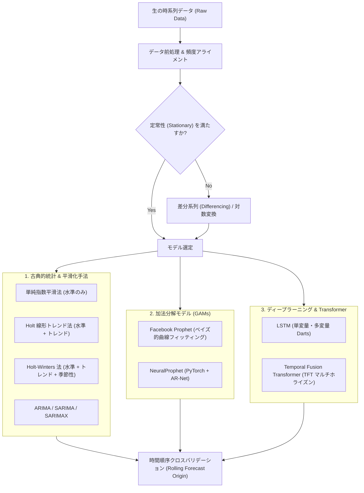

# 時系列予測（Time Series Forecasting）

**時系列予測（Time Series Forecasting）**とは、過去の時系列観測データを分析し、未来の値を予測する手法です。一般的な機械学習の回帰タスクとは異なり、サンプルが独立同分布（i.i.d.）であるという仮定は成り立たず、時間依存性、トレンド、周期性（季節性）、自己相関などの構造を扱います。

本稿では、古典的な統計手法・平滑化から最新のディープラーニングおよびアテンション機構に基づく Transformer までを網羅した [`RNN-practices`](https://github.com/jinyongnan810/RNN-practices) リポジトリの全体像と、実践で極めて重要となる前処理ノウハウを体系的にまとめます。

https://github.com/jinyongnan810/RNN-practices



---

## 1. 時系列予測における必須の前処理ノウハウ

時系列データの前処理では、通常の機械学習以上に厳密さが求められます。ランダムな Train/Test 分割やデータセット全体の平均値補完などを行うと、未来の情報が過去に漏洩する**データリーク（Data Leakage）**が発生し、検証結果が無意味になってしまいます。

`RNN-practices` の各プラクティスから得られる、実践的な前処理の要点を整理します。

### 1. 明示的な日時インデックスと頻度の定義

自己回帰モデル（ARIMA や Holt-Winters）やリカレントモデルは、時間間隔が等間隔かつ欠落のない連続した系列であることを前提としています。

- **日時の正確なパース**: 文字列型の日時カラムを `pd.to_datetime()` でタイムスタンプ化します。
- **インデックスへの設定**: `df.set_index('Date', inplace=True)` で日時をインデックスに指定します。
- **頻度（Frequency）の明示**: `.asfreq()` を用いて明示的なサンプリング周期（`'D'`: 日次、`'W'`: 週次、`'MS'`: 月初、`'h'`: 時間次など）を設定します。これにより、データに潜む「日時の抜け漏れ」が明示的な `NaN` 行として可視化されます。

```python
# 日時をパースし、インデックス化して月初頻度（MS）を明示
df['Date'] = pd.to_datetime(df['Date'])
df.set_index('Date', inplace=True)
df = df.asfreq('MS')
```

### 2. リーク（Lookahead Bias）を起こさない欠損値補完

前処理時の補完手法には注意が必要です：

- **前方補完（Forward Fill, `ffill`）**: 直近の過去値で補完します（`df.fillna(method='ffill')`）。過去の情報のみに依存するため、ストリーミング推論時にも安全です。
- **時間補間（Time Interpolation, `interpolate(method='time')`）**: 前後の観測値の時間間隔に応じた線形補間を行います。過去の学習データのクリーニングに適していますが、予測起点における最新の欠損には使用できません。
- **後方補完（Backward Fill, `bfill`）**: 未来の値を使って過去を埋めます。

> [!WARNING]
> **`bfill` や全体平均補完による未来情報のリークに注意**:
> Train/Test の分割境界をまたいで `bfill` を適用したり、データセット全体の平均値・中央値で欠損を埋めたりしてはいけません。テスト期間の未来シグナルが訓練データに混入し、オフライン検証スコアが不当に過大評価されます。

### 3. 外れ値と異常イベントのトリートメント

局所的なブラックスワン現象（記録的な気象災害、システム障害、突発的なショックなど）は、トレンドや季節性のパラメータ推定を歪めます。

- `bike_sharing_analysis.ipynb` では、2012年10月29日にハリケーン「サンディ（Sandy）」が直撃し、自転車利用数がほぼゼロに急落しました。この異常値を放置すると、通常の週次・月次の季節係数推定が不当に引き下げられてしまいます。
- **対処法**:
  - 異常値を局所的な移動中央値や線形補間で置換（Winsorize）する。
  - または、モデル側の「単発のイベント／祝日レグレッサー」として明示的にフラグを立てて与えることで、基本季節性を汚さずにショックを分離して学習させる。

```python
# 極端な外れ値を NaN に置き換えて線形補間
df.loc['2012-10-29', 'cnt'] = np.nan
df['cnt'] = df['cnt'].interpolate(method='linear')
```

### 4. 定常性（Stationarity）の判定と差分変換

統計的特性（平均・分散・自己相関）が時間を通じて一定である系列を**定常系列**と呼びます。ARIMA などの古典的モデルは、系列が定常であることを前提としています。

1. **ADF 検定（Augmented Dickey-Fuller Test）**: `adfuller` を実行し、$p\text{値} < 0.05$ であれば単位根仮説が棄却され、定常と判定します。
2. **1次差分（$\Delta y_t$）**: トレンドを除去します：
   $$\Delta y_t = y_t - y_{t-1}$$
   （コード例: `df['y'].diff()`）
3. **季節差分（$\Delta_s y_t$）**: 周期的な季節変動を除去します（日次データの週周期なら $s = 7$）：
   $$\Delta_s y_t = y_t - y_{t-s}$$
   （コード例: `df['y'].diff(7)`）
4. **分散の安定化**: 水準の上昇に伴って振幅が拡大する場合（不等分散性）、対数変換（$\log(y_t)$）や変化率（`df['y'].pct_change()`）を適用します。

### 5. 特徴量エンジニアリング（ラグ変数とローリング統計量）

- **ラグ変数（Lagged Variables）**: 過去の観測値 $y_{t-1}, y_{t-2}, \dots$ は、系列が持つ記憶をモデルに教える基本特徴量です。
  ```python
  df['lag_1'] = df['target'].shift(1)
  df['lag_7'] = df['target'].shift(7)
  ```
- **ローリング統計量（Rolling Statistics）**: 短期的なモメンタムやボラティリティを捉えます：
  ```python
  # 7日間の移動平均と移動標準偏差
  df['rolling_mean_7'] = df['target'].rolling(window=7).mean()
  df['rolling_std_7'] = df['target'].rolling(window=7).std()
  ```
- **相関分析とマルチコ除去**: 大量のラグや外部特徴量を生成した後は、目的変数との相関を確認しつつ、多重共線性の高い冗長な特徴量を間引きます。

### 6. 共変量（Covariates）の厳密な分類

**Darts** などのモダンなフレームワークや **TFT** を扱う際は、入力特徴量を以下の 3 種類に明確に分類します：

| 共変量タイプ                        | 定義                                                              | 代表例                                                       |
| :---------------------------------- | :---------------------------------------------------------------- | :----------------------------------------------------------- |
| **Past Covariates（過去共変量）**   | 予測時点 $t$ までの過去のみ観測可能で、未来の値は未知の特徴量。   | 実際に観測された気温、センサー測定値、実アクセス数、取引高。 |
| **Future Covariates（未来共変量）** | 予測先 $t+1, \dots, t+H$ にわたってあらかじめ確定している特徴量。 | 曜日、月、祝日フラグ、予定されている割引セール、価格改定。   |
| **Static Covariates（静的共変量）** | 各系列固有で時間によって変化しない属性情報。                      | 店舗ID、地域カテゴリ、商品ジャンル、センサー型番。           |

### 7. 深層学習向け前処理（スケーリングと型最適化）

ニューラルネットワーク（LSTM、TFT、NeuralProphet）は入力値のスケールに敏感です。

- **Train データのみで Scaler を Fit**:

  ```python
  from darts.dataprocessing.transformers import Scaler

  scaler = Scaler()
  train_scaled = scaler.fit_transform(train_series)
  val_scaled = scaler.transform(val_series)
  ```

- **`float32` へのキャスト**: 64ビット浮動小数点（`float64`）を単精度（`float32`）にダウンキャスト（`df.astype('float32')`）します。PyTorch のテンソル演算は `float32` を基準としており、メモリ使用量を半減させ、GPU や Apple Silicon (MPS) での計算効率を高めます。

### 8. 時間順序クロスバリデーション（ランダム K-Fold は禁止）

時系列において、ランダムにサンプルを抽出する通常の $k$-fold 交差検証は時間順序を破壊するため使用できません。

**ローリング・フォアキャスト・オリジン（拡大ウィンドウ法）**を採用します：

```mermaid
gantt
    title ローリング・フォアキャスト・オリジン（Expanding Window）
    dateFormat X
    axisFormat %s
    section Fold 1
    訓練データ (起点 1) :done, 0, 60
    予測期間 1 :active, 60, 75
    section Fold 2
    訓練データ (起点 2) :done, 0, 75
    予測期間 2 :active, 75, 90
    section Fold 3
    訓練データ (起点 3) :done, 0, 90
    予測期間 3 :active, 90, 105
```



- **評価指標**:
  - **MAE（平均絶対誤差）**: $\frac{1}{n}\sum |y_t - \hat{y}_t|$（外れ値に頑健）。
  - **RMSE（二乗平均平方根誤差）**: $\sqrt{\frac{1}{n}\sum (y_t - \hat{y}_t)^2}$（大きな誤差を厳しく評価）。
  - **MAPE（平均絶対パーセント誤差）**: $\frac{100\%}{n}\sum \left|\frac{y_t - \hat{y}_t}{y_t}\right|$（スケール非依存のパーセンテージ評価）。

---

## 2. リポジトリ各プラクティスの解説

[`RNN-practices`](https://github.com/jinyongnan810/RNN-practices) は、7 つの実践的なモジュールで構成されています。

### Practice 1: 時系列予測の基礎 ([`bitcoin_analysis.ipynb`](https://github.com/jinyongnan810/RNN-practices/tree/main/time-series-forecasting-101/bitcoin_analysis.ipynb))

ビットコインの価格データを題材に、時系列分析の基礎的な作法を網羅しています：

- **日時のインデックス化とリサンプリング**: 日次価格データを週次（`resample('W').mean()`）や月次に集約。
- **移動平均と変化率**: 7日移動平均（Rolling Average）の算出や、`.pct_change()` による価格モメンタムの可視化。
- **季節性分解（Seasonal Decomposition）**: `statsmodels` を用いて、系列を**トレンド（Trend）**、**季節成分（Seasonal）**、**残差（Residual）**に分解。加法モデル（$y_t = T_t + S_t + R_t$）と乗法モデル（$y_t = T_t \times S_t \times R_t$）の挙動を比較。
- **自己相関の分析**: 自己相関関数（ACF）および偏自己相関関数（PACF）をプロットし、過去のどのラグが現在の値に強く影響しているかを特定。

---

### Practice 2: 指数平滑法と Holt-Winters 法 ([`customer_complaints_analysis.ipynb`](https://github.com/jinyongnan810/RNN-practices/tree/main/exponential-smoothing-and-holt-winters/customer_complaints_analysis.ipynb), [`airmiles_analysis.ipynb`](https://github.com/jinyongnan810/RNN-practices/tree/main/exponential-smoothing-and-holt-winters/airmiles_analysis.ipynb))

航空旅客マイル数や顧客苦情件数を題材に、古典的な平滑化手法の発展を扱います：

1. **単純指数平滑法（SES: Simple Exponential Smoothing）**:
   - トレンドも季節性もない系列向け。
   - 平滑化係数 $\alpha$ により、過去にいくほど重みが指数関数的に減衰する移動平均を算出：
     $$\hat{y}_{t+1} = \alpha y_t + (1 - \alpha)\hat{y}_t$$
2. **二重指数平滑法（Holt の線形トレンド法）**:
   - トレンド平滑化係数 $\beta$ を追加し、系列の上昇・下降トレンドに追従。
3. **三重指数平滑法（Holt-Winters 法）**:
   - 周期 $s$（週次苦情件数なら $s=52$）の季節性平滑化係数 $\gamma$ を追加：
     - **加法季節性**: 季節変動の幅が全体の水準によらず一定。
     - **乗法季節性**: 全体の水準上昇に伴って季節変動の振幅も拡大。
4. **検証**: 直近 13 週間のテスト期間において MAE・RMSE・MAPE を測定し、最適なパラメータを比較検証。

---

### Practice 3: ARIMA, SARIMA, SARIMAX ([`chocolate_revenue_analysis.ipynb`](https://github.com/jinyongnan810/RNN-practices/tree/main/arima-sarima-sarimax/chocolate_revenue_analysis.ipynb))

日次チョコレート売上データを題材に、Box-Jenkins 法の体系に沿ったモデリングを実施します：

- **ADF 検定による定常性確認**: 元系列が非定常（$p > 0.05$）であることを確認。
- **差分変換**: 1次差分（$d = 1$）をとることで系列を定常化。
- **モデルの構成**:
  - **ARIMA$(p, d, q)$**: 自己回帰項（$p$）、差分階数（$d$）、移動平均項（$q$）の組み合わせ。
  - **SARIMA$(p, d, q)(P, D, Q)_s$**: 週周期（$s = 7$）の季節自己回帰項・季節移動平均項を導入。
  - **SARIMAX**: キャンペーン有無などの外生変数（`exog`）をモデルに組み込み、販売促進効果を明示的に反映。
- **グリッドサーチ**: AIC（赤池情報量基準）および BIC（ベイズ情報量基準）を最小化する最適パラメータを探索。
- **ローリング予測交差検証**: 過去データを順次拡大しながら予測を繰り返し、汎化性能を検証。

---

### Practice 4: Facebook Prophet ([`bike_sharing_analysis.ipynb`](https://github.com/jinyongnan810/RNN-practices/tree/main/prophet/bike_sharing_analysis.ipynb), [`dhs_analysis.ipynb`](https://github.com/jinyongnan810/RNN-practices/tree/main/prophet/dhs_analysis.ipynb))

Meta（Facebook）が開発した加法分解型時系列ライブラリの実践です：

$$y(t) = g(t) + s(t) + h(t) + \epsilon_t$$

（$g(t)$ は非線形トレンド、$s(t)$ は周期的季節性、$h(t)$ は祝日効果）

- **データ整形**: Prophet の規約である `ds`（日時）と `y`（目的変数）へのリネーム。
- **異常値補完**: 2012年10月29日のハリケーン Sandy の影響を前処理でトリートメント。
- **カスタム祝日定義**: 連邦祝日や独自イベントを含む祝日データフレームを構築。
- **外部レグレッサーの追加**: 気温・湿度・風速などを `model.add_regressor()` で追加。
- **回帰係数の解釈**: 回帰係数を抽出し、「気温が 1 単位上昇すると利用数が何%増加するか」といった直感的な説明文を生成。
- **ハイパーパラメータ調整**: `changepoint_prior_scale`（トレンド変化の柔軟度）や `seasonality_prior_scale` を交差検証で最適化。

---

### Practice 5: NeuralProphet ([`dhs_analysis.ipynb`](https://github.com/jinyongnan810/RNN-practices/tree/main/neuralprophet/dhs_analysis.ipynb))

Prophet の解釈性と PyTorch によるディープラーニング（AR-Net）を融合した次世代ライブラリの実践です：

- **AR-Net（自己回帰ニューラルネットワーク）**: 手動でラグ変数を設計することなく、ニューラルネット層を通じて非線形な過去ラグの影響を直接学習。
- **Future Regressors（未来共変量）**: 予測先 13 週間の気温情報を未来レグレッサーとして供給。
- **多期間先予測**: NYC のホームレスシェルター（DHS）入所者推移を対象に、PyTorch Lightning ベースのバックエンドで学習・予測。

---

### Practice 6: LSTM によるシーケンス学習 ([`nyc_analysis.ipynb`](https://github.com/jinyongnan810/RNN-practices/tree/main/lstm/nyc_analysis.ipynb), [`hourly_train_analysis.ipynb`](https://github.com/jinyongnan810/RNN-practices/tree/main/lstm/hourly_train_analysis.ipynb))

時系列フレームワーク **Darts** を活用し、Long Short-Term Memory（LSTM）ネットワークを構築します：

- **単変量予測 (`nyc_analysis.ipynb`)**:
  - NYC の電力消費データを対象に、過去 46 ステップ（`input_chunk_length`）を入力として未来を予測。
  - Darts の `historical_forecasts` を使ったバックテスト、および `hidden_dim`、`n_rnn_layers`、`dropout`、`lr` のグリッドサーチ。
- **多変量・複数系列予測 (`hourly_train_analysis.ipynb`)**:
  - 複数ルートの時間別列車乗客データを並列に学習。
  - **共変量スタッキング**: 時・曜日のカレンダー属性を生成し、多次元の共変量テンソルとして結合：
    ```python
    covariates = hour_series.stack(day_series)
    ```
  - 単一の LSTM モデルで、相互に関連する複数駅の需要を一括して予測。

---

### Practice 7: Temporal Fusion Transformers - TFT ([`electricity_analysis.ipynb`](https://github.com/jinyongnan810/RNN-practices/tree/main/tft/electricity_analysis.ipynb), [`air_passengers_analysis.ipynb`](https://github.com/jinyongnan810/RNN-practices/tree/main/tft/air_passengers_analysis.ipynb))

時系列予測の最先端アーキテクチャである **Temporal Fusion Transformer（TFT）** の実践です：

- **マルチホライズン予測**: 1ステップずつの再帰予測ではなく、未来の複数ステップをアテンション機構により一括して直接予測。
- **統合的な共変量の取り込み**:
  - 過去の観測値（過去の電力需要）
  - 既知の未来変数（時間帯、曜日、カレンダー周期エンコーディング）
  - 静的属性（地域、メーターID）
- **自己アテンションと解釈性**: Multi-Head Attention により、予測において「過去のどの時点」や「どの特徴量」が重要であったかを可視化・解釈可能。
- **確率的予測（Quantile Forecasts）**: 単一の点予測だけでなく、10%、50%、90% の分位点を同時に出力し、リスク評価に不可欠な信頼区間（不確実性）を提供。

```python
from darts.models import TFTModel

model = TFTModel(
    input_chunk_length=96,            # 過去 96 ステップの入力
    output_chunk_length=24,           # 未来 24 ステップの同時予測
    hidden_size=16,
    lstm_layers=1,
    num_attention_heads=4,
    dropout=0.1,
    batch_size=64,
    n_epochs=10,
    likelihood='quantile',            # 確率的予測（分位点損失）
    random_state=42
)
```

---

## 3. モデル比較と選定基準

| モデル                | 主な長所                                                                       | 短所・注意点                                                    | 推奨ユースケース                                                                       |
| :-------------------- | :----------------------------------------------------------------------------- | :-------------------------------------------------------------- | :------------------------------------------------------------------------------------- |
| **Holt-Winters**      | 超高速、決定論的、学習コストゼロ、明確な季節パラメータ。                       | 複雑な外部変数や非線形トレンドに対応できない。                  | 低レイテンシが求められるベースライン、明確な季節性を持つ単変量の売上・問い合わせ件数。 |
| **ARIMA / SARIMAX**   | 厳密な統計理論、線形自己相関に最適、外生変数の組み込みが可能。                 | 定常化の前処理が必須。次数探索（Grid Search）の計算負荷が高い。 | マクロ経済指標、金融指数、定常的な業務KPI。                                            |
| **Facebook Prophet**  | 欠損値やトレンド変化点に頑健。祝日モデリングや係数解釈が容易。                 | 高頻度（秒・分単位）データでは過学習や計算遅延が起きやすい。    | 日次ビジネスKPI、Webアクセストラフィック、シェアサイクル需要。                         |
| **NeuralProphet**     | Prophet の解釈性と PyTorch AR-Net による非線形自己相関学習を両立。             | ニューラルネット特有のハイパーパラメータ調整が必要。            | 外部要因が多く非線形な自己相関を持つ中規模時系列データ。                               |
| **LSTM (Darts)**      | 単一または複数系列の複雑な長期シーケンス依存関係を学習。                       | ブラックボックス性。厳密なスケーリングと十分なデータ量が必要。  | 高頻度センサーデータ、多変量の交通量や電力需要予測。                                   |
| **TFT (Transformer)** | 最高水準の予測精度、未来・過去・静的共変量のネイティブ統合、確率的分位点出力。 | 計算資源の要求が高い。過学習を防ぐため大量の学習データが必要。  | 大規模なエンタープライズ需要予測（電力網需給、サプライチェーン、多店舗小売）。         |
