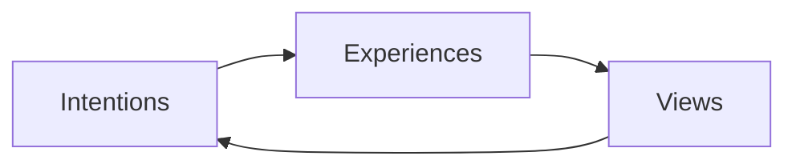
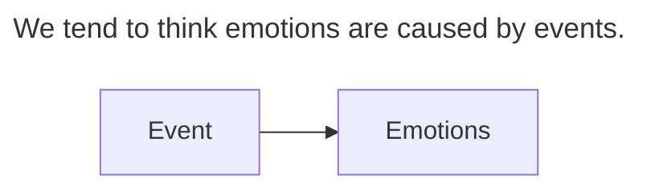
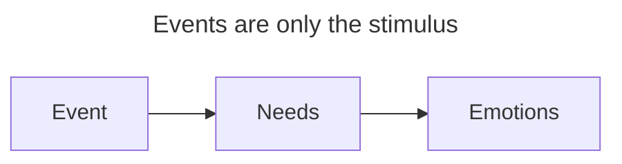
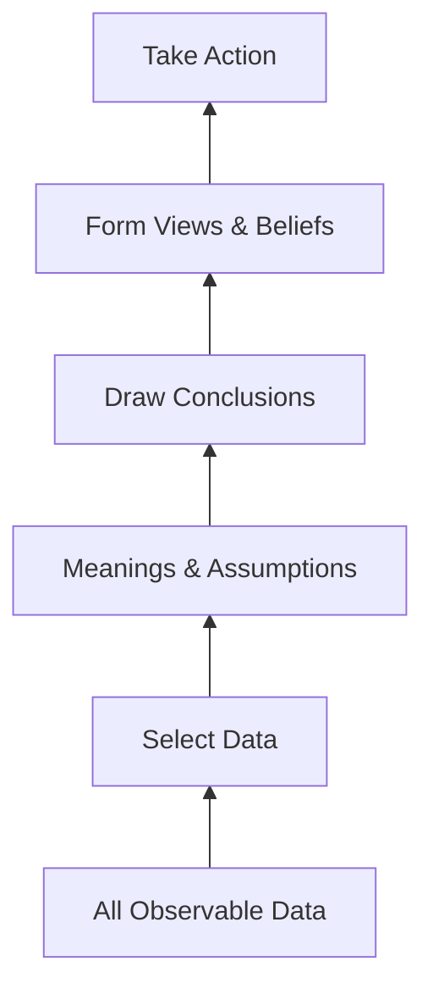

# Say What You Mean

This is my memo of reading the book "Say What You Mean", by Oren Jay Sofer.

# Part One: Lead with Presence

To say what we mean, we must **know what we mean**, and to know what we mean, we have to **listen inwardly**.

To go on a meaningful conversation, we have to be **here**, which is the opposite of being **automatic**.

## The Center of Our Lives

We communicate with

- **Our voice and words**, which link to
  - our breath
  - our emotions, and experience behind them
- **Nonverbal signals** like gesture, silence

So communication is always **multidimensional**, and it takes practice to realize these internally.

## The Power of Mindfulness

**Mindfulness** is essential in conversation simply for the fact that we need to be _here_ to understand anything.

To **lead with presence** means we strive to maintain awareness throughout an entire conversation, which means we need to return to _here_ again and again.

### Anchors

This could be practiced with these methods/anchors

- **Body awareness**: Realize sense of the body, where it grounds, where it contacts.
- **Breath**: Sense the breath.
- **Object touch**: Sense the touch of specific object.
- **Center line**: Sense the line of the spine or the center line of body.

Being present does not mean to achieve a certain mind status, but is to be **honest and real** with our actual present self, whatever it feels.

### Doorway to Heal

**Presence** is also the doorway to processing difficult emotions and painful memories. We tend to seek relief in difficult times, falling into the pit of seeking **instant relief**, which makes us incapable of tolerating even the smallest amount of pain. Presence lets us be honest with our pain and allow it to pass, or at least allow space for our body and mind to heal.

## Relational Awareness

### Pause and Pace

The one tool to reach presence is the **pause**. A pause is pregnant with possibilities; we can notice thoughts, feelings, impulses and take time to choose what to follow. **Slowing down** even a little bit usually increases our ability to lead with presence.

### Make Pause in Real Life

In real-time conversations, the pause is not easy to perform within the limited attention of others. So it's best to make a **clear indication** that we are thinking by pausing with

- **Verbal cue**: _"Hmm..."_
- **Visual cue**: looking up
- **Breath**: take a deep breath
- **Plain phrase** like
  - _"I'm not sure, let me think about that."_
  - _"This sounds important. I'd like to give it some time"_
  - _"I need some time to gather my thoughts, can we come back to this in 10 minutes?"_

### Mutuality and Unknown

Presence also requires **mutuality**, which means seeing the other person as an individual who contains uncertainty. Acknowledging and accepting the **unknown** creates new possibilities in dialogue.

### Relational Awareness

**Relational awareness** means we are sensing ourselves, the other person, and the conversation in between with **balance**, like a spotlight lighting up each location back and forth. This gives us a larger container to hold strong emotions in intense conversations.

# Part Two: Come from Curiosity and Care

**Intention** is the motivation or inner quality of heart behind our words and actions. Others can feel **where we're coming from** inside, regardless of how polished our words are.

Intention determines the **whole tone and trajectory** of a conversation. It can easily become automatic, relying on unconscious, **habitual patterns** if we're not consciously choosing our intention.

## The Blame Game

When our needs are not met, we tend to play the **blame game**. But the logic is: _if I want another person to change their behavior, how useful is it for me to tell them what's wrong with them?_

### The Deeper Roots

Everyone comes with **conditioned worldviews**, which we learned unconsciously while growing up. Parents (who have much more power) often force children to comply because it seems more efficient, or because they lack energy or skills to handle it differently.

So most of us grew up learning:

1. **Win/Lose**: difference usually means someone wins and someone loses
2. **Power imbalance**: those with more power get their needs met more often
3. **Fear of loss**: conflict is dangerous because we can lose what's important to us

We are taught to rely on **external concepts of morality and obligation**, rather than recognizing our **innate ethical sensitivity** or relying on dialogue.

### View Determines Intention

How we **view** things determines how we **relate** to them, which shapes our **intention**.

If we view conflict as a dangerous affair where our only options are to win or lose, we tend to play the **blame game**. We get defensive trying to protect ourselves and get on the "right" side. The other human being becomes just an **object** aiding or blocking us from our needs, leading us to **manipulate or control** the situation to get our way.

The **outcome experience** reinforces the view, and the **view reinforces the intention**, reproducing the experience.

### Habitual Ways of Responding to Conflict

Without consciously choosing our intention, we tend to respond to conflict in the following **habitual ways**:

- **Conflict avoidance**
  - Changing the subject, focus on positive things, ignore problem or pretend there is none.
  - Aim for keep the peace, and wish for problem to go away by itself.
  - When employed unconsciously, it can lead to mistrust, self-doubt, and could endanger emotional deadness.
- **Competitive confrontation**
  - Exclusive focus on our own needs by raising our voice, blame, judge, or even threaten others.
  - Goal is to ensure our needs are met at any cost, during which we can sense some protectiveness and security.
  - Leads to great cost, and people no longer give us honest feedback. And cost our own well-being by leading to isolation.
- **Passivity**
  - Give up what we want and meet other's demand.
  - Comes from needs for belonging, harmony, safety and connection.
  - Leads to disconnect from our own feelings, needs, and desires. And make relationship dull over time.
- **Passive aggression**
  - Agree on demands, but creates new problem for them.
  - Aims to find some way to meet our needs while we don't believe direct engagement will help.
  - Comes from helplessness.

### Loosening the Grip of Habit

When stuck in a habitual way of confronting conflict, our **nervous system** enters familiar patterns based on our views and intentions.

**Mindfulness** can help loosen the grip of our habits and create the possibility of choosing a different course, guiding our energy in a constructive direction.

## Where Are We Coming From?

In **Non-Violent-Communication (NVC)**, we learn to identify the specific _observations_ we want to discuss, our _feelings_ about those events, the deeper human _needs_ from which those feelings arise, and our _requests_ for how to move forward together.

Meeting each other's needs isn't about _*what*_ we say, but rather _*where*_ we're coming from—it's about our **intention**.

### Interest Comes from Curiosity and Care

The less **blame and criticism**, the easier it is for others to hear us. It is in our best interest to come from **curiosity and care**. Grounded in this intention, our verbal and nonverbal communication signals genuine interest, creating space to hear each other and work together.

### Needs

What happiness looks like differs from person to person, but at the root of it, **everything we do, we do to meet a need**.

### Curiosity and Care

**Curiosity** means that we are interested in learning. And learning requires humility, we must be willing to accept not knowing. We need to put aside our preconceived ideas and be open to new ways of seeing.

In order to be interested in something, to give our attention, we also need to **care**. Care means that we are open to being affected by what we learn, that we are committed to seeing the other person's humanity, and finally we are willing to include their needs in the situation.

### Mindfulness in Building Attention

Our default relationship to experience is to **judge and control**. **Mindfulness** helps us observe and notice these tendencies firsthand.

When we unconsciously lead with habitual reactions, we waste energy **chasing pleasure**, **resisting pain**, and trying to control things beyond our sphere of influence.

The first step is identifying when we are on **autopilot**. Then we can return to our **inner ground** and get curious: _"What's happening here? Let me try to understand this."_

In practice, noticing some common signs will be helpful to us.

- **Physical signs**
  - Tightness in the jaw
  - Tension in the limbs and body
  - Shallow and rapid breathing
  - Flushes of heat, sweating, or cold
- **Emotional signs**
  - Fear, anxiety, wanting to run away
  - Irritation, anger, annoyance, aggression
  - Urge to protect, explain, and defend ourselves
  - Frozen, overwhelmed, stuck
- **Mental signs**
  - Thoughts of anger, hate, negativity
  - Thoughts of hopelessness and despair
  - Thoughts of worst-case scenarios
- **Verbal signs**
  - An increase in pace, pitch, or volume of speech
  - Reluctance to speak or respond
  - Some phrase like
    - _"But that's not what I meant..."_
    - _"You don't understand..."_
    - _"should/never/always"_

When signs of reactivity appear, we **pause** and relax physical tension, remembering there are always **choices** in how to proceed, and return to **presence, curiosity, and care**.

- _"What if there were something to learn here?"_
- _"what if we figure this out and become closer?"_
- _"What might work for both of us?"_
- _"Regardless of the outcome, how do I want to handle myself here?"_
- _"What's most important to me? What are my needs?"_
- _"What matters to them? What do they need?"_

### Two Questions

- _"What do I want the other person to do?"_
- _"What do I want their reasons to be for doing it?"_

## Don't Let the Call Drop

When we come from **curiosity and care**, we are willing and able to listen. **True listening** allows us to appreciate the presence of others and let kindness touch us.

True listening depends on **inner silence**, requiring us to empty ourselves and make space to receive something new.

The silence of listening isn't forced or strained; it is a **natural quiet** arising from genuine interest.

### Maintain the Connection

Our primary aim in dialogue is to **make a connection**, and then **maintain the connection** until our needs are met.

Connection easily fractures during heated arguments when active listening stops—the conversation continues, but the **ball is dropped**.

Expressing **acknowledgment** through nonverbal gestures or verbal check-ins like _"Does that make sense?"_ creates a **call-and-response rhythm** that strengthens connection.

### Reflection

A **reflection** is a restatement of or inquiry about what has been said to confirm understanding, making the difference between an **effective conversation** and an argument.

Reflections must not be used mechanically; they should genuinely come from **curiosity and care**.

### Tips

Before giving advice, we can first check: _"I have an idea that I think might be helpful. Are you open to some advice?"_

# Part Three: Focus on What Matters

We adjust our attention to keep identifying **what matters most** in any given moment through _observations_, _emotions_, _needs_, and _requests_.

## Getting Down to What Matters

**Needs** are the core values that motivate our actions—the root reasons for why we want what we want. Any action can be understood as an attempt to **satisfy underlying needs**.

Understanding others' needs helps us find **connections across differences**, while identifying our own needs creates **internal space** to listen to others.

### Tips of Confirming Needs

- Drop the word `need`
  - _"Do you need more respect?"_ -> _"Sounds like you really value respect?"_
- Describe the need
  - _"Sounds like you need more order?"_ -> _"You really like knowing that everything is in its place, yes?"_
- Stay positive
  - _"I hear how much you dislike getting mixed messages, yes?"_ -> _"I hear how much you want clarity and directness, knowing you can take what's said at face value. Am I correct?"_
- Ask, don't tell
  - _"You want to feel more engaged at work"_ -> _"Do you want to feel more engaged at work?"_

## Emotional Agility

Our **emotions** are immutable expressions of our biology, as natural and essential to life as our **immune system**.
_*If there is emotion, something matters*_. Emotions are the primary way our body-mind sends **signals about our needs**.

### The Blame Game

A major myth about emotions is that they are **someone else's fault**, which fuels the blame game of tossing accusations back and forth.

Our feelings are **never caused directly** by other people or their actions. The outward event is merely the **stimulus**; the root cause is how we relate to it through our **needs and values**.

We are each **responsible for our actions and reactions**.

Taking **responsibility for our feelings** by connecting them to our needs (rather than blaming others) makes it much easier for others to hear us.

Hearing others' feelings as reflections of their needs allows us to understand them **without defensiveness**, taking blame, or feeling responsible for their emotions.

## Enhancing Empathy and Inner Resilience

### Self-Empathy

**Self-empathy** strengthens our patience. Mindfully acknowledging our inner experience allows us to temporarily set it aside and create **space to listen**.

### Empathy Distress

**Empathy distress** occurs when we feel overwhelmed or flooded by feeling. Skillful empathy involves managing distress and sensing **our separateness** so we don't lose the capacity to engage.

We can pause for a moment with words like:

- _"I think I need a moment to gather my thoughts."_
- _"I'd like some time to take that in. Can we pause here for a moment?"_
- _"I'd really like to continue discussing this, and I'm feeling a little overwhelmed. Could we take a break and come back to this tomorrow?"_

### What Is Not Empathy

Trying to **fix, change, or resolve** another's pain can reinforce helplessness (_"Let me do it for you"_ is rarely helpful).

The first step of empathy is **listening without judgment** or taking on responsibility for the other person, helping them **feel heard** so they can re-evaluate their experience.

## How to Raise an Issue Without Starting a Fight

It is best to **listen before we speak**; without clear observations, conversations devolve into arguments over details that don't matter.

### Avoid Adding to Experiences

We tend to add **interpretations and judgments** to experiences. We must distinguish these subjective additions from **actual objective observations**.

To make better observations, we can notice the following:

- Use mindfulness to take in raw data of what happened.
- Separate what we actually know from assumptions or interpretations.
- Avoid words like _always_, _never_, _ever_, _whenever_, _rarely_.
- State the experience in the first person: _"when I see/hear/notice"_ rather than _"when you did/said"_.

When observations stick to **objective facts**, understanding feelings and needs becomes much easier.

### The Ladder of Inference

Awareness of the **ladder of inference** allows us to pause and examine assumptions at each level before taking action.

### Tips of Expressing Gratitude

Instead of a generic _"Thank you"_, share **full appreciation**: specify what they did, how we feel, and the underlying value fulfilled.

### There Is No Right or Wrong Way to Speak

Grounded in curiosity and care, there is no single rigid rule for speech—**authentic expression** of feelings and needs is paramount.

### We Can't Control Others' Reactions

We **cannot control how others respond**; we can only maintain an orientation of curiosity and care while expressing ourselves skillfully.

## If We Want Something, Ask for It

Genuine **requests** respect autonomy, time, and energy without creating obligation. Allowing others the **freedom to say no** is essential.
Requests are **invitations to mutual joy** in giving and receiving when framed to satisfy all needs.

# Part Four: Bring It All Together

The three core principles—**lead with presence**, **come from curiosity and care**, and **focus on what matters**—form a continuous, non-linear **flow of dialogue**.

## The Flow of Dialogue

Setting initial conditions requires **mutual agreement** to engage in conversation, before jumping directly into content issues.

Tracking our position within the **flow of dialogue** is essential throughout interaction.

### Center of Attention

Tracking requires noticing the **center of attention** (who holds the floor).

Conversational focus naturally shifts between participants. Offering attention until the counterpart **feels heard** creates space for them to listen when focus shifts back to us.

### Tracking Content

Most conversations involve multiple topics that branch off. **Tracking content** prevents getting lost in secondary threads.

When topics splinter, **gently guiding focus** back to the primary thread while acknowledging secondary topics maintains clarity.

### Being Succinct

Emotion or feeling unheard can cause repetition, but excessive wordiness reduces clarity. **Succinct communication** improves comprehension.

**Chunking**—sharing information in manageable pieces rather than flooding—gives the listener time to process and allows us to check for understanding.

## Running the Rapids

As Bruce Lee noted, _"We don't rise to meet our expectations, we fall to the level of our training."_ **Regular practice** enables applying these skills under pressure.

Navigating tough conversations requires **internal preparation** aligned with our constructive intentions:

- **Nourishing Ourselves**
  - Find the empathy, which can reduce reactivity
- **Investigating what's at stake**
  - Focus on what matters most, and if the goal is realistic
  - If we feel the pulse of judgement in ourselves, recognize it as valuable information about our own needs and values, and use it to guide our actions.
- **Humanizing the other person**
  - Step out of our own story and consider other perspectives.
  - However confusing or harmful another's actions and words may be, there is some internal logic behind their choices.
