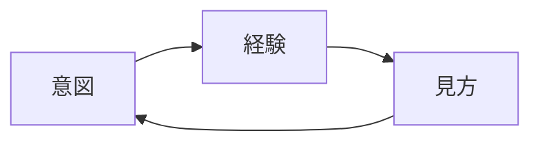
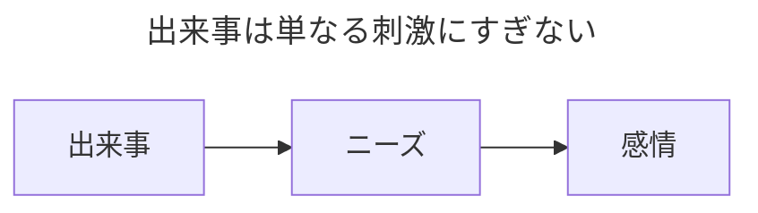
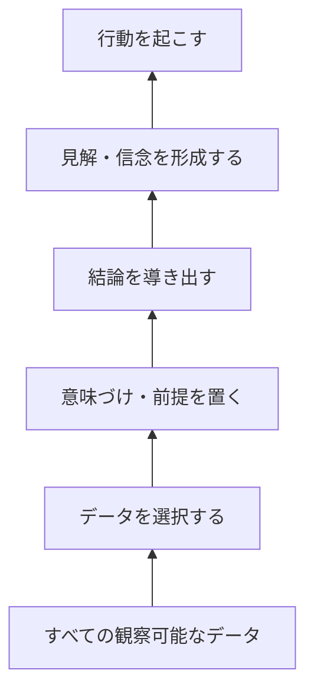

# Say What You Mean

本書は、オーレン・ジェイ・ソファー（Oren Jay Sofer）著『Say What You Mean』の読書メモです。

# 第1部: プレゼンスをもって臨む（Lead with Presence）

言いたいことを正しく伝えるためには、**自分が本当に意味していることを知る**必要があり、それを知るためには**内なる声に耳を傾ける**必要があります。

有意義な対話を行うためには、**「今、ここ」に存在する**必要があります。これは**自動操縦（無自覚な反応）**の対極にある状態です。

## 私たちの生活の中心

私たちは以下を通じてコミュニケーションをとっています:

- **声と言葉**: これらは以下と結びついています
  - 呼吸
  - 感情と、その背後にある経験
- **非言語シグナル**: 身振り手振り、沈黙など

したがって、コミュニケーションは常に**多次元的**であり、これらを内面的に自覚するには練習が必要です。

## マインドフルネスの力

会話において**マインドフルネス**が不可欠なのは、何かを理解するためには単に「ここ」にいなければならないという理由からです。

**プレゼンスをもって臨む（Lead with presence）**とは、会話の全体を通じて気づきを保ち続けるよう努めることを意味し、それは何度も何度も「ここ」に戻ってくることを意味します。

### アンカー（心の錨）

これは以下の方法・アンカーを用いて練習できます:

- **身体の感覚（ボディ・アウェアネス）**: 体の感覚、地面との接地感、何かに触れている感覚を意識する。
- **呼吸**: 呼吸を感じる。
- **対象物の感触**: 特定の物に触れている感触を意識する。
- **身体の中心線**: 背骨のラインや体の中心線を意識する。

プレゼンスがある状態とは、特定の精神状態を無理に作り出すことではなく、何を感じていようと、**ありのままの現在の自分に対して正直でリアルである**ことです。

### 癒しへの入り口

**プレゼンス**は、困難な感情や痛みを伴う記憶を処理するための入り口でもあります。私たちは困難な状況に直面すると、つい**即座の救済**を求めて安易な逃避に陥りがちで、その結果、わずかな苦痛にすら耐えられなくなってしまいます。プレゼンスを保つことで、自分の苦痛を素直に受け止め、それが過ぎ去るのを待つこと、あるいは心身が回復するためのスペースを確保することができます。

## 関係性への気づき（Relational Awareness）

### ポーズ（一時停止）とペース

プレゼンスに到達するための1つの道具が**ポーズ（Pause）**です。一時停止には無限の可能性が秘められています。私たちは思考、感情、衝動に気づき、どれに従うかを選択する時間を持つことができます。少しでも**スピードを落とす（Slowing down）**ことで、プレゼンスをもって対話する能力が高まります。

### 日常会話でポーズを取る方法

リアルタイムの会話では、相手の限られた注意の中でポーズを取ることは容易ではありません。そのため、以下のような方法で「今考えている」という**明確なサイン**を示すのが最善です:

- **言葉の合図**: _「うーん...」_
- **視覚的な合図**: 上を見上げる
- **呼吸**: 深呼吸をする
- **わかりやすいフレーズ**:
  - _「よく分からないので、少し考えさせてください。」_
  - _「大切なことですね。じっくり考えたいと思います。」_
  - _「考えを整理する時間がほしいので、10分後にまた話せますか？」_

### 相互性と未知なるもの

プレゼンスには**相互性（Mutuality）**も必要です。これは、相手を不確実性を持った一人の人間として見ることを意味します。**未知なるもの（Unknown）**を認め、受け入れることが、対話の中に新たな可能性を生み出します。

### 関係性への気づき

**関係性への気づき（Relational awareness）**とは、自分自身、相手、そしてその間にある会話のすべてを**バランスよく**感知することです。スポットライトがあちこちを行き来するように照らし出すイメージです。これにより、緊迫した会話の中でも強い感情を受け止める大きな器を持つことができます。

# 第2部: 好奇心と思いやりから始める（Come from Curiosity and Care）

**意図（Intention）**とは、言葉や行動の背後にある動機や心の性質です。言葉がどれほど洗練されていても、相手は私たちが内面で**「どのような意図から来ているか（where we're coming from）」**を感じ取ります。

意図は会話の**全体のトーンと軌道**を決定づけます。意識的に意図を選択しないと、無意識の**習慣的なパターン**に頼った自動操縦になりがちです。

## 責任転嫁ゲーム（The Blame Game）

自分のニーズが満たされないとき、私たちは**責任転嫁のゲーム**をしがちです。しかし考えてみてください。_相手の行動を変えさせたいとき、相手のどこが間違っているかを指摘することが、どれほど効果的でしょうか？_

### 深い根底にあるもの

誰もが育つ過程で無意識に身につけた**条件づけられた世界観**を持っています。より大きな力を持つ親は、効率的に見えたり、別の方法で対処するエネルギーやスキルがなかったりするために、子どもに従うことを強制しがちです。

そのため、私たちの多くは次のように学んで育ちました:

1. **勝ち／負け (Win/Lose)**: 違いがあるということは、誰かが勝ち、誰かが負けることを意味する
2. **力の不均衡 (Power imbalance)**: 力を持つ者ほど、自分のニーズを満たしやすい
3. **喪失への恐れ (Fear of loss)**: 衝突は大切なものを失う恐れがあるため危険である

私たちは、人間が本来持っている**倫理的感受性**や対話に頼るのではなく、**道徳や義務という外部の概念**に依存するように教え込まれてきました。

### 物の見方が意図を決定する

物事をどう**見るか（View）**が、それらとどう**関わるか（Relate）**を決定し、それが**意図（Intention）**を形作ります。

衝突を「勝ちか負けしかない危険な事態」と見なすと、**責任転嫁ゲーム**に走りやすくなります。自分を守り、「正しい」側に立とうとして防御的になります。その結果、相手の人間は自分のニーズを満たすのを助けるか邪魔する**対象（道具）**にすぎなくなり、思い通りにするために状況を**操作・コントロール**しようとしてしまいます。

その**結果の経験**が見方を強化し、**見方が意図を強化**して、同じ経験が再生産されます。

### 衝突に対する習慣的な反応パターン

意識的に意図を選択しない場合、私たちは衝突に対して以下のような**習慣的なパターン**で反応しがちです:

- **衝突の回避 (Conflict avoidance)**
  - 話題を変える、ポジティブなことだけに目を向ける、問題を無視する、または問題など存在しないかのように振る舞う。
  - 平和を保つことを目指し、問題が自然に消え去ることを願う。
  - 無意識に用いられると、不信感や自己不信を招き、感情の麻痺を引き起こす恐れがある。
- **競争的な対決 (Competitive confrontation)**
  - 声を荒らげたり、相手を非難・批判・脅迫したりして、自分のニーズだけに固執する。
  - いかなる犠牲を払ってでも自分のニーズを満たすことを目的とし、その間は自己防衛や安心感を得られる。
  - 多大な代償を払い、人々は本音のフィードバックをくれなくなる。孤立を招き、自身の幸福を損なう。
- **受動性・迎合 (Passivity)**
  - 自分の望みを諦め、相手の要求を受け入れる。
  - 帰属意識、調和、安全性、繋がりへのニーズから生じる。
  - 自身の感情、ニーズ、欲求から切り離され、長期的には関係性を退屈なものにしてしまう。
- **受動的攻撃 (Passive aggression)**
  - 要求には表面的に同意するが、相手に新たな問題を作り出す（陰口、サボり、嫌がらせなど）。
  - 直接的な関わり合いでは解決しないと諦めつつ、何とか自分のニーズを満たそうとする。
  - 無力感から生じる。

### 習慣の束縛を解く

衝突に対する習慣的なパターンに囚われているとき、私たちの**神経系**は、これまでの見方や意図に基づいた馴染みのあるパターンに陥っています。

**マインドフルネス**は習慣の束縛を緩め、別の道を選択する可能性を作り出し、建設的な方向へとエネルギーを導く助けになります。

## 私たちはどこから出発しているか？

**非暴力コミュニケーション (NVC)** では、話し合いたい具体的な*観察事実 (Observations)*、それらの出来事に対する*感情 (Feelings)*、その感情の根底にある人間の普遍的な*ニーズ (Needs)*、そして共に前進するための具体的な*リクエスト (Requests)* を特定することを学びます。

お互いのニーズを満たすことは、*何を*言うかではなく、どのような心構えから出発しているか——すなわち私たちの**意図**にかかっています。

### 好奇心と思いやりから生まれる関心

**非難や批判**が少なければ少ないほど、相手は私たちの話を聞き入れやすくなります。**好奇心と思いやり (Curiosity and Care)** を起点にすることが、私たち自身にとっても最大の利益になります。この意図に根ざすことで、言語的・非言語的コミュニケーションが本物の関心を伝え、互いに耳を傾け協力し合える空間が生まれます。

### ニーズ

幸せの形は人それぞれ異なりますが、その根底においては、**私たちのあらゆる行動は、何らかのニーズを満たすために行われています**。

### 好奇心と思いやり

**好奇心 (Curiosity)** とは、学びに関心を持つことです。学ぶためには謙虚さが必要であり、自分が「知らない」という状態を受け入れる姿勢が求められます。先入観を脇に置き、新しい見方を受け入れる柔軟さが必要です。

何かに興味を持ち、注意を向けるためには、**思いやり・気遣い (Care)** も必要です。思いやりとは、自分が学ぶことによって影響を受けることを受け入れ、相手の人間性を尊重し、最終的にその状況の中に相手のニーズも含めようとする姿勢を意味します。

### 注意を向けるためのマインドフルネス

経験に対する私たちのデフォルトの関わり方は、**判断しコントロールしようとすること**です。**マインドフルネス**は、こうした傾向を直接観察し気づくのに役立ちます。

習慣的な反応で無意識に行動していると、**快楽を追い求め**、**痛みに抵抗し**、自分のコントロールが及ばないものをコントロールしようとしてエネルギーを浪費してしまいます。

第一歩は、自分が**自動操縦状態**になっていることに気づくことです。その上で、**内なる足場**に戻り、好奇心を持つことができます: _「ここで何が起きているのだろう？ 理解してみよう。」_

実践では、いくつかの典型的なサインに気づくことが役立ちます:

- **身体的なサイン**
  - あごの緊張・噛み締め
  - 手足や体の強張り
  - 浅く速い呼吸
  - 身体の火照り、発汗、冷え
- **感情的なサイン**
  - 恐怖、不安、逃げ出したい衝動
  - イライラ、怒り、不快感、攻撃性
  - 自己弁護や説明、防御をしたいという強い衝動
  - 思考停止、圧倒される感覚、フリーズ
- **精神的なサイン**
  - 怒り、憎しみ、否定的な思考
  - 絶望感や無力感
  - 最悪のシナリオばかりを想像する
- **言語的なサイン**
  - 話すスピード、声のトーン、音量の増大
  - 話すことや答えることへのためらい
  - 次のようなフレーズの使用:
    - _「でも、そういう意味で言ったんじゃない...」_
    - _「分かってないな...」_
    - _「〜すべきだ / 絶対に〜ない / いつも〜だ」_

反応的な兆候が現れたら、**ポーズを取り**、身体の緊張を緩め、どのように進めるかには常に**選択肢**があることを思い出して、**プレゼンス、好奇心、思いやり**へと立ち返ります。

- _「ここから学べることは何だろう？」_
- _「これを一緒に解決できたら、もっと親密になれるのではないか？」_
- _「私たち双方にとってうまくいく方法は何だろう？」_
- _「結果がどうであれ、自分はここでどうありたいか？」_
- _「自分にとって最も重要なことは何だろう？ 自分のニーズは何だろう？」_
- _「相手にとって大切なことは何だろう？ 相手は何を必要としているだろう？」_

### 2つの問い

- _「相手に何をしてほしいのか？」_
- _「相手にどのような理由からそれをしてほしいのか？」_

## 通話を切らない（関係を切断しない）

**好奇心と思いやり**を持って臨むとき、私たちは喜んで耳を傾けることができます。**真に聴くこと**によって、他者の存在に感謝し、優しさに触れることができます。

真の傾聴は**内なる静けさ**に依存しており、自分を空っぽにして新しいものを受け入れるスペースを作る必要があります。

傾聴における静けさは、無理強いされたものではなく、純粋な関心から生まれる**自然な静けさ**です。

### 繋がりを維持する

対話における私たちの主な目的は、**繋がりを築くこと**であり、ニーズが満たされるまで**その繋がりを維持すること**です。

激しい議論の中でアクティブ・リスニングが止まると、繋がりは簡単に途切れてしまいます。会話自体は続いていても、**ボールが落ちてしまっている（繋がりが切れている）**状態です。

非言語的な仕草や、*「言っていること伝わってる？」*といった言葉での確認を通じて**承認（Acknowledgment）**を示すことで、繋がりを強める**コール＆レスポンスのリズム**が生まれます。

### リフレクション（伝え返し）

**リフレクション**とは、理解を確認するために相手が言ったことを言い直したり質問したりすることであり、これによって**効果的な対話**と口論の差が生まれます。

リフレクションは機械的に使うのではなく、心からの**好奇心と思いやり**から発せられる必要があります。

### アドバイスのコツ

助言を与える前に、まず確認してみましょう: _「役に立つかもしれないアイデアがあるのですが、アドバイスを聞いてみますか？」_

# 第3部: 大切なことに焦点を当てる（Focus on What Matters）

私たちは、_観察_、_感情_、_ニーズ_、*リクエスト*を通じて、いかなる瞬間においても**何が最も重要か**を特定し続けるよう意識を調整します。

## 本当に重要なことに迫る

**ニーズ**とは、私たちの行動を動機づける中核的な価値観であり、私たちが何かを望む根本的な理由です。あらゆる行動は、**根底にあるニーズを満たそうとする試み**として理解できます。

他者のニーズを理解することは**違いを超えて繋がる**助けとなり、自分自身のニーズを把握することは他者の話を聞くための**内なるスペース**を生み出します。

### ニーズを確認するコツ

- 「ニーズ（必要）」という言葉をそのまま使わない
  - _「もっと尊重される必要がありますか？」_ $\rightarrow$ _「尊重されることをとても大切にされているようですね？」_
- ニーズの内容を描写する
  - _「もっと秩序が必要なんですね？」_ $\rightarrow$ _「すべてがあるべき場所にあると安心するのですね？」_
- ポジティブな表現を保つ
  - _「曖昧なメッセージを受け取るのが嫌なんですね？」_ $\rightarrow$ _「言葉通りに受け取れる、明確で率直なコミュニケーションを望まれているのですね？」_
- 決めつけず、問いかける
  - _「仕事でもっとやりがいを感じたいのですね」_ $\rightarrow$ _「仕事でもっとやりがいを感じたいと思っていますか？」_

## 感情のしなやかさ（Emotional Agility）

私たちの**感情**は生物学的な不変の表現であり、**免疫系**と同じくらい自然で生命にとって不可欠なものです。
*感情があるところには、大切な何かが存在する*のです。感情は、私たちの心身が**ニーズに関するシグナル**を送る主要な手段です。

### 責任転嫁の罠

感情に関する大きな誤解の1つは、感情が**「誰か他の人のせい」**で引き起こされると考えることです。これが、互いに非難を投げ合う責任転嫁ゲームを助長します。

私たちの感情は、他者やその行動によって**直接引き起こされることは決してありません**。外的な出来事は単なる**刺激（きっかけ）**にすぎず、根本的な原因は、私たちが自分の**ニーズや価値観**を通してそれにどう関わるかにあります。

私たちは一人ひとりが、**自らの行動と反応に対して責任**を負っています。

他者を責めるのではなく、自分の感情を自分のニーズと結びつけて**自分の感情に責任を持つ**ことで、相手はずっとこちらの話を聞き入れやすくなります。

相手の感情を「相手のニーズの表れ」として受け止めることで、**防御的にならず**、自分を責めたり相手の感情に過度な責任を感じたりすることなく、相手を理解できるようになります。

## 共感と内なる回復力の向上

### 自己共感 (Self-Empathy)

**自己共感**は私たちの忍耐力を強化します。自分自身の内的な体験にマインドフルに気づき認めることで、それを一時的に脇に置き、**相手の話を聞くスペース**を作ることができます。

### 共感疲労・圧倒 (Empathy Distress)

感情に圧倒されたり押し流されたりすると、**共感の苦痛**が生じます。巧みな共感とは、苦痛をコントロールしつつ、**相手と自分との境界（別個の存在であること）**を保つことで、関わり続ける力を失わないようにすることです。

次のような言葉で少しポーズを取ることができます:

- _「少し考えをまとめる時間がほしいです。」_
- _「お聞きしたことをしっかり受け止めたいので、少しの間休憩を挟んでもいいですか？」_
- _「ぜひこの話を続けたいのですが、少し感情的になってしまっています。休憩して、また明日話せますか？」_

### 共感ではないもの

相手の苦痛を**直そう、変えよう、解決しよう**とすることは、かえって無力感を助長することがあります（*「私が代わりにやってあげる」*はめったに役に立ちません）。

共感の第一歩は、**評価を下さず**、相手の責任を肩代わりすることなく**ただ聴くこと**です。それにより相手は**「理解された」**と感じ、自らの体験を冷静に見つめ直すことができるようになります。

## 争いを起こさずに問題を切り出す方法

**話す前に聴く**ことが最善です。明確な観察がなければ、会話は本質的でない細部に関する言い争いに発展してしまいます。

### 出来事に解釈を付け加えない

私たちは経験に対して**解釈や判断**を付け加えがちです。これらの主観的な付け足しと、**実際の客観的な観察事実**を明確に区別しなければなりません。

より良い観察を行うために、以下に留意します:

- マインドフルネスを用いて、何が起きたかという生のデータを捉える。
- 実際に分かっていることと、推測や解釈とを分ける。
- *「いつも」「絶対に」「一度も〜ない」「〜する時は必ず」「めったに〜ない」*といった誇張表現を避ける。
- *「あなたが〜した時」*ではなく、*「私が〜を見た（聞いた・気づいた）時」*のように一人称で事実を述べる。

観察が**客観的な事実**に基づいていると、感情やニーズの理解がずっと容易になります。

### 推論の梯子 (The Ladder of Inference)

**推論の梯子**を自覚することで、行動を起こす前に各段階でポーズを取り、自分の前提や思い込みを検証することができます。

### 感謝を伝えるコツ

ありきたりの*「ありがとう」*で済ませるのではなく、**完全な感謝（Full appreciation）**を伝えます: 相手が具体的に何をしてくれたか、それによって自分がどう感じたか、そして満たされた根底にある価値観を明確にします。

### 話し方に「唯一の正解」はない

好奇心と思いやりを根底に持っていれば、話し方に厳格な単一のルールはありません。感情とニーズの**本物の表現（Authentic expression）**こそが最も重要です。

### 他者の反応はコントロールできない

私たちは**相手がどう反応するかをコントロールすることはできません**。私たちができるのは、好奇心と思いやりを持ち続けながら、巧みに自分を表現することだけです。

## 望むものがあるなら、リクエストする

真の**リクエスト（Requests）**は、義務感を生じさせることなく、相手の自律性、時間、エネルギーを尊重します。相手に**「ノー」と言う自由を与える**ことが不可欠です。
双方のニーズを満たす形で提案されたリクエストは、与え受け取るという**相互の喜びへの招待**となります。

# 第4部: すべてを統合する（Bring It All Together）

3つの核となる原則——**プレゼンスをもって臨む**、**好奇心と思いやりから始める**、**大切なことに焦点を当てる**——は、対話の連続的で非線形な**流れ（フロー）**を形成します。

## 対話の流れ (The Flow of Dialogue)

本題に飛び込む前に、まずは会話を始めることについての**相互の合意**を得ることが必要です。

対話を通じて、**対話の流れ**の中で今自分がどこに位置しているかを把握し続けることが極めて重要です。

### 注意の中心 (Center of Attention)

今、**誰が話の中心にいるのか（誰がフロアを持っているか）**に気づく必要があります。

会話の焦点は参加者の間を自然に移動します。相手が**「聞いてもらえた」**と感じるまで十分に注意を傾けることで、焦点が自分に戻ってきたときに相手もこちらに耳を傾ける余裕が生まれます。

### 話題の追跡 (Tracking Content)

多くの会話では複数の話題が枝分かれします。**話題を追跡（Tracking content）**することで、副次的な枝葉の話に迷い込むのを防ぎます。

話題が脱線したときは、副次的な話題の存在を認めつつ、**優しく焦点をメインの話題に戻す**ことで明快さを保ちます。

### 簡潔であること (Being Succinct)

感情が高ぶったり、理解されていないと感じたりすると同じことを繰り返してしまいがちですが、過度な多弁は明快さを損ないます。**簡潔なコミュニケーション**が理解を深めます。

情報を一度に大量に浴びせるのではなく、扱いやすい単位に分割して伝える**チャンキング（Chunking）**を行うことで、聞き手に処理する時間を与え、理解度を確認することができます。

## 激流を乗り切る (Running the Rapids)

ブルース・リーが言ったように、*「私たちは期待の高さまで向上するのではなく、訓練のレベルまで落ちる」*のです。**定期的な実践**によってのみ、プレッシャーのかかる場面でもこれらのスキルを発揮できるようになります。

タフな会話を乗り切るには、建設的な意図に沿った**内面的な準備**が必要です:

- **自分自身を満たす (Nourishing Ourselves)**
  - 共感のスペースを見つけ、過剰な反応を抑える。
- **何が懸かっているかを見極める (Investigating what's at stake)**
  - 最も重要なことに焦点を当て、目標が現実的かどうかを確認する。
  - 自分の中に批判的な感情の高まりを感じたら、それを自分自身のニーズや価値観に関する貴重な情報として認識し、自分の行動指針として役立てる。
- **相手を一人の人間として見る (Humanizing the other person)**
  - 自分自身のストーリーから一歩抜け出し、別の視点を考慮する。
  - 相手の言動がどれほど不可解で有害に見えたとしても、その選択の背後には相手なりの内的な論理が存在している。
