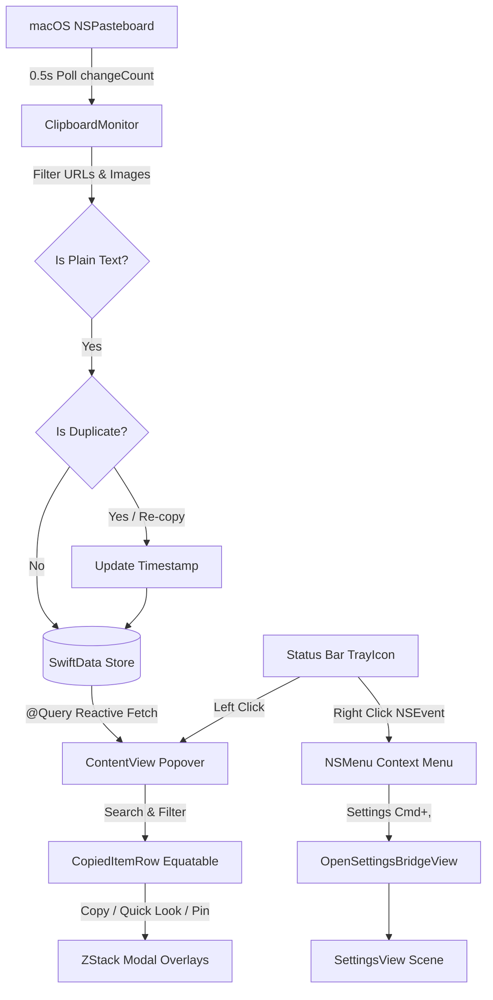

# C2V: MacOS Status Bar App

**C2V** is a lightweight, modern, and privacy-first clipboard history manager for macOS that lives entirely in the status bar (menu bar). Built with **SwiftUI**, **SwiftData**, and Apple's **ServiceManagement** framework, it provides seamless text snippet capture without Dock clutter or background performance overhead.

This article breaks down the engineering design, architecture, offline database management, background clipboard interception, performance optimizations, and the end-to-end process of publishing a status bar utility to the Mac App Store.



---

## App Summary & Links

### What is C2V?

Most clipboard managers for macOS are either bloated with unnecessary features, require invasive system-wide accessibility permissions, or consume significant memory and CPU cycles in the background.

C2V was created with four core principles:

1. **Zero Dock Clutter**: Runs purely as an agent application (`LSUIElement = true`) residing in the macOS menu bar.
2. **100% Offline & Private**: All clipboard snippets remain on the local Mac inside an encrypted local SwiftData database. There is zero telemetry, zero analytics, and zero network access.
3. **Frictionless Workflow**: Instant search, pin-to-top organization, full text inspection (word/line/character counts), and quick-clear controls.
4. **Modern Apple Aesthetics**: Adopts Apple's **Liquid Glass** visual styling with graceful material fallbacks for older macOS versions.

### Links

- **Mac App Store**: [Download C2V on the Mac App Store](https://apps.apple.com/jp/app/c2v-%E3%82%B3%E3%83%94%E3%83%9A%E8%A8%98%E9%8C%B2%E3%82%A2%E3%83%97%E3%83%AA/id6798622919?mt=12)
- **Source Code**: [GitHub Repository](https://github.com/jinyongnan810/C2V)

https://apps.apple.com/jp/app/c2v-%E3%82%B3%E3%83%94%E3%83%9A%E8%A8%98%E9%8C%B2%E3%82%A2%E3%83%97%E3%83%AA/id6798622919?mt=12

https://github.com/jinyongnan810/C2V

---

## Building a macOS Status Bar App

In macOS development, creating a menu bar application historically meant configuring `NSStatusItem` and `NSStatusBar` in AppKit. With macOS 13 (Ventura) and later, SwiftUI introduced the native `MenuBarExtra` scene API.

### 1. The `MenuBarExtra` Scene

In `C2VApp.swift`, the primary application scene is declared using `MenuBarExtra`:

```swift
@main
struct C2VApp: App {
    @State private var monitor: ClipboardMonitor

    var body: some Scene {
        MenuBarExtra {
            ContentView()
                .environment(monitor)
                .modelContainer(Self.sharedModelContainer)
        } label: {
            Image("TrayIcon")
                .renderingMode(.template)
                .resizable()
                .scaledToFit()
                .frame(width: 18, height: 18)
                .background(OpenSettingsBridgeView())
        }
        .menuBarExtraStyle(.window)

        Settings {
            SettingsView()
                .environment(monitor)
                .modelContainer(Self.sharedModelContainer)
        }
    }
}
```

Notice `.menuBarExtraStyle(.window)`:

- `.menu`: Renders standard AppKit-style menu dropdown lists.
- `.window`: Renders an arbitrary SwiftUI view hierarchy inside a detached popover window. This allows full customization of layout, search bars, scrolling lists, and interactive buttons.

The `TrayIcon` is rendered with `.renderingMode(.template)`. This ensures macOS automatically tints the monochrome icon black on light menu bars and white on dark menu bars, or adapts when wallpaper accent colors shift.

### 2. Hiding from the Dock (`LSUIElement`)

To make a status bar app truly lightweight and invisible in the Dock and `Cmd + Tab` app switcher, configure `LSUIElement` in your target build settings:

- In Xcode: **Build Settings** → **Info.plist Values** → **Application is agent (UIElement)** = `YES`
- Or directly in `project.pbxproj`:
  ```text
  INFOPLIST_KEY_LSUIElement = YES;
  ```

This turns the app into an agent utility that leaves no footprint in the macOS Dock.

### 3. Handling Right-Click on the Menu Bar Icon

By default, clicking a `MenuBarExtra` status bar icon always toggles the `.window` popover. SwiftUI does not provide a built-in modifier to differentiate between left clicks and right clicks on the status bar icon.

Users expect right-clicking (or `Ctrl`-clicking) a menu bar icon to reveal a native context menu with options like **Settings** and **Quit**.

To solve this, C2V implements `MenuBarExtraRightClickMonitor` using a local `NSEvent` monitor:

```swift
final class MenuBarExtraRightClickMonitor: NSObject {
    static let shared = MenuBarExtraRightClickMonitor()
    private var eventMonitor: Any?
    var onOpenSettings: (() -> Void)?

    func startMonitoring() {
        guard eventMonitor == nil else { return }

        eventMonitor = NSEvent.addLocalMonitorForEvents(
            matching: [.rightMouseDown, .leftMouseDown]
        ) { [weak self] event in
            guard let self else { return event }

            let isRightClick = event.type == .rightMouseDown
            let isControlLeftClick = event.type == .leftMouseDown &&
                                     event.modifierFlags.contains(.control)

            guard isRightClick || isControlLeftClick else {
                return event
            }

            // Locate the NSStatusBarButton in the event window
            guard let window = event.window,
                  let statusBarButton = findStatusBarButton(in: window)
            else {
                return event
            }

            showContextMenu(for: statusBarButton, with: event)
            // Consume the event so the default left-click popover is not triggered
            return nil
        }
    }

    private func findStatusBarButton(in view: NSView) -> NSStatusBarButton? {
        if let button = view as? NSStatusBarButton {
            return button
        }
        for subview in view.subviews {
            if let button = findStatusBarButton(in: subview) {
                return button
            }
        }
        return nil
    }

    private func showContextMenu(for button: NSStatusBarButton, with event: NSEvent) {
        let menu = NSMenu()

        let settingsItem = NSMenuItem(
            title: NSLocalizedString("Settings", comment: ""),
            action: #selector(openSettings),
            keyEquivalent: ","
        )
        settingsItem.target = self
        menu.addItem(settingsItem)

        menu.addItem(NSMenuItem.separator())

        let quitItem = NSMenuItem(
            title: NSLocalizedString("Quit C2V", comment: ""),
            action: #selector(quitApp),
            keyEquivalent: "q"
        )
        quitItem.target = self
        menu.addItem(quitItem)

        button.isHighlighted = true
        NSMenu.popUpContextMenu(menu, with: event, for: button)
        button.isHighlighted = false
    }
}
```

By traversing the view hierarchy to verify the click occurred on an `NSStatusBarButton` and returning `nil` from the event handler, C2V suppresses the default left-click popover opening and pops up the native `NSMenu` instead.

---

## Displaying Dialogs and Modals in an Opened Window

A notorious challenge when building status bar apps with `.menuBarExtraStyle(.window)` is presenting alerts and modal dialogs.

### Why Standard `.sheet` and `.confirmationDialog` Fail

When you present a standard SwiftUI `.sheet` or `.confirmationDialog` inside a `MenuBarExtra` window:

1. The status bar window is technically a non-activating panel (`NSPanel` / `NSStatusBarWindow`), not a standard key window.
2. Sheets frequently clip outside the popover boundaries or fail to establish focus.
3. In many macOS versions, clicking outside a sheet dismisses the entire `MenuBarExtra` window, losing the user's workflow.

### The In-Window Modal Overlay Solution

C2V solves this by using an **in-window modal overlay pattern** inside the root `ZStack` of `ContentView.swift`:

```swift
ZStack {
    VStack(spacing: 0) {
        headerView
        Divider()
        searchAndFilterBar
        Divider()
        itemList(items: currentFilteredItems)
        Divider()
        footerView(itemCount: currentFilteredItems.count, pinnedCount: currentPinnedCount)
    }

    // Modal Overlay 1: History Clear Confirmation
    if showClearConfirmation {
        ClearConfirmationOverlay(
            onClearUnpinned: { /* ... */ },
            onClearAll: { /* ... */ },
            onCancel: { withAnimation { showClearConfirmation = false } }
        )
        .transition(.opacity.combined(with: .scale(scale: 0.95)))
    }

    // Modal Overlay 2: Quick Look Inspector
    if let item = selectedQuickLookItem {
        QuickLookOverlay(
            item: item,
            isQuickLookCopied: isQuickLookCopied,
            onClose: { withAnimation { selectedQuickLookItem = nil } },
            onCopy: { /* ... */ },
            onTogglePin: { /* ... */ },
            onDelete: { /* ... */ }
        )
        .transition(.opacity.combined(with: .scale(scale: 0.95)))
    }
}
.frame(width: 360, height: 480)
```

Each overlay component is constructed with:

1. **A Dimmed Semi-Transparent Backdrop**:
   ```swift
   Color.black.opacity(0.4)
       .ignoresSafeArea()
       .onTapGesture { onCancel() }
   ```
   Tapping the backdrop immediately dismisses the modal.
2. **A Centered Action Card**:
   Card styling with rounded corners, drop shadows, and Liquid Glass materials (`.liquidGlassEffect(.regular, in: RoundedRectangle(cornerRadius: 14))`).
3. **Accessibility Traits**:
   Annotated with `.accessibilityAddTraits(.isModal)` so screen readers understand focus is trapped within the dialog.

#### Case 1: Selective History Deletion (`ClearConfirmationOverlay`)

Users often want to wipe their temporary clipboard history while preserving their pinned snippets. The confirmation dialog offers three distinct actions:

- **Clear Unpinned Items**: Deletes only non-pinned items (`!$0.isPinned`), preserving pinned templates and favorites.
- **Clear Everything**: Destructive purge of all entries.
- **Cancel**: Safe dismissal without state mutation.

#### Case 2: The Quick Look Inspector (`QuickLookOverlay`)

Clicking the eye icon on any snippet opens an in-place inspector modal that displays:

- Formatted date and time timestamp (`item.createdAt.formatted(date: .abbreviated, time: .shortened)`).
- Real-time text statistics: character count, word count, and line count.
- A scrollable monospaced text view with `.textSelection(.enabled)` for easy selection of partial text.
- Quick actions: Copy (with a 2-second checkmark feedback), Pin/Unpin, and Delete.

---

## Opening the Settings Window

In standard macOS SwiftUI applications, the `Settings` scene responds automatically when the user selects **App Name → Settings...** from the main menu bar. But status bar agent apps (`LSUIElement = true`) have **no main menu bar**.

### The Decoupled Environment Problem

The SwiftUI environment provides `@Environment(\.openSettings) private var openSettings` (macOS 14+), but this action is only accessible from within a SwiftUI view that resides under the application's view hierarchy. It cannot be directly invoked from an AppKit callback like an `NSMenuItem` action or a standalone singleton.

### The `OpenSettingsBridgeView` Pattern

C2V solves this by injecting an invisible bridge view into the `MenuBarExtra` label hierarchy:

```swift
MenuBarExtra {
    ContentView()
} label: {
    Image("TrayIcon")
        .renderingMode(.template)
        .background(OpenSettingsBridgeView()) // <-- Injected here
}
```

Inside `OpenSettingsBridgeView`:

```swift
private struct OpenSettingsBridgeView: View {
    @Environment(\.openSettings) private var openSettings

    var body: some View {
        Color.clear
            .onAppear {
                MenuBarExtraRightClickMonitor.shared.onOpenSettings = {
                    NSApp.activate(ignoringOtherApps: true)
                    if #available(macOS 14.0, *) {
                        openSettings()
                    } else {
                        NSApp.sendAction(Selector(("showSettingsWindow:")), to: nil, from: nil)
                    }
                }
            }
    }
}
```

### Why `NSApp.activate(ignoringOtherApps: true)` Matters

Because agent apps run in the background, clicking "Settings" from a context menu or popover will open the Settings window in the background unless the app explicitly claims system focus. Calling `NSApp.activate(ignoringOtherApps: true)` brings the Settings window directly to the foreground in front of other running applications.

---

## Enabling and Detecting "Start App at Login" (OS Restart)

Launching automatically when the user logs into macOS is an essential feature for clipboard managers.

### Modern `ServiceManagement` vs. Legacy Solutions

Historically, macOS developers had to:

- Embed a helper app in `Contents/Library/LoginItems` and call deprecated APIs like `SMLoginItemSetEnabled`.
- Or write custom LaunchAgent property lists into `~/Library/LaunchAgents`.

Starting in macOS 13 (Ventura), Apple unified login item management with the modern **`SMAppService`** API in the `ServiceManagement` framework.

### Implementing `LaunchAtLoginManager`

C2V wraps `SMAppService.mainApp` in a clean `@Observable` manager:

```swift
import Foundation
import Observation
import ServiceManagement

@MainActor
@Observable
final class LaunchAtLoginManager {
    var isEnabled: Bool = false

    init() {
        checkStatus()
    }

    /// Queries macOS System Settings for the current login item status
    func checkStatus() {
        if #available(macOS 13.0, *) {
            isEnabled = (SMAppService.mainApp.status == .enabled)
        }
    }

    /// Registers or unregisters the app from macOS Login Items
    func setLaunchAtLogin(enabled: Bool) {
        if #available(macOS 13.0, *) {
            do {
                if enabled, SMAppService.mainApp.status != .enabled {
                    try SMAppService.mainApp.register()
                } else if !enabled, SMAppService.mainApp.status == .enabled {
                    try SMAppService.mainApp.unregister()
                }
                checkStatus()
            } catch {
                print("Failed to set Launch at Login: \(error)")
            }
        }
    }
}
```

### Key Considerations

1. **User Control in System Settings**:
   When `SMAppService.mainApp.register()` is called, macOS automatically registers the app under **System Settings → General → Login Items & Extensions**. The user can toggle it off from System Settings at any time, which is why `checkStatus()` checks `status == .enabled` upon appearance.
2. **Status Values**:
   `SMAppService.status` can be:
   - `.enabled`: Successfully registered.
   - `.requiresApproval`: User has blocked login items or needs to approve it in System Settings.
   - `.notFound`: App is not installed in `/Applications` or target service is missing.

---

## How SwiftData is Used Offline

C2V uses Apple's **SwiftData** framework for persistent storage, keeping everything strictly local on the user's Mac.

### 1. Data Model Definition

The core model is `CopiedItem`:

```swift
import Foundation
import SwiftData

@Model
final class CopiedItem {
    @Attribute(.unique) var id: UUID
    var text: String
    var createdAt: Date
    var isPinned: Bool
    var characterCount: Int

    init(
        id: UUID = UUID(),
        text: String,
        createdAt: Date = Date(),
        isPinned: Bool = false,
        characterCount: Int? = nil
    ) {
        self.id = id
        self.text = text
        self.createdAt = createdAt
        self.isPinned = isPinned
        self.characterCount = characterCount ?? text.count
    }
}
```

Precomputing `characterCount` upon initialization avoids recalculating string counts every time a row is displayed in the list.

### 2. Bulletproof Offline Database Recovery

In local desktop applications, database schema changes or abrupt system power loss can corrupt SQLite databases or produce schema mismatch errors. When a standard app fails to open its database, it crashes on launch.

C2V implements a self-healing fallback mechanism in `C2VApp.swift`:

```swift
static let sharedModelContainer: ModelContainer = {
    let schema = Schema([CopiedItem.self])
    let modelConfiguration = ModelConfiguration(schema: schema, isStoredInMemoryOnly: false)
    HistoryLimitManager.setupDefaultLimitIfNeeded()

    do {
        return try ModelContainer(for: schema, configurations: [modelConfiguration])
    } catch {
        print("Failed to initialize persistent ModelContainer: \(error). Reconstructing database...")
        // If migration fails or file is corrupt, clean up SQLite store and WAL files
        if let storeURL = modelConfiguration.url as URL? {
            let fileManager = FileManager.default
            try? fileManager.removeItem(at: storeURL)
            let walURL = URL(fileURLWithPath: storeURL.path + "-wal")
            let shmURL = URL(fileURLWithPath: storeURL.path + "-shm")
            try? fileManager.removeItem(at: walURL)
            try? fileManager.removeItem(at: shmURL)
            let altWalURL = storeURL.deletingPathExtension().appendingPathExtension("store-wal")
            let altShmURL = storeURL.deletingPathExtension().appendingPathExtension("store-shm")
            try? fileManager.removeItem(at: altWalURL)
            try? fileManager.removeItem(at: altShmURL)
        }
        do {
            return try ModelContainer(for: schema, configurations: [modelConfiguration])
        } catch {
            fatalError("Could not reconstruct ModelContainer: \(error)")
        }
    }
}()
```

If SQLite fails to mount due to incompatible schema migrations or corrupted Write-Ahead Logging (`-wal` / `-shm`) files, C2V automatically purges the corrupted store and rebuilds a fresh container. The app never gets bricked on user machines.

### 3. Reactive Queries and Predicates

In the UI (`ContentView.swift`), items are fetched reactively:

```swift
@Query(sort: \CopiedItem.createdAt, order: .reverse) private var items: [CopiedItem]
```

When new items are saved or deleted in background contexts, `@Query` automatically streams updates into SwiftUI without manual refresh calls.

---

## Handling the Clipboard in the Background

### 1. Efficient Polling with `changeCount`

macOS does not provide a global event notification when the system pasteboard changes. Applications monitor the clipboard by observing `NSPasteboard.general.changeCount`.

Instead of inspecting the entire clipboard contents repeatedly, `ClipboardMonitor` checks an integer:

```swift
private func checkPasteboard(modelContext: ModelContext) {
    let currentChangeCount = pasteboard.changeCount
    guard currentChangeCount != lastChangeCount else { return }
    lastChangeCount = currentChangeCount

    // Inspect content only when changeCount increments
    // ...
}
```

The polling timer runs every **0.5 seconds**. Comparing integers takes negligible CPU time (less than 0.01% CPU usage while idle).

### 2. Strict Content Filtering: Text Only

A major issue with naive clipboard monitors is recording accidental file paths or bulky image data when a user copies a file in Finder or takes a screenshot.

C2V enforces strict content guards:

```swift
// Ignore file URLs and Finder file drops
let types = pasteboard.types ?? []
if types.contains(.fileURL) || types.contains(NSPasteboard.PasteboardType("public.file-url")) {
    return
}

// Require valid string representation
guard let text = pasteboard.string(forType: .string) else { return }

let trimmed = text.trimmingCharacters(in: .whitespacesAndNewlines)
guard !trimmed.isEmpty else { return }
```

### 3. Deduplication and Re-Copy Logic

When a user copies the same snippet multiple times in succession, saving duplicate records clutters history.

```swift
var fetchDescriptor = FetchDescriptor<CopiedItem>(
    sortBy: [SortDescriptor(\.createdAt, order: .reverse)]
)
fetchDescriptor.fetchLimit = 1

if let latest = try? modelContext.fetch(fetchDescriptor).first, latest.text == text {
    return // Skip duplicate
}
```

### 4. Preventing Self-Copy Loops

When a user clicks a snippet inside C2V to paste it elsewhere, C2V writes the snippet back to `NSPasteboard.general`. Without special handling, C2V would detect its own write and treat it as a brand-new copied snippet.

To prevent this:

```swift
func copyToClipboard(_ text: String, modelContext: ModelContext) {
    pasteboard.clearContents()
    pasteboard.setString(text, forType: .string)

    // Immediately sync lastChangeCount so the next timer tick ignores this write
    lastChangeCount = pasteboard.changeCount

    // Refresh the item's creation timestamp so it floats to the top of the history list
    var fetchDescriptor = FetchDescriptor<CopiedItem>(
        predicate: #Predicate { $0.text == text }
    )
    fetchDescriptor.fetchLimit = 1

    if let item = try? modelContext.fetch(fetchDescriptor).first {
        item.createdAt = Date()
        try? modelContext.save()
    }
}
```

---

## Optimizations Done in This Project

The following key performance improvements and optimizations were made during development, as documented in the git history:

### 1. Replacing Heavy Backdrop Blur Materials on List Rows

Initially, each snippet row contained interactive action buttons with backdrop blur materials (`.ultraThinMaterial` / `.glass`). When displaying 50 to 100 list rows, macOS had to render dozens of nested real-time material blur layers. This caused noticeable frame drops during scrolling and high GPU utilization.

**Optimization**: Replaced heavy materials on row action buttons with flat color fills:

```swift
// Before: Heavy material on every button in every row
.background(.ultraThinMaterial, in: Circle())

// After: High-performance flat fill
.background(Circle().fill(Color.primary.opacity(0.08)))
```

This single change eliminated scrolling lag and drastically reduced GPU compositing overhead.

### 2. Conforming `CopiedItemRow` to `Equatable`

By default, any state change in `ContentView` (such as typing into the search bar or receiving a new clipboard item) causes SwiftUI to re-evaluate the view body of every single row in the list.

**Optimization**: Conformed `CopiedItemRow` to `Equatable` and invoked `.equatable()` on row elements:

```swift
extension CopiedItemRow: Equatable {
    static func == (lhs: CopiedItemRow, rhs: CopiedItemRow) -> Bool {
        lhs.item.id == rhs.item.id &&
        lhs.item.createdAt == rhs.item.createdAt &&
        lhs.item.isPinned == rhs.item.isPinned &&
        lhs.item.characterCount == rhs.item.characterCount
    }
}
```

SwiftUI now checks `==` and skips re-evaluating unaffected rows, keeping search filtering fast and responsive.

### 3. Memoizing Calculations During Render Passes

In `ContentView.swift`, multiple subviews (the list, header badge, and footer counter) require knowing the filtered items array and the pinned count. Computing these repeatedly within multiple computed properties led to redundant array passes per render frame.

**Optimization**: Computed values once at the top of the `body` property:

```swift
var body: some View {
    let currentFilteredItems = filteredItems
    let currentPinnedCount = pinnedCount
    // Pass pre-computed values down to subviews
}
```

### 4. Native Scroll Tracking with `onScrollGeometryChange`

Older implementations tracked scroll offsets using a zero-height `GeometryReader` preference key at the top of the list. This legacy technique caused layout thrashing and an annoying glitch where the "Scroll to Top" button would briefly flicker whenever the status bar tray was opened.

**Optimization**: Replaced the geometry hack with native macOS 14+ `onScrollGeometryChange`:

```swift
List {
    // ...
}
.onScrollGeometryChange(for: Bool.self) { geometry in
    geometry.contentOffset.y > 20
} action: { oldValue, newValue in
    if oldValue != newValue {
        withAnimation(.easeInOut(duration: 0.2)) {
            isScrolledDown = newValue
        }
    }
}
```

This eliminated layout recalculations and stabilized the scroll-to-top floating button animation.

### 5. Hourly Scheduled Database Trimming

Rather than executing database trim queries on every single clipboard change event, C2V isolates trimming:

- Once on app startup.
- Once when the user closes the Settings window.
- Periodically every **1 hour** via a background `cleanupTimer`.

```swift
cleanupTimer = Timer.scheduledTimer(withTimeInterval: 3600, repeats: true) { [weak self] _ in
    Task { @MainActor [weak self] in
        if let self, let context = self.modelContext {
            trimOldItemsIfNeeded(modelContext: context)
        }
    }
}
```

---

## Mac App Store Release Log

When preparing C2V for the Mac App Store, I configured the App Sandbox, compliance declarations, and the App Store Connect submission workflow.

### 1. App Sandbox & Entitlements

Because enabling App Sandbox is mandatory for Mac App Store submissions, I configured the following in Xcode Build Settings:

- `ENABLE_APP_SANDBOX = YES`
- `ENABLE_HARDENED_RUNTIME = YES`

> [!NOTE]
> **Sandbox Entitlements Investigation Note**:
> When investigating whether clipboard monitoring requires special entitlements, I verified that standard reading and writing of `NSPasteboard.general` is fully permitted within App Sandbox for user-driven interactions. Consequently, I was able to complete the implementation without adding any temporary exception entitlements.

### 2. Non-Exempt Encryption Declaration

To prevent App Store Connect from prompting an export compliance questionnaire on every upload, I added the following key to `Info.plist`:

```text
INFOPLIST_KEY_ITSAppUsesNonExemptEncryption = NO;
```

With this configured, uploaded builds automatically bypass the compliance prompt.

### 3. Application Category and Assets

- **Category**: Configured the utility category for submission:
  ```text
  INFOPLIST_KEY_LSApplicationCategoryType = "public.app-category.utilities";
  ```
- **App Icons**: Prepared asset catalogs covering 16x16 through 1024x1024 sizes (`c2v.icon` and `AppIcon.appiconset`).
- **Status Bar Icon (`TrayIcon`)**: Created a monochrome template image (SVG / PNG) so macOS automatically adjusts its tint between light and dark menu bars.

### 4. Privacy Policy Requirement

Because Apple strictly reviews privacy policies for apps accessing clipboard data, I created and published policies in both English and Japanese on GitHub:

- [PRIVACY_POLICY.md](https://github.com/jinyongnan810/C2V/blob/main/PRIVACY_POLICY.md)
- [PRIVACY_POLICY_JA.md](https://github.com/jinyongnan810/C2V/blob/main/PRIVACY_POLICY_JA.md)

Key declarations included:

- All copied data is stored strictly on the local device.
- No network connections, analytics, trackers, or third-party telemetry SDKs are included.
- Users can clear history at any time.

### 5. Build, Notarization, & Submission

I used **Xcode Cloud** and Xcode Organizer to create and upload builds, then managed release metadata on **App Store Connect**.

#### 1. Archive and Upload

I created the archive build via **Product → Archive**, validated it against App Store requirements, and uploaded it to App Store Connect (and distributed it via TestFlight).

> [!WARNING]
> **Xcode Beta & Xcode Cloud Pitfall (`objectVersion` Rejection)**:
> While developing with an Xcode Beta, `objectVersion` in `project.pbxproj` was automatically updated to `110`, which caused Xcode Cloud to reject the build due to format incompatibility.
> To resolve this, I opened `project.pbxproj` in a text editor and reverted `objectVersion` back to `56`. After changing it to `56`, Xcode Cloud builds succeeded immediately, and I verified there was no impact on app runtime behavior.

#### 2. Adding Localizations in App Information First

> [!NOTE]
> When trying to configure localized screenshots and descriptions for the release, the language options did not appear. I found that **languages must first be added under General → App Information**. Once added there, they became selectable on the release version page.


#### 3. Version Metadata & Screenshots

For each language, I captured macOS desktop screenshots with the status bar popover open, and wrote promotional text and app descriptions.


#### 4. Keywords, Support URLs, & Build Selection

I configured search keywords, support URLs (linking to the GitHub repository), marketing URLs, and copyright notices, and linked the uploaded build.


#### 5. App Review Information & Notes

Because status bar agent apps (`LSUIElement = true`) do not show up in the Dock, I added detailed notes in the App Review field explaining how to operate the app via the menu bar tray icon, preventing reviewers from rejecting the app due to confusion.


#### 6. Pricing and Availability

I configured the pricing tier (free across target territories), tax categories, and public App Store distribution settings before submitting the app for final review.


---

## Conclusion

C2V showcases how modern Apple technologies—**SwiftUI MenuBarExtra**, **SwiftData**, and **ServiceManagement**—enable building powerful, responsive, and privacy-conscious macOS utilities with minimal code complexity. By pairing native APIs with thoughtful performance optimizations (flat button fills, equatable rows, and in-window modal dialogs), a status bar utility can deliver a first-class user experience.
