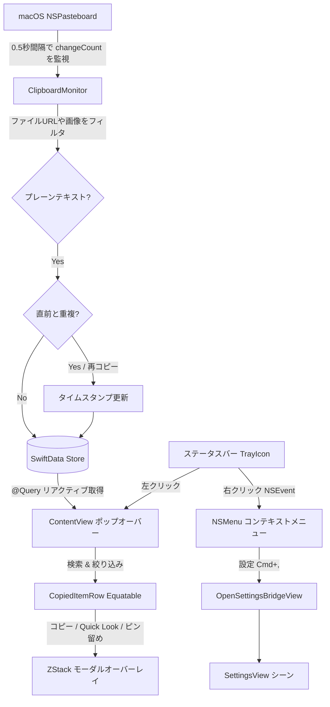

# C2V: macOS ステータスバーアプリ

**C2V** は、macOS のステータスバー（メニューバー）に常駐して動作する、軽量・モダン・プライバシー重視のクリップボード履歴管理アプリです。**SwiftUI**、**SwiftData**、そして Apple の **ServiceManagement** フレームワークを活用し、Dock を占有せず、バックグラウンドでの無駄なリソース消費を抑えた快適な操作性を実現しています。

本稿では、C2V の設計思想、アーキテクチャ、完全オフラインでのデータベース運用、バックグラウンドでのクリップボード監視、各種パフォーマンス最適化、そして Mac App Store へのリリース手順までの道のりを記録します。



---

## アプリ概要とリンク

### C2V とは？

macOS 向けのクリップボードマネージャーは多機能なものが多数存在しますが、肥大化してメモリや CPU を過剰に消費したり、過剰なアクセシビリティ権限を要求したり、外部サーバーへの通信を行うものも少なくありません。

C2V は、以下の 4 つのコア原則を掲げて開発されました：

1. **Dock に居座らない（Zero Dock Clutter）**: `LSUIElement = true` を設定したエージェントアプリとして動作し、macOS のステータスバー（メニューバー）のみに常駐します。
2. **100% オフライン＆プライベート（100% Offline & Private）**: コピーしたすべてのテキストはローカル Mac 内の SwiftData（暗号化ローカルストア）にのみ保存されます。トラッキング、アナリティクス、外部通信は一切行いません。
3. **直感的な操作性（Frictionless Workflow）**: インスタント全文検索、ピン留め（上部固定）、文字数・単語数・行数を即座に確認できる Quick Look インスペクター、ワンクリック全消去／未ピン留め消去。
4. **モダンな Apple デザイン（Modern Apple Aesthetics）**: Apple の **Liquid Glass** スタイルを採用し、旧 macOS バージョンでも適切なマテリアル（`.ultraThinMaterial`）へとフォールバックします。

### リンク

- **Mac App Store**: [C2V - コピペ記録アプリ (Mac App Store)](https://apps.apple.com/jp/app/c2v-%E3%82%B3%E3%83%94%E3%83%9A%E8%A8%98%E9%8C%B2%E3%82%A2%E3%83%97%E3%83%AA/id6798622919?mt=12)
- **ソースコード**: [GitHub リポジトリ](https://github.com/jinyongnan810/C2V)

https://apps.apple.com/jp/app/c2v-%E3%82%B3%E3%83%94%E3%83%9A%E8%A8%98%E9%8C%B2%E3%82%A2%E3%83%97%E3%83%AA/id6798622919?mt=12

https://github.com/jinyongnan810/C2V

---

## ステータスバーアプリの構築方法

従来の macOS 開発でメニューバーアプリを作るには、AppKit の `NSStatusItem` や `NSStatusBar` を直接扱う必要がありました。しかし macOS 13（Ventura）以降、SwiftUI に `MenuBarExtra` シーン API が導入され、SwiftUI ネイティブで構築できるようになりました。

### 1. `MenuBarExtra` シーンの宣言

`C2VApp.swift` では、メインシーンとして `MenuBarExtra` を定義しています：

```swift
@main
struct C2VApp: App {
    @State private var monitor: ClipboardMonitor

    var body: some Scene {
        MenuBarExtra {
            ContentView()
                .environment(monitor)
                .modelContainer(Self.sharedModelContainer)
        } label: {
            Image("TrayIcon")
                .renderingMode(.template)
                .resizable()
                .scaledToFit()
                .frame(width: 18, height: 18)
                .background(OpenSettingsBridgeView())
        }
        .menuBarExtraStyle(.window)

        Settings {
            SettingsView()
                .environment(monitor)
                .modelContainer(Self.sharedModelContainer)
        }
    }
}
```

ここで重要なのが `.menuBarExtraStyle(.window)` です：

- `.menu`: 標準的な AppKit スタイルの縦並びメニューリストを表示します。
- `.window`: 独立したポップオーバーウィンドウとして任意の SwiftUI ビューを表示できます。これにより、検索バー、スクロールリスト、カードUI、各種ボタンを自由自在に配置できます。

アイコン画像 `TrayIcon` には `.renderingMode(.template)` を指定しています。これにより、macOS のメニューバーがライトモードなら黒、ダークモードなら白へと自動で反転し、壁紙のアクセントカラーにも適切に馴染みます。

### 2. Dock や Cmd+Tab に表示させない設定（`LSUIElement`）

常駐型ユーティリティとして Dock や `Cmd + Tab` のアプリスイッチャーから非表示にするには、`LSUIElement` を有効化します。

- Xcode の場合: **Target** → **Build Settings** → **Info.plist Values** → **Application is agent (UIElement)** を `YES` に設定
- `project.pbxproj` の設定例：
  ```text
  INFOPLIST_KEY_LSUIElement = YES;
  ```

この設定により、アプリは純粋なバックグラウンドエージェントとして動作し、Dock を一切占有しません。

### 3. メニューバーアイコンの右クリック検知

標準の `MenuBarExtra` は、アイコンをクリックすると常にポップオーバーウィンドウを開閉します。SwiftUI 標準では「左クリック」と「右クリック」を区別するモディファイアが用意されていません。

しかし、メニューバーアプリでは「右クリック（または `Ctrl` + クリック）したときに **設定** や **終了** のメニューを表示したい」というニーズが一般的です。

C2V では `NSEvent.addLocalMonitorForEvents` を用いたイベントモニター `MenuBarExtraRightClickMonitor` を実装してこれを解決しています：

```swift
final class MenuBarExtraRightClickMonitor: NSObject {
    static let shared = MenuBarExtraRightClickMonitor()
    private var eventMonitor: Any?
    var onOpenSettings: (() -> Void)?

    func startMonitoring() {
        guard eventMonitor == nil else { return }

        eventMonitor = NSEvent.addLocalMonitorForEvents(
            matching: [.rightMouseDown, .leftMouseDown]
        ) { [weak self] event in
            guard let self else { return event }

            let isRightClick = event.type == .rightMouseDown
            let isControlLeftClick = event.type == .leftMouseDown &&
                                     event.modifierFlags.contains(.control)

            guard isRightClick || isControlLeftClick else {
                return event
            }

            // クリックが発生したウィンドウから NSStatusBarButton を再帰探索
            guard let window = event.window,
                  let statusBarButton = findStatusBarButton(in: window)
            else {
                return event
            }

            showContextMenu(for: statusBarButton, with: event)
            // nil を返すことで、標準の左クリック用ポップオーバー起動を抑止する
            return nil
        }
    }

    private func findStatusBarButton(in view: NSView) -> NSStatusBarButton? {
        if let button = view as? NSStatusBarButton {
            return button
        }
        for subview in view.subviews {
            if let button = findStatusBarButton(in: subview) {
                return button
            }
        }
        return nil
    }

    private func showContextMenu(for button: NSStatusBarButton, with event: NSEvent) {
        let menu = NSMenu()

        let settingsItem = NSMenuItem(
            title: NSLocalizedString("Settings", comment: ""),
            action: #selector(openSettings),
            keyEquivalent: ","
        )
        settingsItem.target = self
        menu.addItem(settingsItem)

        menu.addItem(NSMenuItem.separator())

        let quitItem = NSMenuItem(
            title: NSLocalizedString("Quit C2V", comment: ""),
            action: #selector(quitApp),
            keyEquivalent: "q"
        )
        quitItem.target = self
        menu.addItem(quitItem)

        button.isHighlighted = true
        NSMenu.popUpContextMenu(menu, with: event, for: button)
        button.isHighlighted = false
    }
}
```

クリックされたビュー階層を走査して `NSStatusBarButton` 上で起きた右クリックであることを確認し、イベントハンドラから `nil` を返すことで通常のポップオーバー展開をキャンセルし、ネイティブな `NSMenu` をポップアップさせます。

---

## 開いたウィンドウ内でダイアログやモーダルを表示する方法

`.menuBarExtraStyle(.window)` を使ったアプリで直面しやすい最大の落とし穴の一つが、ダイアログや確認アラートの表示です。

### なぜ標準の `.sheet` や `.confirmationDialog` ではダメなのか？

`MenuBarExtra` のウィンドウ内で SwiftUI 標準の `.sheet` や `.confirmationDialog` を呼び出すと、以下の問題が発生します：

1. `MenuBarExtra` のウィンドウは通常のメインウィンドウではなく、非アクティブなステータスバーパネル（`NSPanel`）として管理されている。
2. シートがポップオーバーの枠外にはみ出して描画崩れを起こしたり、フォーカスが外れて操作不能になる。
3. macOS のバージョンによっては、ダイアログ外をクリックした瞬間に `MenuBarExtra` ウィンドウ全体が閉じてしまい、操作が中断される。

### ウィンドウ内モーダルオーバーレイ（In-Window Overlay）による解決

C2V では、`ContentView.swift` のルートにある `ZStack` を使った **インウィンドウ・モーダルオーバーレイ方式** を採用しています：

```swift
ZStack {
    VStack(spacing: 0) {
        headerView
        Divider()
        searchAndFilterBar
        Divider()
        itemList(items: currentFilteredItems)
        Divider()
        footerView(itemCount: currentFilteredItems.count, pinnedCount: currentPinnedCount)
    }

    // モーダルオーバーレイ 1: 履歴消去の確認ダイアログ
    if showClearConfirmation {
        ClearConfirmationOverlay(
            onClearUnpinned: { /* ... */ },
            onClearAll: { /* ... */ },
            onCancel: { withAnimation { showClearConfirmation = false } }
        )
        .transition(.opacity.combined(with: .scale(scale: 0.95)))
    }

    // モーダルオーバーレイ 2: 詳細インスペクター
    if let item = selectedQuickLookItem {
        QuickLookOverlay(
            item: item,
            isQuickLookCopied: isQuickLookCopied,
            onClose: { withAnimation { selectedQuickLookItem = nil } },
            onCopy: { /* ... */ },
            onTogglePin: { /* ... */ },
            onDelete: { /* ... */ }
        )
        .transition(.opacity.combined(with: .scale(scale: 0.95)))
    }
}
.frame(width: 360, height: 480)
```

各オーバーレイは以下の要素で構成されています：

1. **半透明の暗色バックドロップ**:
   ```swift
   Color.black.opacity(0.4)
       .ignoresSafeArea()
       .onTapGesture { onCancel() }
   ```
   背景をタップすると即座に安全にモーダルが閉じます。
2. **中央に配置されたアクションカード**:
   角丸、影、Liquid Glass 効果（`.liquidGlassEffect(.regular, in: RoundedRectangle(cornerRadius: 14))`）を適用。
3. **アクセシビリティ対応**:
   `.accessibilityAddTraits(.isModal)` を付与し、VoiceOver 等のスクリーンリーダーに対してもモーダルとして認識させます。

#### 実装例 1: 選択的な履歴削除（`ClearConfirmationOverlay`）

履歴を整理したい際、「固定したお気に入りは残して、一時的なコピー履歴だけ消したい」という要望に応えるため、3 つの選択肢を提供しています：

- **未ピン留めアイテムを消去**: `!$0.isPinned` のアイテムのみを削除し、定型文やピン留めスニペットを保護。
- **すべて消去**: ピン留めを含め完全消去。
- **キャンセル**: 何も変更せず閉じる。

#### 実装例 2: Quick Look インスペクター（`QuickLookOverlay`）

各行の目のアイコンをクリックすると開くインスペクターです：

- 作成日時のローカライズ表示（`item.createdAt.formatted(date: .abbreviated, time: .shortened)`）。
- テキストの統計情報（文字数、単語数、行数）のリアルタイム表示。
- スクロール可能な等幅フォントテキスト（`.textSelection(.enabled)` で部分選択コピー可能）。
- コピー（成功時に 2 秒間チェックマーク表示）、ピン留め切り替え、削除ボタン。

---

## 設定ウィンドウ（Settings）の開き方

通常の macOS アプリでは、メニューバーの **アプリ名 → 設定...**（`Cmd + ,`）を選択すれば自動的に `Settings` シーンが開きます。しかし、Dock に表示されないエージェントアプリ（`LSUIElement = true`）には **メインメニューバーが存在しません**。

### 環境アクションが届かない問題

SwiftUI では macOS 14 以降、`@Environment(\.openSettings) private var openSettings` が提供されています。しかし、このアクションは **SwiftUI のビューツリー内** からしか呼び出せません。右クリックメニュー（AppKit の `NSMenuItem`）やシングルトン等の外部クラスからは直接参照できません。

### `OpenSettingsBridgeView` によるブリッジパターン

C2V では、`MenuBarExtra` のラベル部分に透明なブリッジ用ビューを埋め込むことでこの問題を解決しています：

```swift
MenuBarExtra {
    ContentView()
} label: {
    Image("TrayIcon")
        .renderingMode(.template)
        .background(OpenSettingsBridgeView()) // <-- ここに埋め込む
}
```

`OpenSettingsBridgeView` の中身：

```swift
private struct OpenSettingsBridgeView: View {
    @Environment(\.openSettings) private var openSettings

    var body: some View {
        Color.clear
            .onAppear {
                MenuBarExtraRightClickMonitor.shared.onOpenSettings = {
                    NSApp.activate(ignoringOtherApps: true)
                    if #available(macOS 14.0, *) {
                        openSettings()
                    } else {
                        NSApp.sendAction(Selector(("showSettingsWindow:")), to: nil, from: nil)
                    }
                }
            }
    }
}
```

### なぜ `NSApp.activate(ignoringOtherApps: true)` が重要か

バックグラウンドエージェントアプリの場合、単にウィンドウを表示するコマンドを送るだけでは、他のアプリの裏側に隠れて開いてしまうことがあります。`NSApp.activate(ignoringOtherApps: true)` を呼ぶことで、アプリを強制的に最前面へ引き上げ、設定ウィンドウを確実にユーザーの目の前に表示します。

---

## OS 起動時の自動起動（ログイン時起動）の検知と設定

クリップボード監視アプリにとって、Mac 起動時に自動で立ち上がる機能は必須です。

### 現代の `ServiceManagement` と従来手法の違い

過去の macOS では：

- `Contents/Library/LoginItems` にヘルパーアプリを同梱し、非推奨の `SMLoginItemSetEnabled` を呼ぶ
- `~/Library/LaunchAgents` に plist ファイルを書き出す

といった煩雑で壊れやすい手法が必要でした。macOS 13（Ventura）以降、Apple は **`SMAppService`** を導入し、ヘルパーアプリなしでメインアプリ自体を直接ログイン項目に登録できるようになりました。

### `LaunchAtLoginManager` の実装

C2V では、`SMAppService.mainApp` をラップしたシンプルな `@Observable` クラスを実装しています：

```swift
import Foundation
import Observation
import ServiceManagement

@MainActor
@Observable
final class LaunchAtLoginManager {
    var isEnabled: Bool = false

    init() {
        checkStatus()
    }

    /// macOS システム設定の現在の登録状況を取得
    func checkStatus() {
        if #available(macOS 13.0, *) {
            isEnabled = (SMAppService.mainApp.status == .enabled)
        }
    }

    /// ログイン項目の登録・解除を実行
    func setLaunchAtLogin(enabled: Bool) {
        if #available(macOS 13.0, *) {
            do {
                if enabled, SMAppService.mainApp.status != .enabled {
                    try SMAppService.mainApp.register()
                } else if !enabled, SMAppService.mainApp.status == .enabled {
                    try SMAppService.mainApp.unregister()
                }
                checkStatus()
            } catch {
                print("Failed to set Launch at Login: \(error)")
            }
        }
    }
}
```

### 実装上の注意点

1. **システム設定との同期**:
   `register()` を呼ぶと、macOS の **システム設定 → 一般 → ログイン項目と拡張機能** に自動登録されます。ユーザーはいつでもシステム設定側からトグルをオフにできるため、アプリ起動時や設定画面表示時に `checkStatus()` で実際の `status == .enabled` を再検証する必要があります。
2. **ステータスの種類**:
   - `.enabled`: 正常に有効化されている。
   - `.requiresApproval`: ユーザーの承認待ち、またはシステム側で制限されている。
   - `.notFound`: アプリが `/Applications` に配置されていない等でサービスが見つからない。

---

## SwiftData の完全オフライン運用

C2V は Apple の永続化フレームワーク **SwiftData** を使用し、すべてのデータをユーザーの Mac ローカルにのみ保存します。

### 1. データモデル定義

モデルは `CopiedItem` です：

```swift
import Foundation
import SwiftData

@Model
final class CopiedItem {
    @Attribute(.unique) var id: UUID
    var text: String
    var createdAt: Date
    var isPinned: Bool
    var characterCount: Int

    init(
        id: UUID = UUID(),
        text: String,
        createdAt: Date = Date(),
        isPinned: Bool = false,
        characterCount: Int? = nil
    ) {
        self.id = id
        self.text = text
        self.createdAt = createdAt
        self.isPinned = isPinned
        self.characterCount = characterCount ?? text.count
    }
}
```

初期化時に `characterCount`（文字数）を事前計算して保持しておくことで、リスト描画のたびに長い文字列のカウント処理が走るのを防いでいます。

### 2. データベース破損時の自動復旧（Self-Healing）

ローカルデータベースを扱うデスクトップアプリでは、スキーマ変更の不一致や強制終了による SQLite の WAL（Write-Ahead Log）破損によって、アプリ起動時にクラッシュしてしまうリスクが常に存在します。

C2V では `C2VApp.swift` に自動復旧機構を組み込んでいます：

```swift
static let sharedModelContainer: ModelContainer = {
    let schema = Schema([CopiedItem.self])
    let modelConfiguration = ModelConfiguration(schema: schema, isStoredInMemoryOnly: false)
    HistoryLimitManager.setupDefaultLimitIfNeeded()

    do {
        return try ModelContainer(for: schema, configurations: [modelConfiguration])
    } catch {
        print("Failed to initialize persistent ModelContainer: \(error). Reconstructing database...")
        // 移行失敗やファイル破損時、古い SQLite ストアと WAL/SHM ファイルを削除してクリーン再生成
        if let storeURL = modelConfiguration.url as URL? {
            let fileManager = FileManager.default
            try? fileManager.removeItem(at: storeURL)
            let walURL = URL(fileURLWithPath: storeURL.path + "-wal")
            let shmURL = URL(fileURLWithPath: storeURL.path + "-shm")
            try? fileManager.removeItem(at: walURL)
            try? fileManager.removeItem(at: shmURL)
            let altWalURL = storeURL.deletingPathExtension().appendingPathExtension("store-wal")
            let altShmURL = storeURL.deletingPathExtension().appendingPathExtension("store-shm")
            try? fileManager.removeItem(at: altWalURL)
            try? fileManager.removeItem(at: altShmURL)
        }
        do {
            return try ModelContainer(for: schema, configurations: [modelConfiguration])
        } catch {
            fatalError("Could not reconstruct ModelContainer: \(error)")
        }
    }
}()
```

もしデータベースの初期化に失敗した場合、孤立した `.store`、`-wal`、`-shm` ファイルをクリーンアップしてコンテナを再作成します。これにより、アップデート時などにアプリが二度と起動しなくなる事故を防いでいます。

### 3. リアクティブなデータ取得

UI（`ContentView.swift`）では `@Query` を使用します：

```swift
@Query(sort: \CopiedItem.createdAt, order: .reverse) private var items: [CopiedItem]
```

バックグラウンドで新しいクリップボード内容が追加されたり、削除されたりすると、`@Query` が自動的に変更を検知して SwiftUI のリストをリアクティブに更新します。

---

## バックグラウンドでのクリップボード処理

### 1. `changeCount` による高効率ポーリング

macOS にはクリップボードが更新された瞬間にOSから通知を受け取るグローバルイベントが存在しません。そのため、`NSPasteboard.general.changeCount` を定期的に確認するアプローチが標準的です。

毎回文字列の中身を取得して比較するのではなく、まずは整数値の `changeCount` を比較します：

```swift
private func checkPasteboard(modelContext: ModelContext) {
    let currentChangeCount = pasteboard.changeCount
    guard currentChangeCount != lastChangeCount else { return }
    lastChangeCount = currentChangeCount

    // カウントが変化した時だけ中身を検査
    // ...
}
```

ポーリングタイマーは **0.5 秒間隔** で動作します。整数の比較だけであれば CPU 負荷は 0.01% 未満であり、バッテリー消費への影響は皆無です。

### 2. 厳格なテキスト判定（ファイルや画像の除外）

クリップボード監視アプリでありがちな不満が、「Finder でファイルをコピーしたときに長いファイルパスが記録される」「スクリーンショットを撮ったときに巨大な画像バイナリが記録される」という点です。

C2V では `pasteboard.types` を検証し、テキストのみを厳密に対象としています：

```swift
// ファイルURL（Finderでのファイル・フォルダコピー）は除外
let types = pasteboard.types ?? []
if types.contains(.fileURL) || types.contains(NSPasteboard.PasteboardType("public.file-url")) {
    return
}

// プレーンテキストとして取得できるか
guard let text = pasteboard.string(forType: .string) else { return }

let trimmed = text.trimmingCharacters(in: .whitespacesAndNewlines)
guard !trimmed.isEmpty else { return }
```

### 3. 重複の防止と再コピーの挙動

同じ文字列が連続してコピーされた場合、重複して新規作成するのを防ぎます：

```swift
var fetchDescriptor = FetchDescriptor<CopiedItem>(
    sortBy: [SortDescriptor(\.createdAt, order: .reverse)]
)
fetchDescriptor.fetchLimit = 1

if let latest = try? modelContext.fetch(fetchDescriptor).first, latest.text == text {
    return // 最新のものと同一なら保存をスキップ
}
```

### 4. 自己コピーの無限ループ防止

ユーザーが C2V 内のリストをクリックしてテキストを再度クリップボードにコピーした際、何もしないと C2V 自体がそれを「新しいクリップボード変更」として検知してしまいます。

これを防ぐため、アプリ側からクリップボードへ書き込む際に `lastChangeCount` を即座に同期させます：

```swift
func copyToClipboard(_ text: String, modelContext: ModelContext) {
    pasteboard.clearContents()
    pasteboard.setString(text, forType: .string)

    // 自らの書き込みで上がった changeCount を即座に同期し、次回の監視で検知させない
    lastChangeCount = pasteboard.changeCount

    // 既存アイテムのタイムスタンプを更新し、履歴の最上部に移動させる
    var fetchDescriptor = FetchDescriptor<CopiedItem>(
        predicate: #Predicate { $0.text == text }
    )
    fetchDescriptor.fetchLimit = 1

    if let item = try? modelContext.fetch(fetchDescriptor).first {
        item.createdAt = Date()
        try? modelContext.save()
    }
}
```

---

## 本プロジェクトで行った最適化

本プロジェクトで実施した主なチューニング内容は以下の通りです。Git コミット履歴からもその変遷が確認できます：

### 1. リスト行の重いマテリアル（ぼかし効果）をフラットカラーへ置換

初期実装では、各行のアクションボタン（クイックルック、ピン留め、削除）の背景に `.ultraThinMaterial` などの半透明マテリアルを使用していました。しかし、リストに 50〜100 件並ぶと、スクロール時に数十枚のリアルタイムぼかしレイヤーが重なり、WindowServer の GPU 負荷が急増してスクロールのカクつきが発生していました。

**最適化内容**: 行内ボタンの背景を、軽量なフラット透過色へと変更しました：

```swift
// 変更前: 1行ごとに3つのリアルタイムぼかしマテリアル
.background(.ultraThinMaterial, in: Circle())

// 変更後: 高速な単色透過塗り
.background(Circle().fill(Color.primary.opacity(0.08)))
```

この修正により、何十件スクロールしても 60/120fps を維持できるようになり、GPU 使用率が劇的に削減されました。

### 2. `CopiedItemRow` の `Equatable` 準拠による再描画スキップ

SwiftUI では親ビュー（`ContentView`）で検索文字を一文字入力するたびに、デフォルトではリスト内の全行の `body` が再評価されてしまいます。

**最適化内容**: 行ビューを `Equatable` に準拠させ、`.equatable()` モディファイアを適用しました：

```swift
extension CopiedItemRow: Equatable {
    static func == (lhs: CopiedItemRow, rhs: CopiedItemRow) -> Bool {
        lhs.item.id == rhs.item.id &&
        lhs.item.createdAt == rhs.item.createdAt &&
        lhs.item.isPinned == rhs.item.isPinned &&
        lhs.item.characterCount == rhs.item.characterCount
    }
}
```

値が変わっていない行の再描画を SwiftUI が自動でスキップするため、文字入力中の検索レスポンスが極めて高速になりました。

### 3. レンダリング時の計算メモ化（Memoization）

`ContentView.swift` 内で、リスト描画、ヘッダーバッジ、フッターの件数表示などで「絞り込み済みアイテム一覧」や「ピン留め件数」が複数回参照されていました。計算プロパティのまま複数箇所から呼ぶと、1 回の描画パスの中で不要なループが重複実行されます。

**最適化内容**: `body` の先頭で一度だけ変数に退避し、各サブビューへ渡すように改善しました：

```swift
var body: some View {
    let currentFilteredItems = filteredItems
    let currentPinnedCount = pinnedCount
    // ...
}
```

### 4. `onScrollGeometryChange` によるネイティブスクロール追跡

以前はスクロール位置を判定するために、リスト先頭に高さ 0 の `GeometryReader` を配置して PreferenceKey でオフセットを伝えるハックを使っていました。この手法はレイアウトの再計算を誘発し、ポップオーバーを開いた瞬間に「トップへ戻る」ボタンが一瞬チラつく（flicker）原因になっていました。

**最適化内容**: macOS 14+ で導入されたネイティブの `onScrollGeometryChange` に置換：

```swift
List {
    // ...
}
.onScrollGeometryChange(for: Bool.self) { geometry in
    geometry.contentOffset.y > 20
} action: { oldValue, newValue in
    if oldValue != newValue {
        withAnimation(.easeInOut(duration: 0.2)) {
            isScrolledDown = newValue
        }
    }
}
```

レイアウトパスに干渉することなく、スクロール量が 20px を超えたときだけスムーズにボタンが表示されるようになりました。

### 5. 毎時バッチ処理によるデータベーストリム

コピーが発生するたびに上限超過アイテムの削除クエリを発行すると、頻繁にテキストをコピーする作業中に無駄なディスク I/O が発生します。

C2V では、トリム処理を以下のタイミングに限定しています：

- アプリ起動時
- 設定画面を閉じた時
- バックグラウンドタイマーによる **1 時間に 1 回** の定期実行

```swift
cleanupTimer = Timer.scheduledTimer(withTimeInterval: 3600, repeats: true) { [weak self] _ in
    Task { @MainActor [weak self] in
        if let self, let context = self.modelContext {
            trimOldItemsIfNeeded(modelContext: context)
        }
    }
}
```

---

## Mac App Store リリース記録

Mac App Store への公開にあたり、App Sandbox の制約対応や各種コンプライアンス設定、審査提出に向けた作業を実施しました。

### 1. App Sandbox と Entitlements の設定

Mac App Store に提出するアプリでは App Sandbox の有効化が必須となるため、Xcode の Build Settings で以下の設定を行いました：

- `ENABLE_APP_SANDBOX = YES`
- `ENABLE_HARDENED_RUNTIME = YES`

> [!NOTE]
> **サンドボックス権限に関する確認メモ**:
> クリップボードの監視・操作を行うにあたり特別な Entitlement（例外権限）が必要か調査したところ、ユーザー操作に基づく `NSPasteboard.general` の通常の読み書きは App Sandbox 内で標準許可されていることがわかりました。そのため、特別な例外権限を追加することなく実装を完了できました。

### 2. 暗号化輸出コンプライアンス（ITSAppUsesNonExemptEncryption）

App Store Connect に新しいビルドをアップロードするたびに輸出管理コンプライアンスの確認ダイアログが表示されるのを防ぐため、`Info.plist` に以下のキーを追加しました：

```text
INFOPLIST_KEY_ITSAppUsesNonExemptEncryption = NO;
```

これを設定したことで、ビルドアップロード後のコンプライアンス確認ステップを自動でパスできるようになりました。

### 3. アプリカテゴリとアセットの準備

- **カテゴリ指定**: ユーティリティカテゴリとして審査に提出するため、以下の設定を追加しました：
  ```text
  INFOPLIST_KEY_LSApplicationCategoryType = "public.app-category.utilities";
  ```
- **アプリアイコン**: 16x16 から 1024x1024 までの各サイズ（`c2v.icon` および `AppIcon.appiconset`）を用意しました。
- **メニューバー用アイコン（`TrayIcon`）**: ライト／ダーク両方のメニューバーで適切に反転表示されるよう、白黒のテンプレート画像（SVG / PNG）を作成して登録しました。

### 4. プライバシーポリシーの整備

Apple の審査ではクリップボードデータを扱うアプリのプライバシーポリシーが厳格にチェックされるため、GitHub 上に英語および日本語のポリシーを用意して公開しました：

- [PRIVACY_POLICY.md](https://github.com/jinyongnan810/C2V/blob/main/PRIVACY_POLICY.md)
- [PRIVACY_POLICY_JA.md](https://github.com/jinyongnan810/C2V/blob/main/PRIVACY_POLICY_JA.md)

主に以下の点を明記しました：

- コピーされたデータはすべてローカルデバイス内にのみ保存されること。
- 外部サーバーへの通信、トラッキング、アナリティクス、広告 SDK は一切含まれないこと。
- ユーザー自身がいつでも履歴を全消去できること。

### 5. ビルド・公証・審査提出

ビルドとアップロードには **Xcode Cloud** および Xcode Organizer を活用し、**App Store Connect** 上でリリースに向けたメタデータ設定を実施しました。

#### 1. ビルド作成とアップロード

Xcode の **Product → Archive** からビルドを作成し、App Store 向けのバリデーションを通過させた上で App Store Connect へアップロード（および TestFlight 配信）を行いました。

> [!WARNING]
> **Xcode Beta 版利用時の落とし穴（Xcode Cloud の `objectVersion` エラー）**:
> Xcode Beta 版で開発作業を行っていたところ、`project.pbxproj` の `objectVersion` が自動的に `110` などの新しいバージョンに更新されてしまい、Xcode Cloud 側が対応しておらずビルドが reject される問題に遭遇しました。
> そのため、`project.pbxproj` をエディタで直接開き、`objectVersion` を `56`（標準の互換バージョン）に戻す修正を実施しました。`56` に戻したところ、Xcode Cloud で正常にビルドが通るようになり、アプリのランタイム動作にも影響がないことを確認できました。

#### 2. 多言語対応（ローカライゼーション）の事前追加

> [!NOTE]
> リリースバージョン側で多言語のメタデータ（スクリーンショットや説明文）を設定しようとしたところ、言語選択肢に表示されない問題がありました。調査した結果、**事前に「一般」→「アプリ情報」で対象言語を追加しておく必要がある**ことがわかったため、まずアプリ情報側で言語を追加した上でリリース設定を進めました。


#### 3. バージョン情報とスクリーンショットの設定

各言語向けに、macOS デスクトップ上でステータスバーのポップオーバーを開いた状態のスクリーンショットを撮影・登録し、プロモーション用テキストやアプリの概要説明文を設定しました。


#### 4. キーワード・サポートURL・ビルドの紐付け

検索キーワード、サポート URL（GitHub リポジトリ等）、マーケティング URL、著作権表記を入力し、アップロード済みのビルドを選択して紐付けを行いました。


#### 5. App Review（審査員向け情報）の入力

常駐型アプリ（`LSUIElement = true`）は起動しても Dock にアイコンが表示されないため、審査員が操作方法に迷ってリジェクトされるのを防ぐ目的で、「App Reviewに関する情報」のメモ欄にステータスバーアイコンをクリックして操作する旨や機能概要を詳しく記載しました。


#### 6. 価格および配信状況の設定

価格設定（無料配信、対象の国・地域）、税金カテゴリ、App Store での一般公開設定を完了させ、最終的な審査提出を行いました。


---

## まとめ

C2V は、**SwiftUI MenuBarExtra**、**SwiftData**、**ServiceManagement** というモダンな Apple の標準フレームワークを組み合わせることで、最小限のコード量で高機能かつプライバシーに配慮した macOS 常駐アプリを作れることを実証したプロジェクトです。

さらに、インウィンドウ・モーダルオーバーレイの導入や、重いマテリアル描画の排除、`Equatable` による再描画抑制といった細やかな最適化を施すことで、日常的に使い続けられる快適なユーティリティに仕上がっています。
