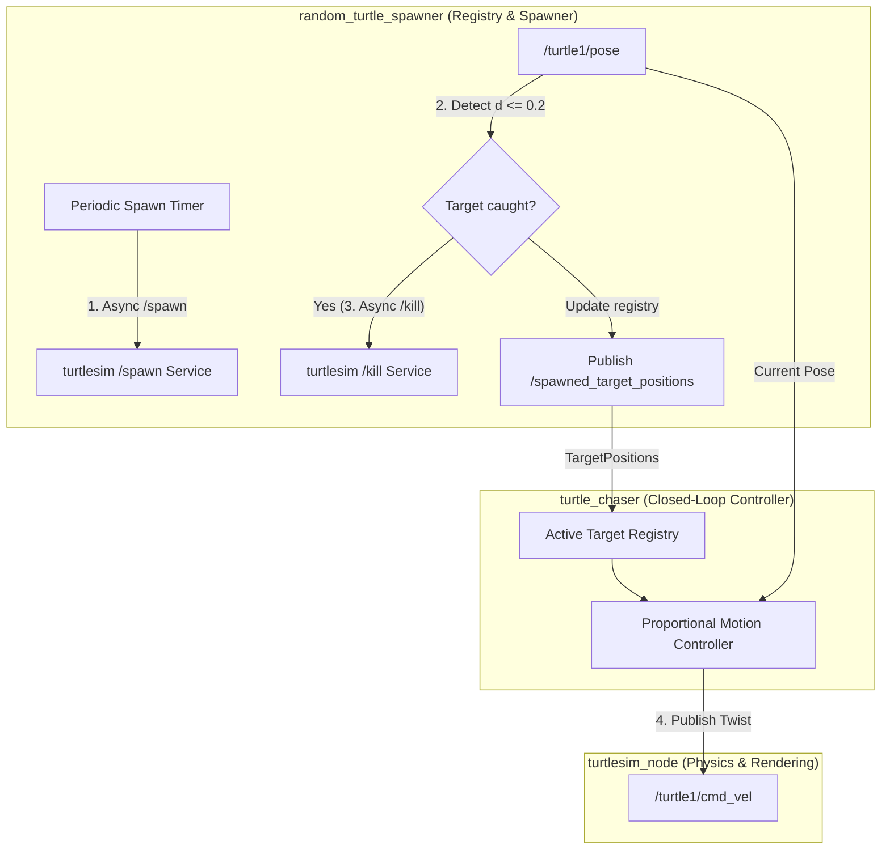
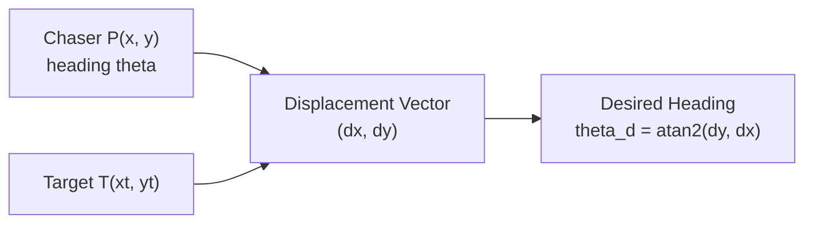
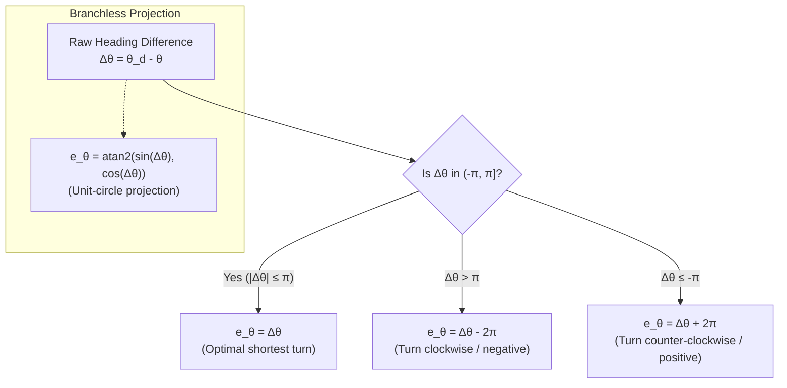
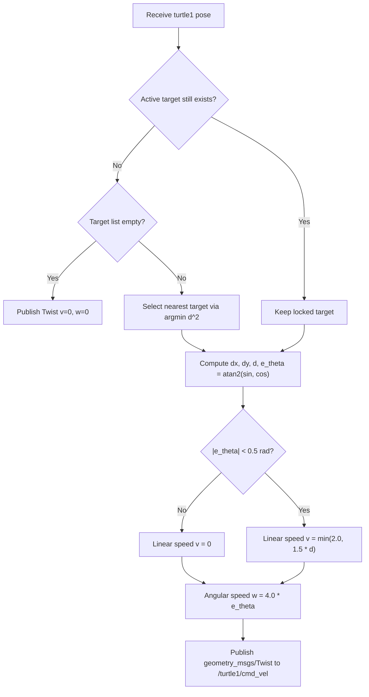

# Chasing turtle

This explores **The Chasing Turtle Problem**—a complete multi-agent robotics solution implemented in ROS 2 Jazzy.

---

## 1. Problem Statement: Autonomous Multi-Target Pursuit

In a 2D continuous coordinate plane (Turtlesim), we want to build a fully autonomous multi-node robotics system that solves the following challenge:

1. **Target Generation:** Targets randomly spawn at coordinates $(x \in [1.0, 10.0], y \in [1.0, 10.0])$ at a configurable time interval.
2. **Registry Distribution:** An active target registry is maintained and broadcasted to all listening nodes in real time.
3. **Autonomous Navigation:** An autonomous chaser robot (`turtle1`) continuously tracks the nearest available target, steers towards it using closed-loop proportional feedback, and smoothly slows down upon approach.
4. **Target Capture & Lifecycle:** When the chaser reaches within distance $d \le 0.2$ of the active target, the target is destroyed via a service call, removed from the registry, and the chaser seamlessly locks onto the next closest target.



---

## 2. System Architecture & Node Roles

The system decomposes into three distinct nodes communicating over Topics and Services:

| Node                    | Type        | Responsibility                                                                                                                | ROS 2 Interfaces Used                                                                                |
| :---------------------- | :---------- | :---------------------------------------------------------------------------------------------------------------------------- | :--------------------------------------------------------------------------------------------------- |
| `turtlesim_node`        | Simulator   | Simulates robot physics and screen rendering.                                                                                 | Provides `/spawn`, `/kill`, `/turtle1/pose`, `/turtle1/cmd_vel`                                      |
| `random_turtle_spawner` | Coordinator | Spawns targets at random coordinates, monitors distance to targets, calls `/kill` upon capture, and publishes active targets. | Client of `/spawn`, `/kill`; Subscriber of `/turtle1/pose`; Publisher of `/spawned_target_positions` |
| `turtle_chaser`         | Controller  | Selects nearest target, locks on until captured, and computes steering / velocity control signals.                            | Subscriber of `/spawned_target_positions`, `/turtle1/pose`; Publisher of `/turtle1/cmd_vel`          |

---

## 3. Custom Message Interfaces

To communicate the active targets between the spawner and chaser, we define two custom messages inside a `chasing_interfaces` package:

### 1. Single Target Definition (`Target.msg`)

```text
# chasing_interfaces/msg/Target.msg
string name
geometry_msgs/Point position
```

### 2. Target Array Registry (`TargetPositions.msg`)

```text
# chasing_interfaces/msg/TargetPositions.msg
chasing_interfaces/Target[] targets
```

---

## 4. Mathematical Derivation & Control Laws

Let the current chaser pose be:

$$
P = (x, y, \theta)
$$

and the selected target coordinates be:

$$
T = (x_t, y_t)
$$

The displacement vector from robot to target is:

$$
\Delta x = x_t - x, \qquad \Delta y = y_t - y
$$



### 1. Nearest Target Selection (Optimization)

When no target is currently locked, the chaser evaluates the squared Euclidean distance to each target in the registry:

$$
d_i^2 = (x_i - x)^2 + (y_i - y)^2
$$

and selects the optimal index $i^*$:

$$
i^* = \operatorname*{arg\,min}_i d_i^2
$$

> **Why Squared Distance?** Computing the square root $\sqrt{\cdot}$ is computationally expensive. Because $f(u) = u^2$ is strictly monotonic for non-negative distances, $d_a^2 < d_b^2 \iff d_a < d_b$. Squaring preserves ordering without running unnecessary square root instructions.

### 2. Target Locking Principle

To avoid chaotic oscillations (where a robot rapidly switches back and forth between two equidistant targets), the controller **locks onto the selected target name** and pursues it exclusively until that target is confirmed destroyed.

### 3. Heading Calculation & Angle Wrapping

The Euclidean distance and desired steering angle are:

$$
d = \sqrt{\Delta x^2 + \Delta y^2}, \qquad \theta_d = \operatorname{atan2}(\Delta y, \Delta x)
$$

A direct angle difference $\Delta\theta = (\theta_d - \theta)$ causes discontinuity across the boundary $\pm \pi$. For example, if the current heading is $+179^\circ$ ($\approx +3.12\text{ rad}$) and the desired heading is $-179^\circ$ ($\approx -3.12\text{ rad}$), a naive subtraction yields $-358^\circ$, causing the robot to turn almost a complete circle instead of taking the optimal $2^\circ$ shortest turn.

To unconditionally map heading error to the interval $[-\pi, \pi]$, we project the angle difference onto the unit circle:



#### Formulation 1: Unit-Circle Projection (`atan2`)

$$
e_\theta = \operatorname{atan2}\left(\sin(\theta_d - \theta),\ \cos(\theta_d - \theta)\right)
$$

- **Branchless:** No `if/else` branching logic.
- **Universal:** Works for any raw difference $\Delta\theta \in (-\infty, \infty)$ (even if angles accumulated multi-turn rotations).

#### Formulation 2: Conditional Range Shift (`if / else`)

Because both $\theta_d \in (-\pi, \pi]$ and $\theta \in (-\pi, \pi]$, their difference $\Delta\theta \in (-2\pi, 2\pi)$. Thus at most a single addition or subtraction of $2\pi$ is ever needed:

```python
e_theta = theta_d - theta

if e_theta > math.pi:
    e_theta -= 2 * math.pi
elif e_theta <= -math.pi:
    e_theta += 2 * math.pi
```

| Method                   | Advantages                                              | Considerations                                            |
| :----------------------- | :------------------------------------------------------ | :-------------------------------------------------------- |
| **`atan2(sin, cos)`**    | • Branchless<br>• Handles any angle $(-\infty, \infty)$ | • Minor trigonometric computation cost                    |
| **`if / else` shifting** | • Extremely simple arithmetic<br>• Intuitive            | • Assumes inputs are already bounded within $(-\pi, \pi]$ |

### 4. Proportional Velocity Controller

The control policy calculates angular speed $\omega$ and linear speed $v$:

1. **Angular Velocity (Steering):** Proportional to heading error:

$$
\omega = k_\omega \cdot e_\theta \quad (k_\omega = 4.0)
$$

2. **Linear Velocity (Forward Motion):** Capped proportional speed, gated by heading alignment:

$$
v = \begin{cases} \min(v_{\max}, k_v \cdot d), & |e_\theta| < 0.5\text{ rad} \\ 0, & |e_\theta| \ge 0.5\text{ rad} \end{cases} \quad (k_v = 1.5, v_{\max} = 2.0)
$$

**Intuition:**

- When poorly aligned ($|e_\theta| \ge 0.5\text{ rad} \approx 28.6^\circ$), the robot **stops forward motion and rotates in place**.
- Once aligned ($|e_\theta| < 0.5\text{ rad}$), it moves forward at high speed when far away, and smoothly decelerates as it closes in on the target.



---

## 5. Implementation

### 1. `random_turtle_spawner` (Coordinator Node)

Key implementation challenges solved:

- **Asynchronous Service Invocations:** Uses `call_async` / `async_send_request` with future completion callbacks to prevent thread starvation.
- **In-flight Request Guards:** Uses `request_pending` flag and a `pending_kills` set so rapid timer ticks or high-frequency pose callbacks do not fire duplicate concurrent requests.

#### Python (`random_turtle_spawner.py`)

```python
#!/usr/bin/env python3
import math
import random
import rclpy
from geometry_msgs.msg import Point
from rclpy.node import Node
from turtlesim.msg import Pose
from turtlesim.srv import Kill, Spawn
from chasing_interfaces.msg import Target, TargetPositions

class RandomTurtleSpawner(Node):
    def __init__(self):
        super().__init__("random_turtle_spawner")

        duration = self.declare_parameter("duration", 2.0).value
        self.spawn_client = self.create_client(Spawn, "/spawn")
        self.kill_client = self.create_client(Kill, "/kill")
        self.positions_publisher = self.create_publisher(
            TargetPositions, "/spawned_target_positions", 10
        )
        self.pose_subscription = self.create_subscription(
            Pose, "/turtle1/pose", self.handle_pose, 10
        )

        self.target_positions = TargetPositions()
        self.pending_kills = set()
        self.request_pending = False
        self.timer = self.create_timer(duration, self.spawn_turtle)

    def spawn_turtle(self):
        if not self.spawn_client.service_is_ready() or self.request_pending:
            return

        request = Spawn.Request()
        request.x = random.uniform(1.0, 10.0)
        request.y = random.uniform(1.0, 10.0)
        request.theta = random.uniform(0.0, 2.0 * math.pi)
        self.request_pending = True

        future = self.spawn_client.call_async(request)
        future.add_done_callback(
            lambda fut: self.spawn_finished(fut, request)
        )

    def spawn_finished(self, future, request):
        self.request_pending = False
        try:
            response = future.result()
        except Exception as err:
            self.get_logger().error(f"Spawn failed: {err}")
            return

        target = Target(
            name=response.name,
            position=Point(x=float(request.x), y=float(request.y)),
        )
        self.target_positions.targets.append(target)
        self.positions_publisher.publish(self.target_positions)
        self.get_logger().info(f"Spawned {response.name} at ({request.x:.2f}, {request.y:.2f})")

    def handle_pose(self, pose):
        if not self.kill_client.service_is_ready():
            return

        for target in self.target_positions.targets:
            dx = pose.x - target.position.x
            dy = pose.y - target.position.y
            if dx * dx + dy * dy > 0.2**2 or target.name in self.pending_kills:
                continue

            request = Kill.Request(name=target.name)
            self.pending_kills.add(target.name)
            future = self.kill_client.call_async(request)
            future.add_done_callback(
                lambda fut, name=target.name: self.kill_finished(fut, name)
            )

    def kill_finished(self, future, name):
        self.pending_kills.discard(name)
        try:
            future.result()
        except Exception as err:
            self.get_logger().error(f"Failed to kill {name}: {err}")
            return

        self.target_positions.targets = [
            t for t in self.target_positions.targets if t.name != name
        ]
        self.positions_publisher.publish(self.target_positions)
        self.get_logger().info(f"Captured and cleared target {name}")
```

---

### 2. `turtle_chaser` (Controller Node)

#### C++ (`turtle_chaser.cpp`)

```cpp
#include <algorithm>
#include <cmath>
#include <memory>
#include <string>

#include "chasing_interfaces/msg/target_positions.hpp"
#include "geometry_msgs/msg/twist.hpp"
#include "rclcpp/rclcpp.hpp"
#include "turtlesim/msg/pose.hpp"

class TurtleChaser : public rclcpp::Node
{
public:
    TurtleChaser() : Node("turtle_chaser")
    {
        target_subscription_ = create_subscription<chasing_interfaces::msg::TargetPositions>(
            "/spawned_target_positions", 10,
            [this](const chasing_interfaces::msg::TargetPositions::SharedPtr msg) {
                target_positions_ = *msg;
            });

        pose_subscription_ = create_subscription<turtlesim::msg::Pose>(
            "/turtle1/pose", 10,
            std::bind(&TurtleChaser::handle_pose, this, std::placeholders::_1));

        velocity_publisher_ = create_publisher<geometry_msgs::msg::Twist>("/turtle1/cmd_vel", 10);
    }

private:
    void handle_pose(const turtlesim::msg::Pose::SharedPtr pose)
    {
        geometry_msgs::msg::Twist command;
        if (target_positions_.targets.empty())
        {
            selected_target_name_.clear();
            velocity_publisher_->publish(command);
            return;
        }

        // Check if previously selected target is still active
        auto selected_target = std::find_if(
            target_positions_.targets.begin(), target_positions_.targets.end(),
            [this](const auto &target) { return target.name == selected_target_name_; });

        // If target was killed or not chosen yet, select nearest by squared distance
        if (selected_target == target_positions_.targets.end())
        {
            selected_target = std::min_element(
                target_positions_.targets.begin(), target_positions_.targets.end(),
                [&pose](const auto &a, const auto &b) {
                    const auto dax = a.position.x - pose->x;
                    const auto day = a.position.y - pose->y;
                    const auto dbx = b.position.x - pose->x;
                    const auto dby = b.position.y - pose->y;
                    return (dax * dax + day * day) < (dbx * dbx + dby * dby);
                });
            selected_target_name_ = selected_target->name;
            RCLCPP_INFO(get_logger(), "Locked target: %s", selected_target_name_.c_str());
        }

        const auto delta_x = selected_target->position.x - pose->x;
        const auto delta_y = selected_target->position.y - pose->y;
        const auto distance = std::hypot(delta_x, delta_y);
        const auto desired_heading = std::atan2(delta_y, delta_x);

        // Normalize heading error to [-pi, pi]
        const auto heading_error = std::atan2(
            std::sin(desired_heading - pose->theta),
            std::cos(desired_heading - pose->theta)
        );

        // Proportional angular steering
        command.angular.z = 4.0 * heading_error;

        // Proportional linear speed gated by heading alignment
        if (std::abs(heading_error) < 0.5)
        {
            command.linear.x = std::min(2.0, 1.5 * distance);
        }

        velocity_publisher_->publish(command);
    }

    rclcpp::Subscription<chasing_interfaces::msg::TargetPositions>::SharedPtr target_subscription_;
    rclcpp::Subscription<turtlesim::msg::Pose>::SharedPtr pose_subscription_;
    rclcpp::Publisher<geometry_msgs::msg::Twist>::SharedPtr velocity_publisher_;
    chasing_interfaces::msg::TargetPositions target_positions_;
    std::string selected_target_name_;
};

int main(int argc, char *argv[])
{
    rclcpp::init(argc, argv);
    rclcpp::spin(std::make_shared<TurtleChaser>());
    rclcpp::shutdown();
    return 0;
}
```

---

## 6. System Launch & Orchestration

Using an XML launch file, we orchestrate the entire multi-node system with a single command:

```xml
<!-- chasing_py_pkg/launch/random_turtle_spawner.launch.xml -->
<launch>
  <arg name="duration" default="2.0"/>

  <node pkg="turtlesim" exec="turtlesim_node" name="turtlesim_node"/>
  <node pkg="chasing_py_pkg" exec="random_turtle_spawner" name="random_turtle_spawner">
    <param name="duration" value="$(var duration)"/>
  </node>
  <node pkg="chasing_py_pkg" exec="turtle_chaser" name="turtle_chaser"/>
</launch>
```

### Execution Commands

```bash
# Build the workspace
colcon build --packages-up-to chasing_cpp_pkg chasing_py_pkg
source install/setup.bash

# Run Python System
ros2 launch chasing_py_pkg random_turtle_spawner.launch.xml duration:=2.0

# Or Run C++ System
ros2 launch chasing_cpp_pkg random_turtle_spawner.launch.xml duration:=2.0
```

---

## 7. Live System Introspection & Telemetry

While the simulation is running, inspect the live topics and computational graph:

```bash
# Inspect the active target list
ros2 topic echo /spawned_target_positions

# Inspect velocity commands sent to the motor driver
ros2 topic echo /turtle1/cmd_vel

# Visual graph of communicating nodes
rqt_graph
```
