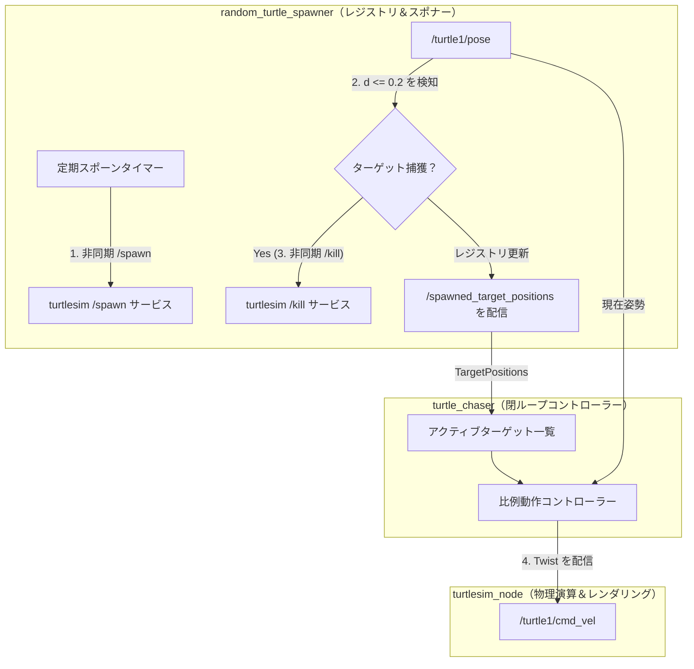
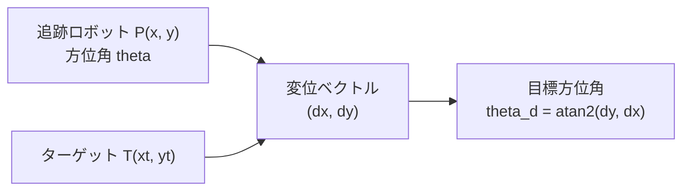
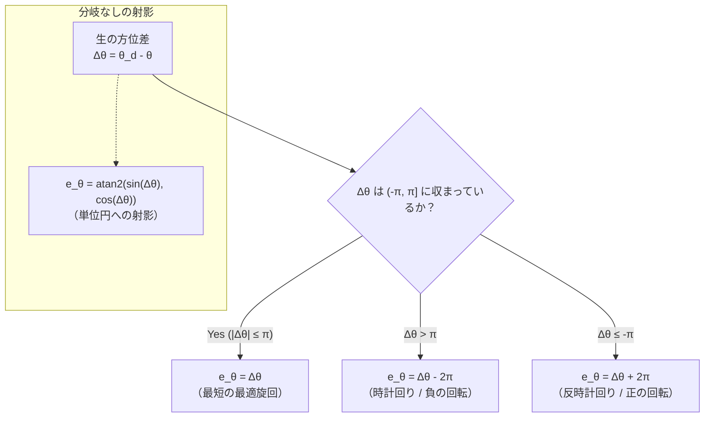
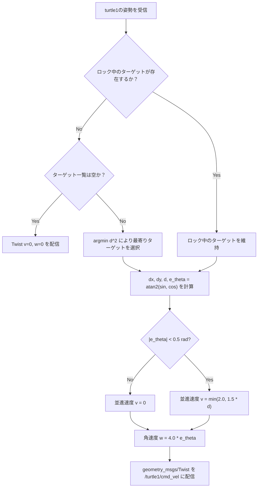

# カメ追いかけ問題（Chasing Turtle）

ROS 2 Jazzy で実装された完全なマルチエージェントロボティクスソリューションである **「カメ追いかけ問題（The Chasing Turtle Problem）」** について解説します。

https://github.com/jinyongnan810/ros-practice/tree/main/4.ex.chasing-turtle

---

## 1. 課題設定: 自律型複数ターゲット追従

2D連続座標平面（Turtlesim）において、以下の課題を解決する完全自律型のマルチノードロボットシステムを構築します:

1. **ターゲット生成:** 設定可能な時間間隔で、座標 $(x \in [1.0, 10.0], y \in [1.0, 10.0])$ にターゲットがランダムに出現（スポーン）する。
2. **レジストリ配信:** アクティブなターゲット一覧（レジストリ）が保持され、受信するすべてのノードにリアルタイムで配信される。
3. **自律ナビゲーション:** 追跡ロボット（`turtle1`）が現在利用可能な最も近いターゲットを常に追跡し、閉ループ比例フィードバックを用いてその方向へ操舵し、接近時にスムーズに減速する。
4. **ターゲット捕獲とライフサイクル:** 追跡ロボットがターゲットとの距離 $d \le 0.2$ 以内に到達すると、サービスコールを通じてターゲットが消去（kill）され、レジストリから削除され、ロボットはシームレスに次の最寄りのターゲットをロックオンする。



---

## 2. システムアーキテクチャとノードの役割

システムはTopicとServiceを介して通信する3つの独立したノードに分割されます:

| ノード名                | 種別             | 役割・責務                                                                                                                      | 使用するROS 2インターフェース                                                                                      |
| :---------------------- | :--------------- | :------------------------------------------------------------------------------------------------------------------------------ | :----------------------------------------------------------------------------------------------------------------- |
| `turtlesim_node`        | シミュレータ     | ロボットの物理挙動と画面描画をシミュレートする。                                                                                | `/spawn`, `/kill`, `/turtle1/pose`, `/turtle1/cmd_vel` を提供                                                      |
| `random_turtle_spawner` | コーディネーター | ランダムな座標にターゲットを生成し、ターゲットとの距離を監視し、捕獲時に `/kill` を呼び出し、アクティブなターゲットを配信する。 | `/spawn`, `/kill` のクライアント、`/turtle1/pose` のサブスクライバー、`/spawned_target_positions` のパブリッシャー |
| `turtle_chaser`         | コントローラー   | 最も近いターゲットを選択し、捕獲するまでロックオンし、操舵角・速度の制御信号を計算する。                                        | `/spawned_target_positions`, `/turtle1/pose` のサブスクライバー、`/turtle1/cmd_vel` のパブリッシャー               |

---

## 3. 数学的導出と制御則

現在の追跡ロボットの姿勢を以下とします:

$$
P = (x, y, \theta)
$$

選択されたターゲットの座標を以下とします:

$$
T = (x_t, y_t)
$$

ロボットからターゲットへの変位ベクトルは以下のようになります:

$$
\Delta x = x_t - x, \qquad \Delta y = y_t - y
$$



### 1. 最寄りターゲットの選択（最適化）

現在ターゲットがロックされていない場合、ロボットはレジストリ内の各ターゲットに対するユークリッド距離の2乗を評価します:

$$
d_i^2 = (x_i - x)^2 + (y_i - y)^2
$$

そして最適なインデックス $i^*$ を選択します:

$$
i^* = \operatorname*{arg\,min}_i d_i^2
$$

> **なぜ距離の2乗を使うのか？** 平方根 $\sqrt{\cdot}$ の計算は計算負荷が高くなります。非負の距離に対して $f(u) = u^2$ は狭義単調増加であるため、$d_a^2 < d_b^2 \iff d_a < d_b$ が成り立ちます。2乗を用いることで、不要な平方根計算を省きつつ順序を正しく評価できます。

### 2. ターゲットのロックオン原則

カオティックな振動（等距離にある2つのターゲット間でロボットが激しく目標を切り替えてしまう現象）を防ぐため、コントローラーは**選択したターゲット名をロック**し、そのターゲットの消滅が確認されるまでそのターゲットのみを一貫して追跡します。

### 3. 目標方位角の計算と角度の正規化 (Angle Wrapping)

ユークリッド距離と目標操舵角は以下の通りです:

$$
d = \sqrt{\Delta x^2 + \Delta y^2}, \qquad \theta_d = \operatorname{atan2}(\Delta y, \Delta x)
$$

単純な角度差 $\Delta\theta = (\theta_d - \theta)$ は、$\pm \pi$ の境界をまたぐ際に不連続性を引き起こします。例えば、現在の方位が $+179^\circ$ ($\approx +3.12\text{ rad}$) で目標方位が $-179^\circ$ ($\approx -3.12\text{ rad}$) の場合、単純な引き算では $-358^\circ$ となり、最短の $2^\circ$ の回転ではなく、ロボットがほぼ1回転してしまいます。

方位誤差を $[-\pi, \pi]$ の区間に無条件でマッピングするため、角度差を単位円上に射影します:



#### 方式 1: 単位円射影 (`atan2`)

$$
e_\theta = \operatorname{atan2}\left(\sin(\theta_d - \theta),\ \cos(\theta_d - \theta)\right)
$$

- **分岐なし:** `if/else` の条件分岐が不要。
- **汎用性:** 任意の生角度差 $\Delta\theta \in (-\infty, \infty)$ に対して機能（角度が何周も累積回転している場合でも有効）。

#### 方式 2: 条件付き範囲シフト (`if / else`)

$\theta_d \in (-\pi, \pi]$ かつ $\theta \in (-\pi, \pi]$ であるため、それらの差は $\Delta\theta \in (-2\pi, 2\pi)$ に収まります。したがって、高々1回の $2\pi$ の加減算で正規化できます:

```python
e_theta = theta_d - theta

if e_theta > math.pi:
    e_theta -= 2 * math.pi
elif e_theta <= -math.pi:
    e_theta += 2 * math.pi
```

| 手法                   | メリット                                                  | 考慮事項                                            |
| :--------------------- | :-------------------------------------------------------- | :-------------------------------------------------- |
| **`atan2(sin, cos)`**  | • 条件分岐なし<br>• 任意の角度 $(-\infty, \infty)$ に対応 | • わずかな三角関数計算コスト                        |
| **`if / else` シフト** | • 極めて単純な算術演算<br>• 直感的                        | • 入力が既に $(-\pi, \pi]$ に収まっていることが前提 |

### 4. 比例速度コントローラー (P Controller)

制御ポリシーにより角速度 $\omega$ と並進速度 $v$ を計算します:

1. **角速度（旋回）:** 方位誤差に比例:

$$
\omega = k_\omega \cdot e_\theta \quad (k_\omega = 4.0)
$$

2. **並進速度（前進）:** 方位のアライメントによって制限される上限付き比例速度:

$$
v = \begin{cases} \min(v_{\max}, k_v \cdot d), & |e_\theta| < 0.5\text{ rad} \\ 0, & |e_\theta| \ge 0.5\text{ rad} \end{cases} \quad (k_v = 1.5, v_{\max} = 2.0)
$$

**直感的理解:**

- 向きが大きくずれている場合（$|e_\theta| \ge 0.5\text{ rad} \approx 28.6^\circ$）、ロボットは**前進を停止し、その場で超信地旋回**します。
- 向きが揃うと（$|e_\theta| < 0.5\text{ rad}$）、離れているときは最高速度で前進し、ターゲットに近づくにつれてスムーズに減速します。



---

## 4. 実装とシステムの起動

解決された主要な実装課題:

- **非同期サービス呼び出し:** スレッドの枯渇を防ぐため、Future完了コールバックを伴う `call_async` / `async_send_request` を使用。
- **実行中リクエストの保護 (In-flight Guard):** 高速なタイマーや高頻度の姿勢コールバックによる重複リクエスト送信を防ぐため、`request_pending` フラグと `pending_kills` セットを使用。
- **ターゲットのロックオン追跡:** 等距離ターゲット間での激しい目標振動を防止。
- **比例閉ループ操舵と速度制御:** ゲート付き並進速度と比例角速度コントローラー。

### プロジェクトソースコードと起動ファイル

https://github.com/jinyongnan810/ros-practice/tree/main/4.ex.chasing-turtle

### 実行コマンド

```bash
# ワークスペースのビルド
colcon build --packages-up-to chasing_cpp_pkg chasing_py_pkg
source install/setup.bash

# Python版システムの実行
ros2 launch chasing_py_pkg random_turtle_spawner.launch.xml duration:=2.0

# または C++版システムの実行
ros2 launch chasing_cpp_pkg random_turtle_spawner.launch.xml duration:=2.0
```

---

## 5. 稼働中システムのテレメトリと診断

シミュレーション実行中に、稼働中のトピックやノードグラフを確認できます:

```bash
# アクティブなターゲット一覧を確認
ros2 topic echo /spawned_target_positions

# モータードライバに送信されている速度コマンドを確認
ros2 topic echo /turtle1/cmd_vel

# ノード間通信のGUIグラフを表示
rqt_graph
```
