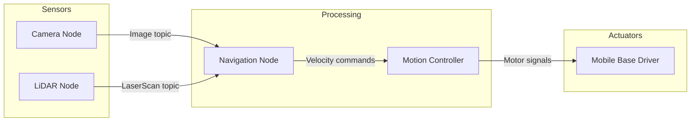
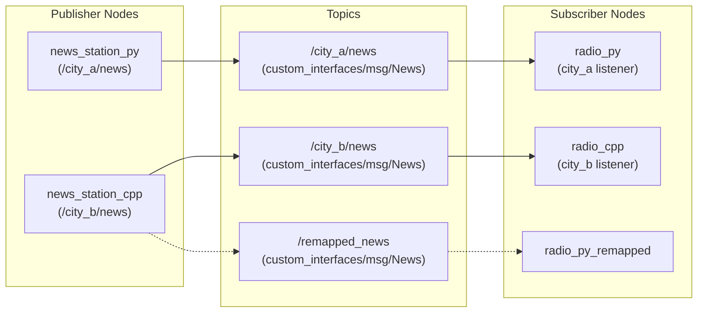
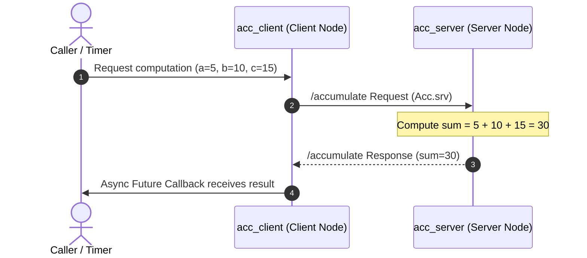
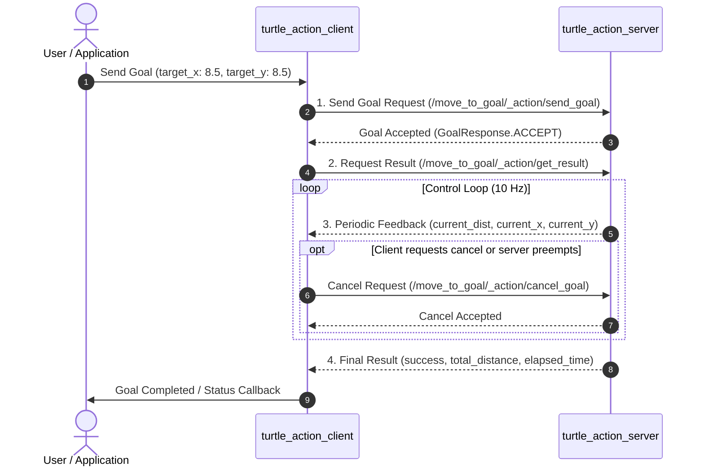
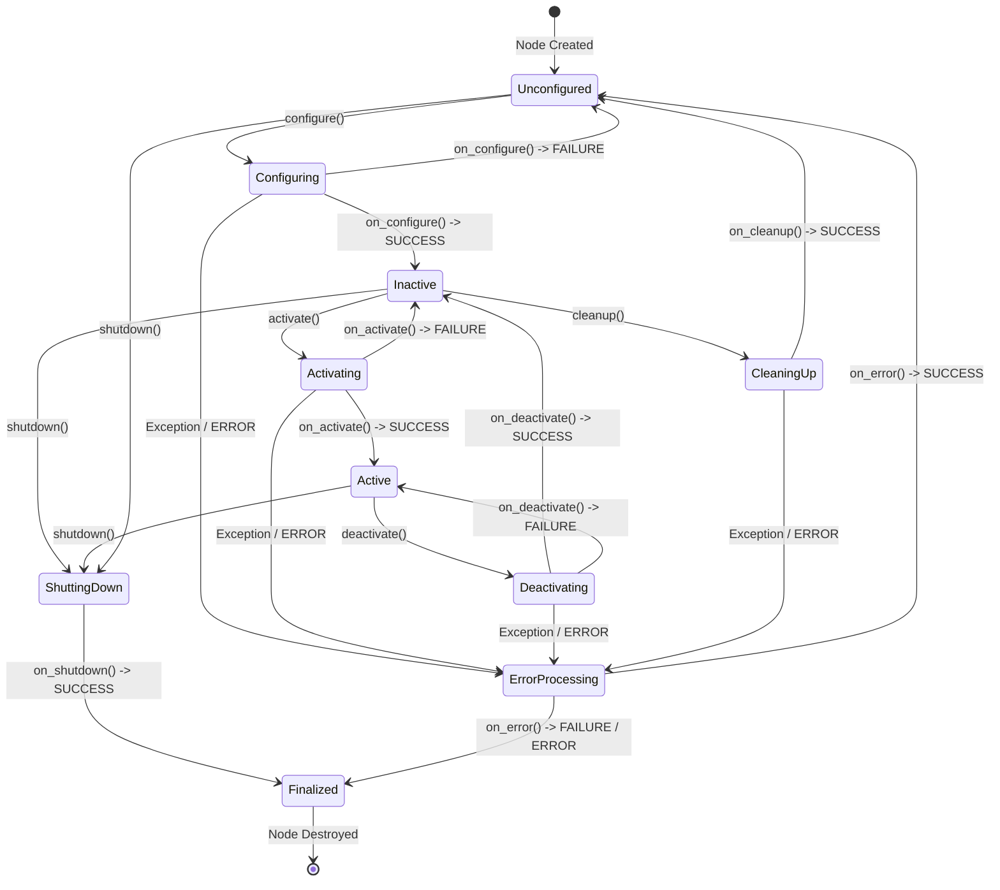
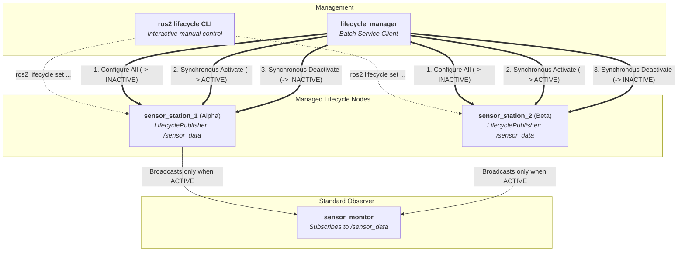

# ROS 2 Basics

**ROS 2 (Robot Operating System 2)** is the industry-standard open-source framework and middleware for building modular robotics systems.

Despite its name, ROS 2 is not a traditional operating system like Linux or macOS. Instead, it is a **robotics middleware**—a communication layer that lets distributed software processes (called **Nodes**) exchange data reliably across threads, processes, and networked machines.

https://github.com/jinyongnan810/ros-practice



---

## 1. Core Architectural Mental Model

Robots are complex machines composed of many hardware and software components. Building a monolithic program to read sensors, plan trajectories, and drive motors leads to brittle, hard-to-debug code.

ROS 2 breaks the system down into decoupled building blocks:

- **Nodes:** Single-purpose programs (e.g., reading a LiDAR sensor or computing a path).
- **Communication Paradigms & Node Types:**
  - **Topics (Publish / Subscribe):** Continuous, unidirectional data streams (e.g., sensor telemetry, camera feeds).
  - **Services (Request / Response):** Synchronous or asynchronous two-way remote procedure calls (e.g., trigger calibration, compute a sum, spawn an entity).
  - **Actions (Goal / Feedback / Result):** Asynchronous, long-running, preemptible tasks with continuous progress updates (e.g., navigating to coordinates, trajectory tracking).
  - **Lifecycle Nodes (Managed Nodes):** State-machine driven nodes (Unconfigured, Inactive, Active, Finalized) that provide deterministic startup, synchronized multi-sensor activation, and controlled shutdown.
  - **Parameters:** Configuration values set at launch or adjusted at runtime.

---

## 2. Nodes: The Building Blocks

A **Node** is a process that performs a specific robotics computation. In modern ROS 2, nodes are best implemented using **Object-Oriented Programming (OOP)** by inheriting from the client library's base Node class (`rclcpp::Node` in C++ or `rclpy.node.Node` in Python).

### Example Implementations

https://github.com/jinyongnan810/ros-practice/tree/main/1.nodes

---

## 3. Topics: Publish / Subscribe Pattern

**Topics** enable asynchronous, many-to-many, unidirectional data streaming.

- A **Publisher** produces messages and pushes them to a named channel (topic).
- A **Subscriber** listens to the named channel and receives incoming messages via a callback.
- Publishers and subscribers are completely decoupled: publishers do not know who is listening, and subscribers do not care who generated the data.



### Example Implementations

https://github.com/jinyongnan810/ros-practice/tree/main/2.topics

---

## 4. Services: Request / Response Pattern

While topics handle continuous streams, **Services** handle on-demand transactions where a **Client** sends a request to a **Server** and waits for a reply.



### Example Implementations

https://github.com/jinyongnan810/ros-practice/tree/main/3.services

---

## 5. Actions: Goal / Feedback / Result Pattern

While topics handle continuous streams and services handle quick request/response calls, **Actions** are designed for **long-running, goal-oriented, and preemptible tasks** (e.g., navigating a robot to a coordinate, moving a robotic arm, or docking).

Under the hood, ROS 2 actions are a higher-level composite communication paradigm built on top of topics and services:

- **Goal (Service):** The client requests the server to execute a goal; the server responds immediately whether it accepts or rejects the goal.
- **Feedback (Topic):** During execution, the server publishes periodic progress updates back to the client.
- **Result (Service):** When the task terminates (succeeded, canceled, or aborted), the server sends the final outcome and metrics to the client.
- **Cancel (Service):** The client can request goal cancellation at any time during execution.

### Action Interface Definition (`.action`)

Actions are defined in `.action` files located in the `action/` directory of an interface package, separated into three distinct sections by `---`:

```action
# 1. Goal: Target coordinates and desired linear velocity
float32 target_x
float32 target_y
float32 linear_velocity
---
# 2. Result: Final status and journey statistics
bool success
float32 total_distance
float32 elapsed_time
---
# 3. Feedback: Current position and remaining distance to target
float32 current_distance
float32 current_x
float32 current_y
```

### Communication Flow



### Topics vs. Services vs. Actions

| Feature                 | Topics                                             | Services                                              | Actions                                                |
| :---------------------- | :------------------------------------------------- | :---------------------------------------------------- | :----------------------------------------------------- |
| **Pattern**             | Many-to-many publish / subscribe                   | 1-to-1 request / response                             | 1-to-1 goal-driven client / server                     |
| **Data Flow**           | Continuous unidirectional stream                   | Two-way synchronous / asynchronous RPC                | Asynchronous multi-stage transaction                   |
| **Duration**            | Continuous / indefinite                            | Short / immediate (< seconds)                         | Long-running (seconds to minutes)                      |
| **Feedback**            | Continuous stream of messages                      | None (only final reply)                               | Periodic execution updates                             |
| **Preemption / Cancel** | Not applicable                                     | Cannot cancel in flight                               | Fully cancellable & preemptible                        |
| **Typical Use Cases**   | LiDAR scans, IMU data, motor velocity (`/cmd_vel`) | Calibration, querying map origin, setting reset flags | Waypoint navigation, arm trajectory execution, docking |

### Key Architectural Insights & Best Practices

1. **Rate-Regulated Loops vs. Fixed `sleep()`:**
   Control loops inside action execution callbacks should always use ROS 2 `Rate` objects (`self.create_rate(10)` in Python or `rclcpp::Rate(10)` in C++) rather than naive `sleep()`:
   - **Clock Drift Compensation:** `Rate.sleep()` dynamically subtracts computation time (coordinate transforms, feedback publishing) to maintain steady loop frequencies.
   - **Simulation Time (`use_sim_time`):** `Rate` synchronizes with ROS clock (`/clock`), speeding up, slowing down, or pausing automatically with Gazebo.
2. **Goal Preemption Policy:**
   ROS 2 actions do not enforce concurrency rules out of the box. Servers managing physical hardware should track `active_goal_handle` protected by a mutex/lock. When a new goal arrives while another is executing, abort the prior goal (`goal_handle.abort()`) and smoothly hand control over to the incoming goal.
3. **Concurrency with MultiThreadedExecutor:**
   Because an action server's `execute_callback` runs a sustained control loop, a single-threaded executor would starve other callbacks (such as incoming odometry/pose subscriptions or cancellation requests). Action servers must use a `ReentrantCallbackGroup` and spin inside a `MultiThreadedExecutor`.

### Example Implementations

https://github.com/jinyongnan810/ros-practice/tree/main/6.actions

---

## 6. Lifecycle Nodes: State-Machine Driven Node Management

In standard ROS 2 nodes (`rclcpp::Node` / `rclpy.node.Node`), all initialization—creating publishers, establishing hardware connections, and starting timer callbacks—happens directly in the constructor. Once instantiated, the node immediately starts executing and publishing.

In production robotics, this unmanaged startup creates critical challenges:

- **Uncontrolled Startup Order:** A navigation or sensor fusion node might receive and process sensor data before hardware drivers have finished self-tests, calibration, or warmup.
- **No Native Pause/Mute:** To stop publishing or adjust hardware configurations, a standard node must usually be destroyed and respawned.
- **Desynchronized Multi-Sensor Pipelines:** When bringing up multiple cameras, LiDARs, and IMUs, their data streams start at disparate times, causing dropped or desynchronized early frames.

**Lifecycle Nodes** (also known as **Managed Nodes**) solve this by embedding a formal, deterministic finite state machine into the node. Instead of running immediately upon creation, the node transitions through explicit states controlled either manually via the CLI or programmatically via a central coordinator.

### The Lifecycle State Machine

A Lifecycle Node transitions between **4 Primary States** via **Transition States**:



| Primary State    | State ID | Description                                                                                                                             | Allowed Transitions               |
| :--------------- | :------: | :-------------------------------------------------------------------------------------------------------------------------------------- | :-------------------------------- |
| **Unconfigured** |   `1`    | Node is instantiated. Parameters are declared, but dynamic resources, timers, and hardware connections are not yet allocated.           | `configure`, `shutdown`           |
| **Inactive**     |   `2`    | Static resources, publishers, timers, and hardware connections are configured. **Message publishing is suppressed**.                    | `activate`, `cleanup`, `shutdown` |
| **Active**       |   `3`    | Node is fully operational and executing its control loop. **Lifecycle publishers transmit live messages** onto the DDS / ROS 2 network. | `deactivate`, `shutdown`          |
| **Finalized**    |   `4`    | Terminal state before node destruction. All resources and memory are released.                                                          | None (ready for destruction)      |

### Transition Callbacks & Return Codes

Each transition invokes a corresponding lifecycle callback. Callbacks must return one of three status codes:

- **`SUCCESS`**: The transition was successful; the node enters the target primary state.
- **`FAILURE`**: Transition failed gracefully; the node returns to its previous primary state (or `Unconfigured`).
- **`ERROR`**: An unhandled exception or critical error occurred; the node transitions into `ErrorProcessing` to attempt recovery via `on_error()`.

| Callback               | Invoked Transition                                        | Typical Responsibility                                                                                |
| :--------------------- | :-------------------------------------------------------- | :---------------------------------------------------------------------------------------------------- |
| `on_configure(state)`  | `Unconfigured` $\rightarrow$ `Inactive`                   | Read parameters, allocate memory, create publishers/subscribers, connect to hardware interfaces.      |
| `on_activate(state)`   | `Inactive` $\rightarrow$ `Active`                         | Activate lifecycle publishers, enable hardware actuation, start operational control loops.            |
| `on_deactivate(state)` | `Active` $\rightarrow$ `Inactive`                         | Deactivate lifecycle publishers, safely stop actuators/motors, pause execution loops.                 |
| `on_cleanup(state)`    | `Inactive` $\rightarrow$ `Unconfigured`                   | Reset timers, release publishers/subscribers, tear down dynamic allocations and hardware connections. |
| `on_shutdown(state)`   | Any state $\rightarrow$ `Finalized`                       | Clean up remaining handles and prepare node for termination.                                          |
| `on_error(state)`      | Error occurred $\rightarrow$ `Unconfigured` / `Finalized` | Perform emergency cleanup and attempt recovery to `Unconfigured`, or fail to `Finalized`.             |

### Lifecycle Publishers

Standard publishers (`rclcpp::Publisher` / `Publisher`) begin transmitting data over DDS immediately upon creation. In contrast, a **`LifecyclePublisher`** (`rclcpp_lifecycle::LifecyclePublisher` in C++ or `LifecyclePublisher` in Python) is state-aware:

1. **Suppression when Inactive:** While the node is in `Unconfigured` or `Inactive` state, calling `publish()` is a **safe no-op**—data packets are discarded internally without touching DDS network buffers.
2. **Activation:**
   - In C++: Explicitly activated in `on_activate()` via `pub_->on_activate()` and deactivated in `on_deactivate()` via `pub_->on_deactivate()`.
   - In Python: Calling `super().on_activate(state)` and `super().on_deactivate(state)` automatically toggles all registered lifecycle publishers.
3. **Guard Message Computation:** Even though `publish()` safely drops messages when inactive, constructing and serializing heavy sensor messages still consumes CPU cycles. Guarding publishing logic with `pub->is_activated()` prevents wasted computation:

```cpp
void timer_callback() {
  // Only allocate and publish if the publisher is active
  if (pub_ && pub_->is_activated()) {
    std_msgs::msg::String msg;
    msg.data = "Sensor reading #" + std::to_string(count_++);
    pub_->publish(msg);
  }
}
```

### Coordinated Multi-Node Orchestration

The true power of Lifecycle Nodes emerges in distributed multi-sensor systems. Rather than letting individual nodes manage their own transitions, a centralized **Lifecycle Manager** orchestrates states across all robot subsystems via standard ROS 2 services (`/node_name/change_state` and `/node_name/get_state` from `lifecycle_msgs`).



#### Synchronized Startup Sequence

1. **Configure Phase:** The manager requests all sensor drivers to configure. Sensors connect to hardware and calibrate. All enter `INACTIVE` state.
2. **Readiness Check:** The manager verifies all nodes report `INACTIVE`. If any sensor fails calibration (`FAILURE`), the manager can abort without ever activating the robot.
3. **Synchronous Activation:** The manager triggers `activate` across all nodes simultaneously. Sensor streams begin publishing synchronously from time $t_0$, ensuring downstream sensor fusion algorithms receive aligned data.

### Key Architectural Insights & Best Practices

1. **Keep Constructors Minimal:** Declare parameters and establish defaults in constructors. Never connect to sockets, open serial ports, or allocate heavy buffers in the constructor—defer all dynamic initialization to `on_configure()`.
2. **Always Check `pub->is_activated()`:** Prevents costly image preprocessing, point-cloud transformations, and message serialization during `INACTIVE` states.
3. **Separate Management from Processing:** Managed nodes should not know who manages them. They only respond to standard `lifecycle_msgs` transition services, allowing flexible orchestration via CLI, custom managers, or Nav2 lifecycle managers.

### Example Implementations

https://github.com/jinyongnan810/ros-practice/tree/main/7.lifecycle

---

## 7. Parameters and Launch Orchestration

### Dynamic Parameters

Parameters allow configuring node properties without modifying or recompiling source code.

- **Declare:** Nodes declare parameters with default values (`declare_parameter("timer_interval", 1.0)`).
- **Update at runtime:** Users can modify parameters on running nodes:
  ```bash
  ros2 param set /news_station_node timer_interval 0.25
  ```

### Launch Files: Declarative System Startup

Real-world robots require launching dozens of nodes, remapping topic names, and setting namespaces. ROS 2 provides two main launch formats:

1. **Python Launch Files (`.launch.py`):** Programmatic, flexible, and conditional logic.
2. **XML Launch Files (`.launch.xml`):** Concise, declarative, and easy to read.

---

## 8. Workspace Setup & Build Workflow

A ROS 2 workspace follows a standard directory structure:

```text
ros_workspace/
├── src/                    # Source code for packages
│   ├── my_cpp_pkg/         # C++ package (CMakeLists.txt, package.xml)
│   └── my_py_pkg/          # Python package (setup.py, package.xml)
├── build/                  # Intermediate compilation artifacts
├── install/                # Built executables, libraries, and setup scripts
└── log/                    # Build and runtime log files
```

### Common Build Commands (`colcon`)

```bash
# Build all packages in workspace
colcon build

# Build specific packages to save time
colcon build --packages-select topic_cpp_pkg topic_py_pkg

# Symlink Python files for instant reload during development
colcon build --symlink-install

# Source the newly compiled workspace environment
source install/setup.bash
```

In real-world projects, it's convenient to add `source install/setup.bash` to `.envrc` and use `allow direnv` to automatically source the workspace when entering the directory.

---

## 9. Essential ROS 2 CLI Cheat Sheet

### Node Introspection

```bash
ros2 node list                     # List all active nodes in the computation graph
ros2 node info /turtle_chaser      # Inspect publishers, subscribers, and services of a node
rqt_graph                          # Launch GUI visualizer of the computational graph
```

### Topic Inspection & Publishing

```bash
ros2 topic list -t                 # List active topics with their message types
ros2 topic echo /turtle1/pose      # Print live stream of messages published to a topic
ros2 topic hz /turtle1/pose        # Measure publishing frequency in Hertz
ros2 topic bw /turtle1/pose        # Measure bandwidth usage
ros2 topic pub -r 5 /news custom_interfaces/msg/News "{datetime: '2026-08-16', title: 'Daily News', content: 'Ready'}"
```

### Service Operations

```bash
ros2 service list -t               # List active services with types
ros2 interface show custom_interfaces/srv/Acc # Display .srv definition
ros2 service call /accumulate custom_interfaces/srv/Acc "{a: 5, b: 10, c: 15}"
```

### Action Operations

```bash
ros2 action list                   # List active actions
ros2 action list -t                # List active actions with action types
ros2 action info /move_to_goal     # Inspect action servers and clients
ros2 interface show custom_interfaces/action/MoveToGoal # Inspect action definition (.action)
ros2 action send_goal /move_to_goal custom_interfaces/action/MoveToGoal "{target_x: 8.0, target_y: 8.0, linear_velocity: 2.0}" --feedback # Send goal with live feedback stream
```

### Lifecycle Management

```bash
ros2 lifecycle get /sensor_station_1       # Query current lifecycle state
ros2 lifecycle list /sensor_station_1      # List available transitions from current state
ros2 lifecycle set /sensor_station_1 configure  # Transition: Unconfigured -> Inactive
ros2 lifecycle set /sensor_station_1 activate   # Transition: Inactive -> Active (enables publishing)
ros2 lifecycle set /sensor_station_1 deactivate # Transition: Active -> Inactive (suppresses publishing)
ros2 lifecycle set /sensor_station_1 cleanup    # Transition: Inactive -> Unconfigured
ros2 lifecycle set /sensor_station_1 shutdown   # Transition: Any state -> Finalized
```

### Parameter Management

```bash
ros2 param list                    # List parameters for all running nodes
ros2 param get /news_station_node timer_interval
ros2 param set /news_station_node timer_interval 0.5
ros2 param dump /news_station_node # Export current parameters to YAML
```

### Rosbag Data Recording & Playback

```bash
ros2 bag record -o test_run /turtle1/pose /turtle1/cmd_vel
ros2 bag info test_run
ros2 bag play test_run
```
