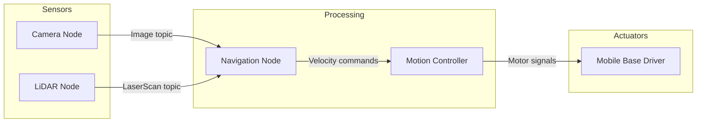
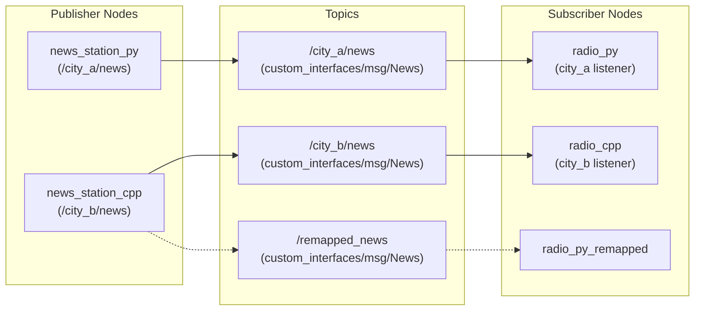
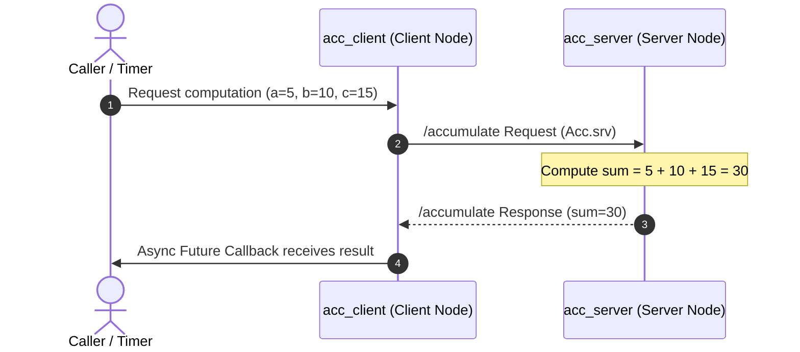

# ROS 2 Basics

**ROS 2 (Robot Operating System 2)** is the industry-standard open-source framework and middleware for building modular robotics systems.

Despite its name, ROS 2 is not a traditional operating system like Linux or macOS. Instead, it is a **robotics middleware**—a communication layer that lets distributed software processes (called **Nodes**) exchange data reliably across threads, processes, and networked machines.

https://github.com/jinyongnan810/ros-practice



---

## 1. Core Architectural Mental Model

Robots are complex machines composed of many hardware and software components. Building a monolithic program to read sensors, plan trajectories, and drive motors leads to brittle, hard-to-debug code.

ROS 2 breaks the system down into decoupled building blocks:

- **Nodes:** Single-purpose programs (e.g., reading a LiDAR sensor or computing a path).
- **Communication Paradigms:**
  - **Topics (Publish / Subscribe):** Continuous, unidirectional data streams (e.g., sensor telemetry, camera feeds).
  - **Services (Request / Response):** Synchronous or asynchronous two-way remote procedure calls (e.g., trigger calibration, compute a sum, spawn an entity).
  - **Parameters:** Configuration values set at launch or adjusted at runtime.

---

## 2. Nodes: The Building Blocks

A **Node** is a process that performs a specific robotics computation. In modern ROS 2, nodes are best implemented using **Object-Oriented Programming (OOP)** by inheriting from the client library's base Node class (`rclcpp::Node` in C++ or `rclpy.node.Node` in Python).

### Example Implementations

https://github.com/jinyongnan810/ros-practice/tree/main/1.nodes

---

## 3. Topics: Publish / Subscribe Pattern

**Topics** enable asynchronous, many-to-many, unidirectional data streaming.

- A **Publisher** produces messages and pushes them to a named channel (topic).
- A **Subscriber** listens to the named channel and receives incoming messages via a callback.
- Publishers and subscribers are completely decoupled: publishers do not know who is listening, and subscribers do not care who generated the data.



### Example Implementations

https://github.com/jinyongnan810/ros-practice/tree/main/2.topics

---

## 4. Services: Request / Response Pattern

While topics handle continuous streams, **Services** handle on-demand transactions where a **Client** sends a request to a **Server** and waits for a reply.



### Example Implementations

https://github.com/jinyongnan810/ros-practice/tree/main/3.services

---

## 5. Parameters and Launch Orchestration

### Dynamic Parameters

Parameters allow configuring node properties without modifying or recompiling source code.

- **Declare:** Nodes declare parameters with default values (`declare_parameter("timer_interval", 1.0)`).
- **Update at runtime:** Users can modify parameters on running nodes:
  ```bash
  ros2 param set /news_station_node timer_interval 0.25
  ```

### Launch Files: Declarative System Startup

Real-world robots require launching dozens of nodes, remapping topic names, and setting namespaces. ROS 2 provides two main launch formats:

1. **Python Launch Files (`.launch.py`):** Programmatic, flexible, and conditional logic.
2. **XML Launch Files (`.launch.xml`):** Concise, declarative, and easy to read.

---

## 6. Workspace Setup & Build Workflow

A ROS 2 workspace follows a standard directory structure:

```text
ros_workspace/
├── src/                    # Source code for packages
│   ├── my_cpp_pkg/         # C++ package (CMakeLists.txt, package.xml)
│   └── my_py_pkg/          # Python package (setup.py, package.xml)
├── build/                  # Intermediate compilation artifacts
├── install/                # Built executables, libraries, and setup scripts
└── log/                    # Build and runtime log files
```

### Common Build Commands (`colcon`)

```bash
# Build all packages in workspace
colcon build

# Build specific packages to save time
colcon build --packages-select topic_cpp_pkg topic_py_pkg

# Symlink Python files for instant reload during development
colcon build --symlink-install

# Source the newly compiled workspace environment
source install/setup.bash
```

In real-world projects, it's convenient to add `source install/setup.bash` to `.envrc` and use `allow direnv` to automatically source the workspace when entering the directory.

---

## 7. Essential ROS 2 CLI Cheat Sheet

### Node Introspection

```bash
ros2 node list                     # List all active nodes in the computation graph
ros2 node info /turtle_chaser      # Inspect publishers, subscribers, and services of a node
rqt_graph                          # Launch GUI visualizer of the computational graph
```

### Topic Inspection & Publishing

```bash
ros2 topic list -t                 # List active topics with their message types
ros2 topic echo /turtle1/pose      # Print live stream of messages published to a topic
ros2 topic hz /turtle1/pose        # Measure publishing frequency in Hertz
ros2 topic bw /turtle1/pose        # Measure bandwidth usage
ros2 topic pub -r 5 /news custom_interfaces/msg/News "{datetime: '2026-08-16', title: 'Daily News', content: 'Ready'}"
```

### Service Operations

```bash
ros2 service list -t               # List active services with types
ros2 interface show custom_interfaces/srv/Acc # Display .srv definition
ros2 service call /accumulate custom_interfaces/srv/Acc "{a: 5, b: 10, c: 15}"
```

### Parameter Management

```bash
ros2 param list                    # List parameters for all running nodes
ros2 param get /news_station_node timer_interval
ros2 param set /news_station_node timer_interval 0.5
ros2 param dump /news_station_node # Export current parameters to YAML
```

### Rosbag Data Recording & Playback

```bash
ros2 bag record -o test_run /turtle1/pose /turtle1/cmd_vel
ros2 bag info test_run
ros2 bag play test_run
```
