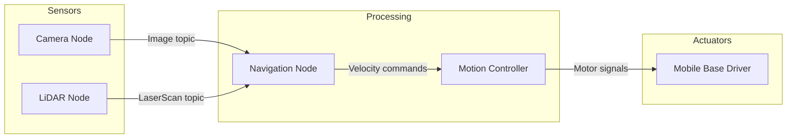
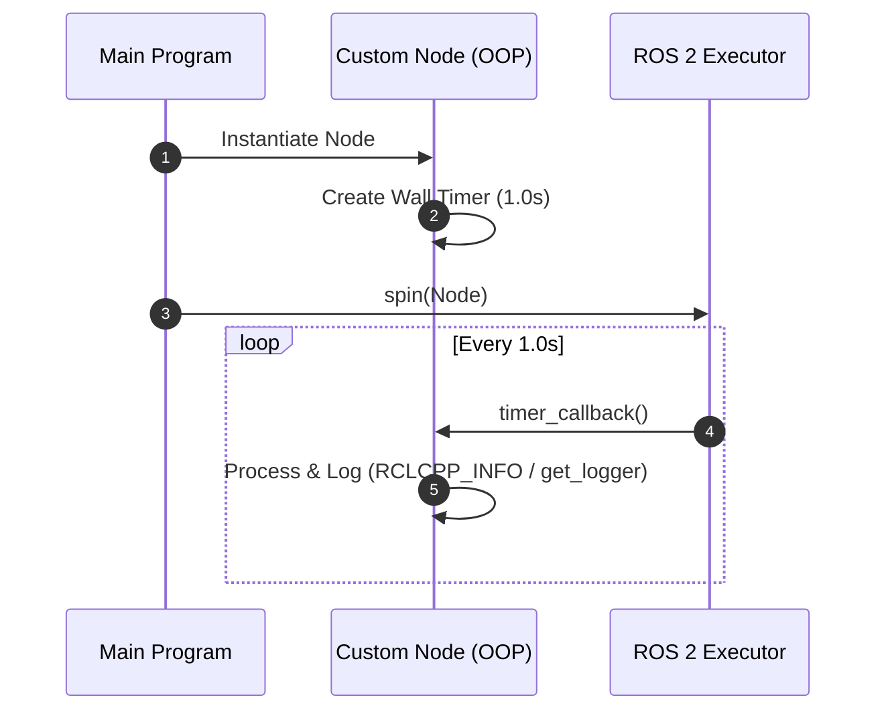
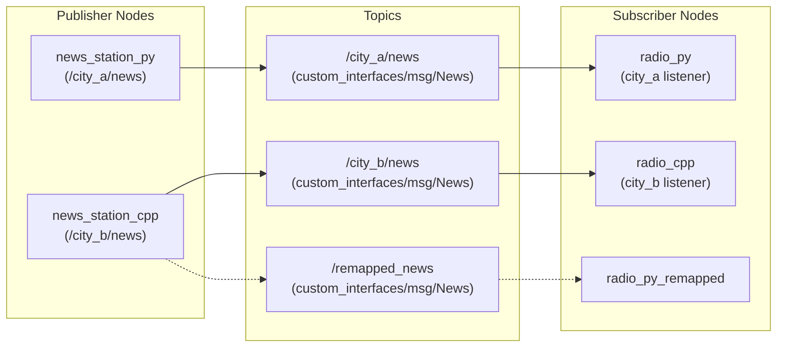
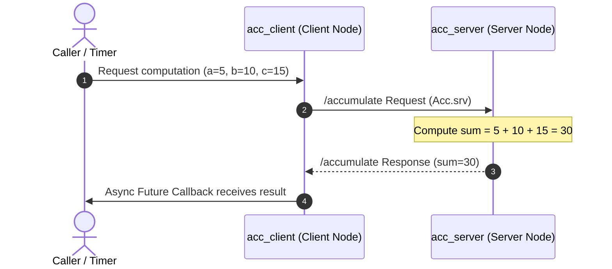

# ROS 2 Basics

**ROS 2 (Robot Operating System 2)** is the industry-standard open-source framework and middleware for building modular robotics systems.

Despite its name, ROS 2 is not a traditional operating system like Linux or macOS. Instead, it is a **robotics middleware**—a communication layer that lets distributed software processes (called **Nodes**) exchange data reliably across threads, processes, and networked machines.



---

## 1. Core Architectural Mental Model

Robots are complex machines composed of many hardware and software components. Building a monolithic program to read sensors, plan trajectories, and drive motors leads to brittle, hard-to-debug code.

ROS 2 breaks the system down into decoupled building blocks:

- **Nodes:** Single-purpose programs (e.g., reading a LiDAR sensor or computing a path).
- **Communication Paradigms:**
  - **Topics (Publish / Subscribe):** Continuous, unidirectional data streams (e.g., sensor telemetry, camera feeds).
  - **Services (Request / Response):** Synchronous or asynchronous two-way remote procedure calls (e.g., trigger calibration, compute a sum, spawn an entity).
  - **Actions (Goal / Feedback / Result):** Long-running preemptible tasks (e.g., navigate to a waypoint with progress updates).
  - **Parameters:** Configuration values set at launch or adjusted at runtime.
- **DDS (Data Distribution Service):** The underlying peer-to-peer transport layer providing discovery, real-time Quality of Service (QoS), and network routing without requiring a centralized master node.

---

## 2. Nodes: The Building Blocks

A **Node** is a process that performs a specific robotics computation. In modern ROS 2, nodes are best implemented using **Object-Oriented Programming (OOP)** by inheriting from the client library's base Node class (`rclcpp::Node` in C++ or `rclpy.node.Node` in Python).

### Node Lifecycle and Timers

Rather than running blocking `while (true)` sleep loops, ROS 2 nodes use **wall timers and callbacks** registered with the executor. When you "spin" a node (`rclcpp::spin` or `rclpy.spin`), the executor waits for timer events or incoming messages and invokes the corresponding callback methods.



### Side-by-Side Implementation

#### C++ (`rclcpp`)

```cpp
#include "rclcpp/rclcpp.hpp"

class HelloWorldNode : public rclcpp::Node
{
public:
    HelloWorldNode() : Node("hello_world_node"), counter_(0)
    {
        RCLCPP_INFO(this->get_logger(), "Hello World Node has started!");

        // Create a wall timer firing every 1.0 second
        timer_ = this->create_wall_timer(
            std::chrono::seconds(1),
            [this]() { timer_callback(); }
        );
    }

private:
    rclcpp::TimerBase::SharedPtr timer_;
    int counter_;

    void timer_callback()
    {
        RCLCPP_INFO(this->get_logger(), "Hello World! Tick #%d", counter_++);
    }
};

int main(int argc, char *argv[])
{
    rclcpp::init(argc, argv);
    auto node = std::make_shared<HelloWorldNode>();
    rclcpp::spin(node);
    rclcpp::shutdown();
    return 0;
}
```

#### Python (`rclpy`)

```python
#!/usr/bin/env python3
import rclpy
from rclpy.node import Node

class HelloWorldNode(Node):
    def __init__(self):
        super().__init__("hello_world_node")
        self.counter = 0
        self.get_logger().info("Hello World Node has started!")

        # Create a timer firing every 1.0 second
        self.timer = self.create_timer(1.0, self.timer_callback)

    def timer_callback(self):
        self.get_logger().info(f"Hello World! Tick #{self.counter}")
        self.counter += 1

def main(args=None):
    rclpy.init(args=args)
    node = HelloWorldNode()
    rclpy.spin(node)
    node.destroy_node()
    rclpy.shutdown()

if __name__ == "__main__":
    main()
```

---

## 3. Topics: Publish / Subscribe Pattern

**Topics** enable asynchronous, many-to-many, unidirectional data streaming.

- A **Publisher** produces messages and pushes them to a named channel (topic).
- A **Subscriber** listens to the named channel and receives incoming messages via a callback.
- Publishers and subscribers are completely decoupled: publishers do not know who is listening, and subscribers do not care who generated the data.



### Custom Message Interfaces (`.msg`)

ROS 2 uses strongly-typed message definitions stored in a `msg/` directory inside an interface package.

```text
# custom_interfaces/msg/News.msg
string datetime
string title
string content
```

### Publisher and Subscriber Code

#### Publisher Node (Python)

```python
from custom_interfaces.msg import News
import rclpy
from rclpy.node import Node

class NewsStationNode(Node):
    def __init__(self):
        super().__init__("news_station_node")
        self.publisher_ = self.create_publisher(News, "news", 10)
        self.timer_ = self.create_timer(1.0, self.publish_news)

    def publish_news(self):
        msg = News()
        msg.datetime = "2026-08-16 10:00:00"
        msg.title = "Robotics Daily"
        msg.content = "ROS 2 Jazzy is deployed successfully!"
        self.publisher_.publish(msg)
        self.get_logger().info(f"Published: {msg.title}")
```

#### Subscriber Node (C++)

```cpp
#include "rclcpp/rclcpp.hpp"
#include "custom_interfaces/msg/news.hpp"

class RadioNode : public rclcpp::Node
{
public:
    RadioNode() : Node("radio_node")
    {
        subscription_ = this->create_subscription<custom_interfaces::msg::News>(
            "news", 10,
            [this](const custom_interfaces::msg::News::SharedPtr msg) {
                RCLCPP_INFO(this->get_logger(), "Received News: [%s] %s",
                            msg->title.c_str(), msg->content.c_str());
            });
    }

private:
    rclcpp::Subscription<custom_interfaces::msg::News>::SharedPtr subscription_;
};
```

---

## 4. Services: Request / Response Pattern

While topics handle continuous streams, **Services** handle on-demand transactions where a **Client** sends a request to a **Server** and waits for a reply.



### Custom Service Specification (`.srv`)

Service files define the Request schema above the `---` separator and the Response schema below it.

```text
# custom_interfaces/srv/Acc.srv
int64 a
int64 b
int64 c
---
int64 sum
```

### Server & Asynchronous Client

#### Service Server (C++)

```cpp
#include "rclcpp/rclcpp.hpp"
#include "custom_interfaces/srv/acc.hpp"

class AccServer : public rclcpp::Node
{
public:
    AccServer() : Node("acc_server")
    {
        service_ = this->create_service<custom_interfaces::srv::Acc>(
            "accumulate",
            [this](const std::shared_ptr<custom_interfaces::srv::Acc::Request> req,
                   std::shared_ptr<custom_interfaces::srv::Acc::Response> res) {
                res->sum = req->a + req->b + req->c;
                RCLCPP_INFO(this->get_logger(), "Incoming request: %ld + %ld + %ld = %ld",
                            req->a, req->b, req->c, res->sum);
            });
    }

private:
    rclcpp::Service<custom_interfaces::srv::Acc>::SharedPtr service_;
};
```

#### Asynchronous Non-Blocking Client (Python)

```python
import rclpy
from rclpy.node import Node
from custom_interfaces.srv import Acc

class AccClient(Node):
    def __init__(self):
        super().__init__("acc_client")
        self.client = self.create_client(Acc, "accumulate")
        while not self.client.wait_for_service(timeout_sec=1.0):
            self.get_logger().warn("Waiting for /accumulate service...")

    def send_request(self, a, b, c):
        req = Acc.Request()
        req.a, req.b, req.c = a, b, c
        future = self.client.call_async(req)
        future.add_done_callback(self.response_callback)

    def response_callback(self, future):
        try:
            response = future.result()
            self.get_logger().info(f"Accumulated result: {response.sum}")
        except Exception as e:
            self.get_logger().error(f"Service call failed: {e}")
```

---

## 5. Parameters and Launch Orchestration

### Dynamic Parameters

Parameters allow configuring node properties without modifying or recompiling source code.

- **Declare:** Nodes declare parameters with default values (`declare_parameter("timer_interval", 1.0)`).
- **Update at runtime:** Users can modify parameters on running nodes:
  ```bash
  ros2 param set /news_station_node timer_interval 0.25
  ```
- **Load via YAML:**
  ```yaml
  # config/news_station.yaml
  /news_station_node:
    ros__parameters:
      timer_interval: 0.5
  ```

### Launch Files: Declarative System Startup

Real-world robots require launching dozens of nodes, remapping topic names, and setting namespaces. ROS 2 provides two main launch formats:

1. **Python Launch Files (`.launch.py`):** Programmatic, flexible, and conditional logic.
2. **XML Launch Files (`.launch.xml`):** Concise, declarative, and easy to read.

```xml
<!-- topics_bringup/launch/topics.launch.xml -->
<launch>
  <group>
    <push-ros-namespace namespace="city_a"/>
    <node pkg="topic_py_pkg" exec="news_station_py" name="news_station_py_1"/>
    <node pkg="topic_py_pkg" exec="radio_py" name="radio_py_1"/>
  </group>

  <group>
    <push-ros-namespace namespace="city_b"/>
    <node pkg="topic_cpp_pkg" exec="news_station_cpp" name="news_station_cpp_1"/>
    <node pkg="topic_cpp_pkg" exec="radio_cpp" name="radio_cpp_1"/>
  </group>
</launch>
```

---

## 6. Workspace Setup & Build Workflow

A ROS 2 workspace follows a standard directory structure:

```text
ros_workspace/
├── src/                    # Source code for packages
│   ├── my_cpp_pkg/         # C++ package (CMakeLists.txt, package.xml)
│   └── my_py_pkg/          # Python package (setup.py, package.xml)
├── build/                  # Intermediate compilation artifacts
├── install/                # Built executables, libraries, and setup scripts
└── log/                    # Build and runtime log files
```

### Common Build Commands (`colcon`)

```bash
# Build all packages in workspace
colcon build

# Build specific packages to save time
colcon build --packages-select topic_cpp_pkg topic_py_pkg

# Symlink Python files for instant reload during development
colcon build --symlink-install

# Source the newly compiled workspace environment
source install/setup.bash
```

---

## 7. Essential ROS 2 CLI Cheat Sheet

### Node Introspection

```bash
ros2 node list                     # List all active nodes in the computation graph
ros2 node info /turtle_chaser      # Inspect publishers, subscribers, and services of a node
rqt_graph                          # Launch GUI visualizer of the computational graph
```

### Topic Inspection & Publishing

```bash
ros2 topic list -t                 # List active topics with their message types
ros2 topic echo /turtle1/pose      # Print live stream of messages published to a topic
ros2 topic hz /turtle1/pose        # Measure publishing frequency in Hertz
ros2 topic bw /turtle1/pose        # Measure bandwidth usage
ros2 topic pub -r 5 /news custom_interfaces/msg/News "{datetime: '2026-08-16', title: 'Daily News', content: 'Ready'}"
```

### Service Operations

```bash
ros2 service list -t               # List active services with types
ros2 interface show custom_interfaces/srv/Acc # Display .srv definition
ros2 service call /accumulate custom_interfaces/srv/Acc "{a: 5, b: 10, c: 15}"
```

### Parameter Management

```bash
ros2 param list                    # List parameters for all running nodes
ros2 param get /news_station_node timer_interval
ros2 param set /news_station_node timer_interval 0.5
ros2 param dump /news_station_node # Export current parameters to YAML
```

### Rosbag Data Recording & Playback

```bash
ros2 bag record -o test_run /turtle1/pose /turtle1/cmd_vel
ros2 bag info test_run
ros2 bag play test_run
```
