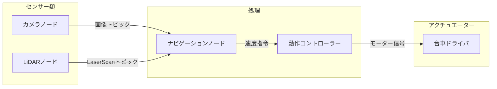
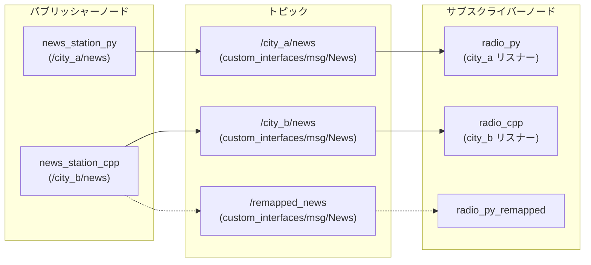
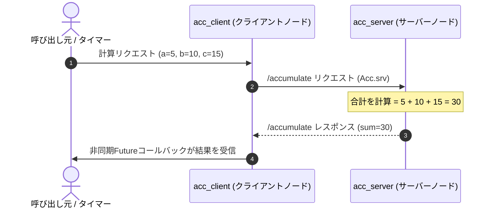
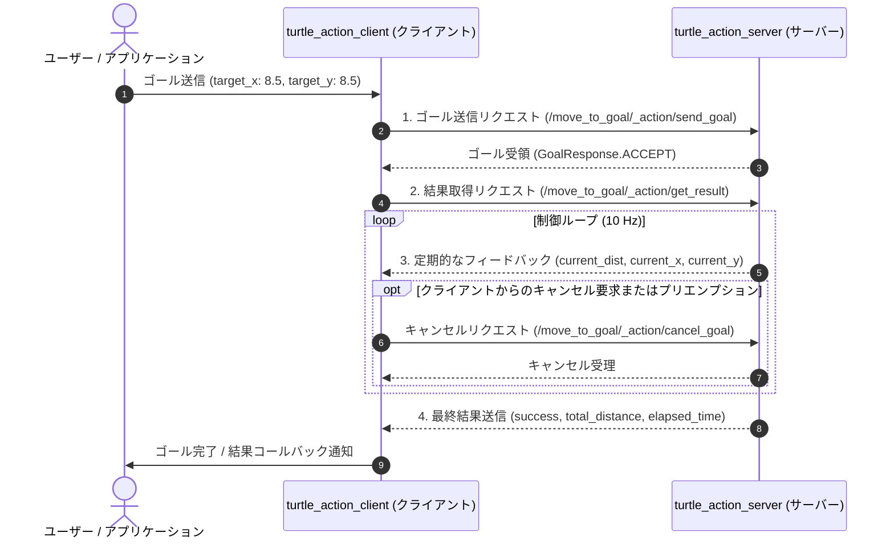
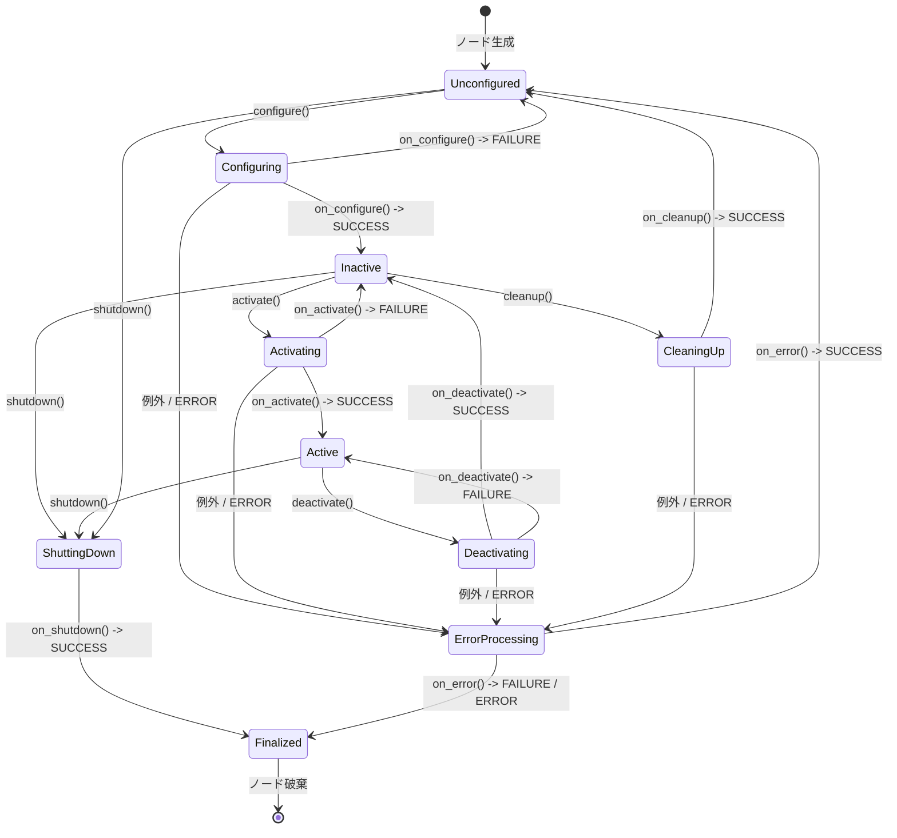
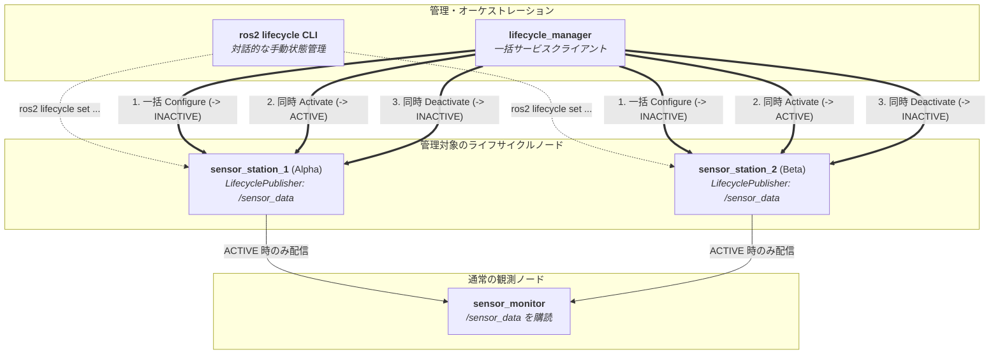
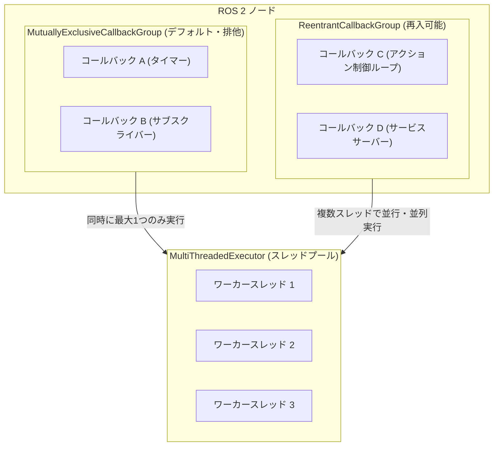

# ROS 2 の基礎（ROS 2 Basics）

**ROS 2 (Robot Operating System 2)** は、モジュール化されたロボットシステムを構築するための業界標準のオープンソースフレームワークおよびミドルウェアです。

その名前に反して、ROS 2 は Linux や macOS のような従来のオペレーティングシステムではありません。むしろ **ロボティクス・ミドルウェア** であり、分散したソフトウェアプロセス（**ノード** と呼ばれます）がスレッド、プロセス、そしてネットワーク接続されたマシン間で確実にデータをやり取りできるようにする通信レイヤーです。

https://github.com/jinyongnan810/ros-practice



---

## 1. コアアーキテクチャのメンタルモデル

ロボットは多数のハードウェアおよびソフトウェアコンポーネントで構成される複雑な機械です。センサー読み取り、軌道計画、モーター駆動をひとつのモノリシックなプログラムとして記述すると、脆くデバッグが困難なコードになってしまいます。

ROS 2 はシステムを疎結合な構成要素に分解します:

- **ノード (Nodes):** 単一の目的を持つプログラム（例: LiDARセンサーの読み取り、経路計算など）。
- **通信パラダイムとノード管理:**
  - **トピック (Topics / Publish-Subscribe):** 連続的で単方向のデータストリーム（例: センサーテレメトリ、カメラ映像）。
  - **サービス (Services / Request-Response):** 同期または非同期の双方向リモートプロシージャコール（例: キャリブレーションの実行、計算結果の取得、オブジェクトの生成）。
  - **アクション (Actions / Goal-Feedback-Result):** 継続的な進捗フィードバックを伴う、非同期かつ長時間実行・中断（キャンセル）可能なタスク（例: 指定座標へのナビゲーション、ロボットアームの軌道制御）。
  - **ライフサイクルノード (Lifecycle Nodes / Managed Nodes):** 状態マシン（Unconfigured, Inactive, Active, Finalized）によって制御され、決定論的な起動順序、複数センサーの同期アクティベーション、安全な終了を実現するマネージドノード。
  - **パラメータ (Parameters):** 起動時に設定するか実行時に調整可能な設定値。
- **実行と並行処理 (Execution & Concurrency):**
  - **Executor:** ミドルウェアと協調してコールバックを単一または複数スレッドにスケジューリング・ディスパッチする実行エンジン。
  - **Callback Group:** どのコールバックを並行（同時）実行可能かを定義する並行処理制御ポリシー（MutuallyExclusive, Reentrant）。

---

## 2. ノード: システムの構成単位

**ノード** は、特定のロボット工学的計算を実行するプロセスです。最新の ROS 2 では、クライアントライブラリの基底ノードクラス（C++ の `rclcpp::Node` や Python の `rclpy.node.Node`）を継承した**オブジェクト指向プログラミング (OOP)** を用いてノードを実装するのがベストプラクティスです。

### 実装例

https://github.com/jinyongnan810/ros-practice/tree/main/1.nodes

---

## 3. トピック: パブリッシュ / サブスクライブ パターン

**トピック (Topics)** は、非同期かつ多対多の単方向データストリーミングを実現します。

- **パブリッシャー (Publisher):** メッセージを生成し、名前付きチャネル（トピック）に送信します。
- **サブスクライバー (Subscriber):** 名前付きチャネルをリッスンし、コールバック関数経由で受信メッセージを処理します。
- パブリッシャーとサブスクライバーは完全に疎結合です。パブリッシャーは誰が受信しているかを知らず、サブスクライバーは誰がデータを生成したかを気にしません。



### 実装例

https://github.com/jinyongnan810/ros-practice/tree/main/2.topics

---

## 4. サービス: リクエスト / レスポンス パターン

トピックが連続的なストリームを処理するのに対し、**サービス (Services)** は、**クライアント** が **サーバー** にリクエストを送信し、返答を待つオンデマンドなトランザクションを処理します。



### 実装例

https://github.com/jinyongnan810/ros-practice/tree/main/3.services

---

## 5. アクション: ゴール / フィードバック / リザルト パターン

トピックが連続的なデータストリームを扱い、サービスが即時的なリクエスト／レスポンスを処理するのに対し、**アクション (Actions)** は **長時間実行され、進捗フィードバックを返し、中断（プリエンプション／キャンセル）可能なタスク**（例: 目標座標へのロボットの自律移動、アームによる把持、自動充電ドッキングなど）のために設計されています。

ROS 2 のアクションは、内部的にはトピックとサービスを組み合わせた上位の複合通信パラダイムです:

- **ゴール (Goal / Service):** クライアントがサーバーにタスクを要求し、サーバーは即座にゴールを受け入れる（Accept）か拒否する（Reject）かを返します。
- **フィードバック (Feedback / Topic):** 実行中、サーバーは進捗状況をクライアントへ定期的にパブリッシュします。
- **リザルト (Result / Service):** タスクが完了または終了した際（成功、キャンセル、中止）、サーバーは最終結果と統計データをクライアントに送信します。
- **キャンセル (Cancel / Service):** クライアントは実行中の任意のタイミングでゴールのキャンセルを要求できます。

### アクションインターフェース定義 (`.action`)

アクションはインターフェースパッケージの `action/` ディレクトリ内の `.action` ファイルで定義され、`---` によって3つのセクション（ゴール、リザルト、フィードバック）に分割されます:

```action
# 1. ゴール: 目標座標と希望直進速度
float32 target_x
float32 target_y
float32 linear_velocity
---
# 2. リザルト: 最終ステータスと移動統計
bool success
float32 total_distance
float32 elapsed_time
---
# 3. フィードバック: 現在位置と目標までの残り距離
float32 current_distance
float32 current_x
float32 current_y
```

### 通信の流れ



### トピック vs サービス vs アクション の比較

| 項目                   | トピック (Topics)                        | サービス (Services)                          | アクション (Actions)                                 |
| :--------------------- | :--------------------------------------- | :------------------------------------------- | :--------------------------------------------------- |
| **通信方式**           | 多対多 パブリッシュ／サブスクライブ      | 1対1 リクエスト／レスポンス                  | 1対1（または1対多）ゴール駆動型                      |
| **データフロー**       | 連続的な単方向ストリーム                 | 双方向の同期／非同期 RPC                     | 非同期マルチステージトランザクション                 |
| **実行時間**           | 継続的／常時                             | 瞬間的・短時間（秒未満〜数秒）               | 長時間実行（数秒〜数分）                             |
| **進捗フィードバック** | なし（生データのみ）                     | なし（最終応答のみ）                         | 定期的な進捗状況の通知                               |
| **中断・キャンセル**   | 不可                                     | 原則不可（完了まで待機）                     | 任意時点でキャンセル・プリエンプション可能           |
| **代表的な用途**       | LiDAR、オドメトリ、速度指令 (`/cmd_vel`) | 原点復帰、キャリブレーション、パラメータ取得 | 目的地へのナビゲーション、アーム軌道制御、ドッキング |

### アーキテクチャの要点とベストプラクティス

1. **周期制御ループ（`Rate.sleep()` vs `time.sleep()`）:**
   アクションの実行コールバック内の制御ループでは、固定の `sleep()` ではなく ROS 2 の `Rate` オブジェクト（Python: `self.create_rate(10)`、C++: `rclcpp::Rate(10)`）を使用します。
   - **クロックドリフト補償:** 距離計算やフィードバック送信にかかった時間を差し引いてスリープするため、正確な周期（例: 10 Hz）を維持できます。
   - **シミュレーション時刻への追従 (`use_sim_time`):** ROS クロック (`/clock`) と連動するため、Gazebo の一時停止や倍速再生にも自動的に同期します。
2. **ゴールプリエンプション（横取り）方針:**
   単一のロボット／アクチュエータを制御する場合、`active_goal_handle` をミューテックス／ロックで保護して追跡します。実行中に新しいゴールを受信した際は、直前のゴールを中止 (`goal_handle.abort()`) して新しいゴールへ滑らかに操舵を引き継ぎます。
3. **MultiThreadedExecutor による並行処理:**
   アクションサーバーの `execute_callback` で継続的な制御ループを回す場合、シングルスレッド実行ではセンサ受信コールバック（`/turtle1/pose` 等）やキャンセル要求がブロックされてしまいます。`ReentrantCallbackGroup` と `MultiThreadedExecutor` を利用して並行処理を保証します。

### 実装例

https://github.com/jinyongnan810/ros-practice/tree/main/6.actions

---

## 6. ライフサイクルノード: 状態マシン駆動のノード管理

標準の ROS 2 ノード（`rclcpp::Node` / `rclpy.node.Node`）では、パブリッシャーの生成、ハードウェア接続、タイマーの開始など、すべての初期化処理がコンストラクタ内で直接実行されます。インスタンス化された瞬間からノードは即座に稼働し、メッセージを配信し始めます。

しかし、実世界のロボットシステムでは、この制御されない起動シーケンスが深刻な問題を引き起こします:

- **起動順序の不確定性:** センサーハードウェアの自己診断やキャリブレーション、ウォームアップが完了する前に、後段のナビゲーションやセンサーフュージョンノードが不完全なデータを受信して処理してしまう。
- **一時停止やミュートの仕組みの欠如:** 設定変更や一時停止のためにデータ配信を止めたい場合、標準ノードではプロセスを強制終了して再起動するしかありません。
- **複数センサーの非同期起動:** カメラ、LiDAR、IMU などを同時に立ち上げる際、配信開始タイミングがバラバラになり、初期フレームの脱落やタイムスタンプのズレが発生する。

**ライフサイクルノード (Lifecycle Nodes / Managed Nodes)** は、ノード内に決定論的な状態マシン（State Machine）を組み込むことでこれらの問題を解決します。ノードは作成時にいきなり稼働するのではなく、CLI や中央コーディネーターからの指示に応じて明示的な状態遷移を順を追って実行します。

### ライフサイクルの状態マシン

ライフサイクルノードは、**遷移状態 (Transition States)** を経由して **4つの主要状態 (Primary States)** の間を遷移します:



| 主要状態 (Primary State)     | 状態 ID | 説明                                                                                                                         | 可能な遷移                        |
| :--------------------------- | :-----: | :--------------------------------------------------------------------------------------------------------------------------- | :-------------------------------- |
| **Unconfigured**（未設定）   |   `1`   | ノードがインスタンス化された状態。パラメータの宣言のみ行われ、動的リソースやタイマー、ハードウェア接続は未確保。             | `configure`, `shutdown`           |
| **Inactive**（非アクティブ） |   `2`   | リソース確保、パブリッシャー・タイマーの初期化、ハードウェア接続が完了した状態。**メッセージ配信は抑制（ミュート）される**。 | `activate`, `cleanup`, `shutdown` |
| **Active**（アクティブ）     |   `3`   | ノードが完全稼働している状態。**ライフサイクルパブリッシャーが DDS / ROS 2 ネットワーク上へデータを実際に送信する**。        | `deactivate`, `shutdown`          |
| **Finalized**（終了）        |   `4`   | ノード破棄直前の終端状態。全リソースとメモリが解放済み。                                                                     | なし（ノード破棄待ち）            |

### 遷移コールバックと戻り値

各状態遷移が発生すると、対応するコールバック関数が呼び出されます。コールバックは以下のステータスコードのいずれかを返す必要があります:

- **`SUCCESS`**: 遷移が成功。ターゲットの主要状態へ遷移します。
- **`FAILURE`**: 遷移が正常に失敗。直前の主要状態（または `Unconfigured`）へ安全に戻ります。
- **`ERROR`**: 予期せぬ例外や重大なエラーが発生。`ErrorProcessing` 状態へ遷移し、`on_error()` による復旧を試みます。

| コールバック           | 対象の遷移                                            | 主な役割                                                                                         |
| :--------------------- | :---------------------------------------------------- | :----------------------------------------------------------------------------------------------- |
| `on_configure(state)`  | `Unconfigured` $\rightarrow$ `Inactive`               | パラメータの読み込み、メモリ確保、パブリッシャー・サブスクライバーの生成、ハードウェアへの接続。 |
| `on_activate(state)`   | `Inactive` $\rightarrow$ `Active`                     | ライフサイクルパブリッシャーのアクティベーション、アクチュエーターの動作許可、制御ループの開始。 |
| `on_deactivate(state)` | `Active` $\rightarrow$ `Inactive`                     | ライフサイクルパブリッシャーの非アクティブ化、モーター等の安全停止、配信の一時停止。             |
| `on_cleanup(state)`    | `Inactive` $\rightarrow$ `Unconfigured`               | タイマーのリセット、パブリッシャー・サブスクライバーの破棄、動的リソースや通信切断。             |
| `on_shutdown(state)`   | 任意の状態 $\rightarrow$ `Finalized`                  | 残余リソースの完全解放、プロセスの終了準備。                                                     |
| `on_error(state)`      | エラー発生 $\rightarrow$ `Unconfigured` / `Finalized` | 緊急クリーンアップの実施と復旧、復旧不能時の Finalized への移行。                                |

### ライフサイクルパブリッシャー (LifecyclePublisher)

通常のパブリッシャー（`rclcpp::Publisher` / `Publisher`）は生成直後から DDS レイヤーへのメッセージ送信が有効です。これに対し、**`LifecyclePublisher`**（C++ では `rclcpp_lifecycle::LifecyclePublisher`、Python では `LifecyclePublisher`）はノードの状態に連動します:

1. **非アクティブ時の安全な配信抑制:** ノードが `Unconfigured` または `Inactive` 状態のとき、`publish()` を呼び出しても **安全な no-op（何もしない処理）** となり、DDS バッファを汚さず破棄されます。
2. **アクティベーションの手順:**
   - C++: `on_activate()` 内で `pub_->on_activate()` を明示的に呼び出し、`on_deactivate()` 内で `pub_->on_deactivate()` を呼び出します。
   - Python: `on_activate()` および `on_deactivate()` 内で `super().on_activate(state)` / `super().on_deactivate(state)` を呼ぶことで、登録済みの全ライフサイクルパブリッシャーが一括で切り替わります。
3. **メッセージ生成処理のガード:** `publish()` 自体は安全にドロップしてくれますが、大きな画像や点群のシリアライズ・前処理には CPU コストがかかります。`pub->is_activated()` で判定して処理自体をスキップするのがベストプラクティスです:

```cpp
void timer_callback() {
  // パブリッシャーが ACTIVE 状態の場合のみメッセージ生成と配信を実行
  if (pub_ && pub_->is_activated()) {
    std_msgs::msg::String msg;
    msg.data = "Sensor reading #" + std::to_string(count_++);
    pub_->publish(msg);
  }
}
```

### ライフサイクルマネージャーによる協調起動オーケストレーション

ライフサイクルノードの真価は、分散システム全体の協調制御で発揮されます。各ノードが勝手に状態を変えるのではなく、中央の **ライフサイクルマネージャー (Lifecycle Manager)** が標準サービス（`lifecycle_msgs/srv/ChangeState` および `GetState`）経由でロボットのサブシステム群を一元管理します。



#### 同期起動シーケンス

1. **一括設定（Configure フェーズ）:** マネージャーが全センサーノードに `configure` を要求。各センサーが接続・初期化・キャリブレーションを行い、全ノードが `INACTIVE` 状態に到達します。
2. **準備完了確認:** マネージャーが全ノードの `INACTIVE` を確認。もし1台でも初期化に失敗 (`FAILURE`) した場合、ロボットの起動を中断してエラー処理に移れます。
3. **完全同期アクティベーション:** 全ノードの準備が整った瞬間、マネージャーが同時に `activate` を発行。時間 $t_0$ から全センサーがズレなく同期してデータ配信を開始します。

### アーキテクチャ上の重要ポイントとベストプラクティス

1. **コンストラクタでの重い処理を避ける:** パラメータの宣言やデフォルト値の設定のみにとどめ、ソケット接続、シリアルポートのオープン、メモリの大量確保などはすべて `on_configure()` に委ねます。
2. **`pub->is_activated()` によるガード:** `INACTIVE` 時に無駄な画像処理や計算負荷をかけないよう、コールバック内でパブリッシャーのアクティブ状態を確認します。
3. **ノードの独立性を保つ:** マネージドノード側は「誰が自身を管理しているか」を知る必要はありません。標準の `lifecycle_msgs` サービスインターフェースを介して外から制御可能に設計することで、CLI、カスタムマネージャー、Nav2 のライフサイクルマネージャー等と柔軟に連携できます。

### 実装例

https://github.com/jinyongnan810/ros-practice/tree/main/7.lifecycle

---

## 7. Executor と Callback Group: 並行処理とスレッドモデル

ROS 2 では、ノードはタイマー周期処理、トピック受信、サービスリクエスト、アクションのゴール受付などのイベントに対して **コールバック (Callback)** を登録します。しかし、ノードオブジェクト自身が直接コールバックを実行するわけではありません。実行のスケジューリングとディスパッチは **Executor** が担っています。

### Executor: コールバックの実行スケジューラ

**Executor** は、DDS ミドルウェアの Wait-set（またはイベントループ）を監視して処理可能なイベントを検知し、`spin()` の呼び出しに応じてコールバックを実行スレッドに割り振ります:

- **`SingleThreadedExecutor`（デフォルト）:**
  - 単一スレッドですべてのコールバックを順次（シーケンシャルに）実行します。
  - **メリット:** 明示的なミューテックス（排他ロック）なしでスレッドセーフが保たれ、予測可能性が高く低オーバーヘッドです。
  - **デメリット:** ひとつのコールバックが長時間ブロックまたは待機すると、ノード内の他のすべてのコールバックが実行待ち（Starvation）に陥ります。
- **`MultiThreadedExecutor`:**
  - ワーカースレッドプール（デフォルトは利用可能な CPU コア数）を管理します。
  - 複数スレッド上で複数のコールバックを並行・並列に実行でき、重い処理によるコールバックの遅延を防止します。
- **`StaticSingleThreadedExecutor` (C++):**
  - ノード初期化時に静的なグラフ構造をあらかじめ解析・最適化しておくことで、ループごとの Wait-set 再構築オーバーヘッドを削減する低レイテンシ向け単一スレッド Executor です。

### Callback Group: 並行実行のルール制御

Executor が「いくつのスレッドで処理可能か」を決めるのに対し、**Callback Group** は「どのコールバック同士が同時に実行されてよいか」という**並行処理のルール**を定義します:

- **`MutuallyExclusiveCallbackGroup`（デフォルト）:**
  - このグループに属するコールバックは、たとえ `MultiThreadedExecutor` に空きスレッドがあっても**同時に実行されることはありません（排他実行）**。
  - グループ内のコールバックは常に最大1つしか実行されないため、クラスメンバ変数の競合をロックなしで安全に防ぐことができます。
- **`ReentrantCallbackGroup`:**
  - このグループに属するコールバックは、複数スレッドで**同時に並行実行（再入可能）**できます。
  - 異なるコールバック同士だけでなく、同一コールバックが同時に複数スレッドで発火することも許可されます。共有リソースの変更には明示的な排他制御（C++ の `std::mutex`、Python の `threading.Lock`）が必要です。



### 並行実行マトリクス

| Executor                     | Callback Group の種類           | 並行実行の動作                 | 状態のスレッドセーフ性           |
| :--------------------------- | :------------------------------ | :----------------------------- | :------------------------------- |
| **`SingleThreadedExecutor`** | 任意のグループ                  | 完全にシーケンシャル実行       | 単一スレッドのため安全           |
| **`MultiThreadedExecutor`**  | 同一の `MutuallyExclusive`      | グループ内はシーケンシャル実行 | グループ内では安全               |
| **`MultiThreadedExecutor`**  | 異なる `MutuallyExclusive` 同士 | 別グループ同士は並行実行       | 共有状態がある場合はロックが必要 |
| **`MultiThreadedExecutor`**  | `ReentrantCallbackGroup`        | 全スレッドで完全に並行実行     | 手動の排他制御（Mutex）が必須    |

### 典型的な落とし穴: 同期サービス呼び出しによるデッドロック

初心者が最も陥りやすいバグが、コールバック内での**サービスの同期的呼び出し**です:

```python
# SingleThreadedExecutor または同一 MutuallyExclusiveCallbackGroup 内でのデッドロック罠:
def timer_callback(self):
    # この呼び出しはサービスの返答が来るまでスレッドをブロックする...
    # しかし返答を処理するためのコールバックも同じスレッド/グループでしか動けないため永遠に停止する！
    response = self.cli.call(request)
```

**デッドロックを防ぐ方法:**

1. **非同期呼び出しの利用:** `call_async()` (Python) や `async_send_request()` (C++) を使い、ブロッキングせずに Future の完了コールバックで結果を受け取る。
2. **`MultiThreadedExecutor` + 別 Callback Group の指定:** 呼び出し元のコールバックとサービスクライアントを別の `MutuallyExclusiveCallbackGroup`（または `ReentrantCallbackGroup`）に所属させ、`MultiThreadedExecutor` でスピンさせる。

---

## 8. パラメータと起動管理（Launch）

### 動的パラメータ

パラメータを使用すると、ソースコードを変更・再コンパイルすることなくノードのプロパティを設定できます。

- **宣言:** ノードはデフォルト値を指定してパラメータを宣言します (`declare_parameter("timer_interval", 1.0)`)。
- **実行時の更新:** ユーザーは実行中のノードのパラメータを変更できます:
  ```bash
  ros2 param set /news_station_node timer_interval 0.25
  ```

### Launchファイル: 宣言的なシステム起動

実際のロボットシステムでは、何十ものノードを起動し、トピック名をリマップし、名前空間を設定する必要があります。ROS 2 は主に2つのLaunchフォーマットを提供します:

1. **Python Launchファイル (`.launch.py`):** プログラマブルで柔軟な条件分岐ロジックを記述可能。
2. **XML Launchファイル (`.launch.xml`):** 簡潔で宣言的、可読性が高い。

---

## 9. ワークスペースのセットアップとビルド手順

ROS 2 ワークスペースは標準的なディレクトリ構造に従います:

```text
ros_workspace/
├── src/                    # パッケージのソースコード
│   ├── my_cpp_pkg/         # C++パッケージ (CMakeLists.txt, package.xml)
│   └── my_py_pkg/          # Pythonパッケージ (setup.py, package.xml)
├── build/                  # 中間コンパイル成果物
├── install/                # ビルド済み実行ファイル、ライブラリ、設定スクリプト
└── log/                    # ビルドおよび実行時のログファイル
```

### 一般的なビルドコマンド (`colcon`)

```bash
# ワークスペース内の全パッケージをビルド
colcon build

# 特定のパッケージのみをビルドして時間を節約
colcon build --packages-select topic_cpp_pkg topic_py_pkg

# Pythonファイルをシンボリックリンクし、開発中の即時反映を有効化
colcon build --symlink-install

# 新しくコンパイルされたワークスペース環境を読み込む
source install/setup.bash
```

実務プロジェクトでは、`.envrc` に `source install/setup.bash` を追加し、`direnv allow` を使ってディレクトリ移動時に自動で環境をロードするのが便利です。

---

## 10. 必須 ROS 2 CLI チートシート

### ノードの診断

```bash
ros2 node list                     # 稼働中の全ノードを一覧表示
ros2 node info /turtle_chaser      # ノードのパブリッシャー、サブスクライバー、サービスを確認
rqt_graph                          # 計算グラフのGUIビジュアライザを起動
```

### トピックの確認と配信

```bash
ros2 topic list -t                 # メッセージ型付きでアクティブなトピックを一覧表示
ros2 topic echo /turtle1/pose      # トピックに配信されるメッセージをリアルタイム表示
ros2 topic hz /turtle1/pose        # 配信周波数（Hz）を計測
ros2 topic bw /turtle1/pose        # 帯域幅の使用量を計測
ros2 topic pub -r 5 /news custom_interfaces/msg/News "{datetime: '2026-08-16', title: 'Daily News', content: 'Ready'}"
```

### サービスの操作

```bash
ros2 service list -t               # アクティブなサービス一覧を型付きで表示
ros2 interface show custom_interfaces/srv/Acc # .srv 定義を表示
ros2 service call /accumulate custom_interfaces/srv/Acc "{a: 5, b: 10, c: 15}"
```

### アクションの操作

```bash
ros2 action list                   # 稼働中のアクション一覧を表示
ros2 action list -t                # アクション型付きで一覧表示
ros2 action info /move_to_goal     # アクションのサーバーとクライアント詳細を確認
ros2 interface show custom_interfaces/action/MoveToGoal # .action 定義を表示
ros2 action send_goal /move_to_goal custom_interfaces/action/MoveToGoal "{target_x: 8.0, target_y: 8.0, linear_velocity: 2.0}" --feedback # フィードバック付きでゴールを送信
```

### ライフサイクルノードの管理

```bash
ros2 lifecycle get /sensor_station_1       # 現在のライフサイクル状態を確認
ros2 lifecycle list /sensor_station_1      # 現在の状態から遷移可能なアクション一覧を表示
ros2 lifecycle set /sensor_station_1 configure  # 遷移: Unconfigured -> Inactive
ros2 lifecycle set /sensor_station_1 activate   # 遷移: Inactive -> Active (データ配信開始)
ros2 lifecycle set /sensor_station_1 deactivate # 遷移: Active -> Inactive (データ配信一時停止)
ros2 lifecycle set /sensor_station_1 cleanup    # 遷移: Inactive -> Unconfigured
ros2 lifecycle set /sensor_station_1 shutdown   # 遷移: 任意の状態 -> Finalized
```

### パラメータの管理

```bash
ros2 param list                    # 全実行中ノードのパラメータを一覧表示
ros2 param get /news_station_node timer_interval
ros2 param set /news_station_node timer_interval 0.5
ros2 param dump /news_station_node # 現在のパラメータをYAMLにエクスポート
```

### Rosbag によるデータ記録と再生

```bash
ros2 bag record -o test_run /turtle1/pose /turtle1/cmd_vel
ros2 bag info test_run
ros2 bag play test_run
```
