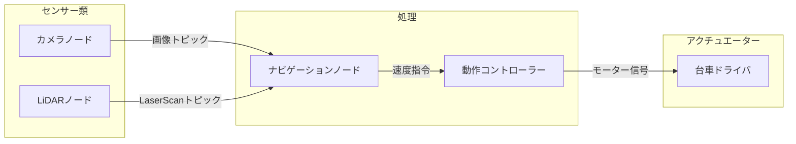
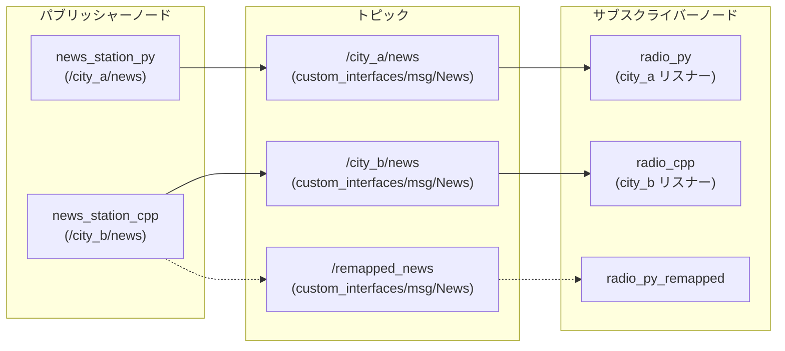
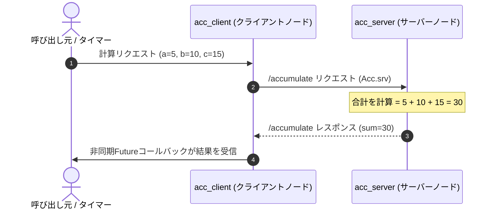

# ROS 2 の基礎（ROS 2 Basics）

**ROS 2 (Robot Operating System 2)** は、モジュール化されたロボットシステムを構築するための業界標準のオープンソースフレームワークおよびミドルウェアです。

その名前に反して、ROS 2 は Linux や macOS のような従来のオペレーティングシステムではありません。むしろ **ロボティクス・ミドルウェア** であり、分散したソフトウェアプロセス（**ノード** と呼ばれます）がスレッド、プロセス、そしてネットワーク接続されたマシン間で確実にデータをやり取りできるようにする通信レイヤーです。

https://github.com/jinyongnan810/ros-practice



---

## 1. コアアーキテクチャのメンタルモデル

ロボットは多数のハードウェアおよびソフトウェアコンポーネントで構成される複雑な機械です。センサー読み取り、軌道計画、モーター駆動をひとつのモノリシックなプログラムとして記述すると、脆くデバッグが困難なコードになってしまいます。

ROS 2 はシステムを疎結合な構成要素に分解します:

- **ノード (Nodes):** 単一の目的を持つプログラム（例: LiDARセンサーの読み取り、経路計算など）。
- **通信パラダイム:**
  - **トピック (Topics / Publish-Subscribe):** 連続的で単方向のデータストリーム（例: センサーテレメトリ、カメラ映像）。
  - **サービス (Services / Request-Response):** 同期または非同期の双方向リモートプロシージャコール（例: キャリブレーションの実行、計算結果の取得、オブジェクトの生成）。
  - **パラメータ (Parameters):** 起動時に設定するか実行時に調整可能な設定値。

---

## 2. ノード: システムの構成単位

**ノード** は、特定のロボット工学的計算を実行するプロセスです。最新の ROS 2 では、クライアントライブラリの基底ノードクラス（C++ の `rclcpp::Node` や Python の `rclpy.node.Node`）を継承した**オブジェクト指向プログラミング (OOP)** を用いてノードを実装するのがベストプラクティスです。

### 実装例

https://github.com/jinyongnan810/ros-practice/tree/main/1.nodes

---

## 3. トピック: パブリッシュ / サブスクライブ パターン

**トピック (Topics)** は、非同期かつ多対多の単方向データストリーミングを実現します。

- **パブリッシャー (Publisher):** メッセージを生成し、名前付きチャネル（トピック）に送信します。
- **サブスクライバー (Subscriber):** 名前付きチャネルをリッスンし、コールバック関数経由で受信メッセージを処理します。
- パブリッシャーとサブスクライバーは完全に疎結合です。パブリッシャーは誰が受信しているかを知らず、サブスクライバーは誰がデータを生成したかを気にしません。



### 実装例

https://github.com/jinyongnan810/ros-practice/tree/main/2.topics

---

## 4. サービス: リクエスト / レスポンス パターン

トピックが連続的なストリームを処理するのに対し、**サービス (Services)** は、**クライアント** が **サーバー** にリクエストを送信し、返答を待つオンデマンドなトランザクションを処理します。



### 実装例

https://github.com/jinyongnan810/ros-practice/tree/main/3.services

---

## 5. パラメータと起動管理（Launch）

### 動的パラメータ

パラメータを使用すると、ソースコードを変更・再コンパイルすることなくノードのプロパティを設定できます。

- **宣言:** ノードはデフォルト値を指定してパラメータを宣言します (`declare_parameter("timer_interval", 1.0)`)。
- **実行時の更新:** ユーザーは実行中のノードのパラメータを変更できます:
  ```bash
  ros2 param set /news_station_node timer_interval 0.25
  ```

### Launchファイル: 宣言的なシステム起動

実際のロボットシステムでは、何十ものノードを起動し、トピック名をリマップし、名前空間を設定する必要があります。ROS 2 は主に2つのLaunchフォーマットを提供します:

1. **Python Launchファイル (`.launch.py`):** プログラマブルで柔軟な条件分岐ロジックを記述可能。
2. **XML Launchファイル (`.launch.xml`):** 簡潔で宣言的、可読性が高い。

---

## 6. ワークスペースのセットアップとビルド手順

ROS 2 ワークスペースは標準的なディレクトリ構造に従います:

```text
ros_workspace/
├── src/                    # パッケージのソースコード
│   ├── my_cpp_pkg/         # C++パッケージ (CMakeLists.txt, package.xml)
│   └── my_py_pkg/          # Pythonパッケージ (setup.py, package.xml)
├── build/                  # 中間コンパイル成果物
├── install/                # ビルド済み実行ファイル、ライブラリ、設定スクリプト
└── log/                    # ビルドおよび実行時のログファイル
```

### 一般的なビルドコマンド (`colcon`)

```bash
# ワークスペース内の全パッケージをビルド
colcon build

# 特定のパッケージのみをビルドして時間を節約
colcon build --packages-select topic_cpp_pkg topic_py_pkg

# Pythonファイルをシンボリックリンクし、開発中の即時反映を有効化
colcon build --symlink-install

# 新しくコンパイルされたワークスペース環境を読み込む
source install/setup.bash
```

実務プロジェクトでは、`.envrc` に `source install/setup.bash` を追加し、`direnv allow` を使ってディレクトリ移動時に自動で環境をロードするのが便利です。

---

## 7. 必須 ROS 2 CLI チートシート

### ノードの診断

```bash
ros2 node list                     # 稼働中の全ノードを一覧表示
ros2 node info /turtle_chaser      # ノードのパブリッシャー、サブスクライバー、サービスを確認
rqt_graph                          # 計算グラフのGUIビジュアライザを起動
```

### トピックの確認と配信

```bash
ros2 topic list -t                 # メッセージ型付きでアクティブなトピックを一覧表示
ros2 topic echo /turtle1/pose      # トピックに配信されるメッセージをリアルタイム表示
ros2 topic hz /turtle1/pose        # 配信周波数（Hz）を計測
ros2 topic bw /turtle1/pose        # 帯域幅の使用量を計測
ros2 topic pub -r 5 /news custom_interfaces/msg/News "{datetime: '2026-08-16', title: 'Daily News', content: 'Ready'}"
```

### サービスの操作

```bash
ros2 service list -t               # アクティブなサービス一覧を型付きで表示
ros2 interface show custom_interfaces/srv/Acc # .srv 定義を表示
ros2 service call /accumulate custom_interfaces/srv/Acc "{a: 5, b: 10, c: 15}"
```

### パラメータの管理

```bash
ros2 param list                    # 全実行中ノードのパラメータを一覧表示
ros2 param get /news_station_node timer_interval
ros2 param set /news_station_node timer_interval 0.5
ros2 param dump /news_station_node # 現在のパラメータをYAMLにエクスポート
```

### Rosbag によるデータ記録と再生

```bash
ros2 bag record -o test_run /turtle1/pose /turtle1/cmd_vel
ros2 bag info test_run
ros2 bag play test_run
```
