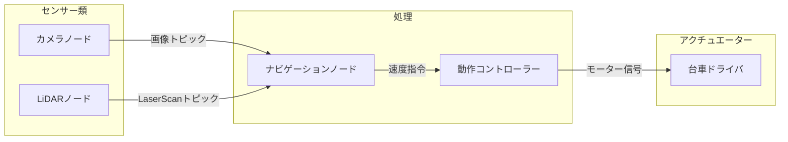
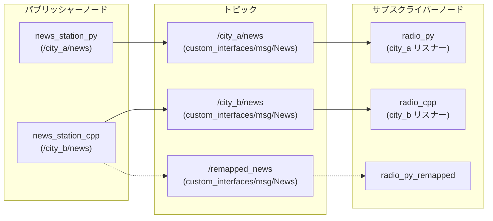
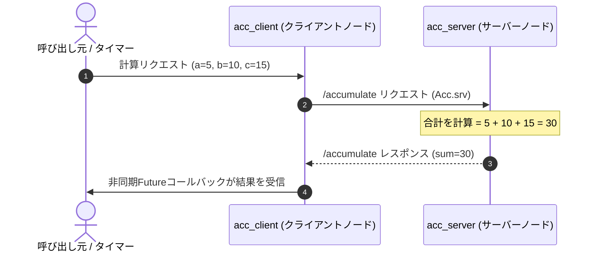
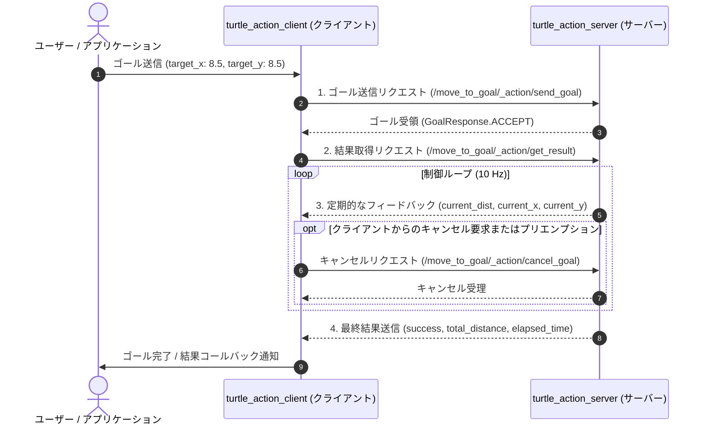

# ROS 2 の基礎（ROS 2 Basics）

**ROS 2 (Robot Operating System 2)** は、モジュール化されたロボットシステムを構築するための業界標準のオープンソースフレームワークおよびミドルウェアです。

その名前に反して、ROS 2 は Linux や macOS のような従来のオペレーティングシステムではありません。むしろ **ロボティクス・ミドルウェア** であり、分散したソフトウェアプロセス（**ノード** と呼ばれます）がスレッド、プロセス、そしてネットワーク接続されたマシン間で確実にデータをやり取りできるようにする通信レイヤーです。

https://github.com/jinyongnan810/ros-practice



---

## 1. コアアーキテクチャのメンタルモデル

ロボットは多数のハードウェアおよびソフトウェアコンポーネントで構成される複雑な機械です。センサー読み取り、軌道計画、モーター駆動をひとつのモノリシックなプログラムとして記述すると、脆くデバッグが困難なコードになってしまいます。

ROS 2 はシステムを疎結合な構成要素に分解します:

- **ノード (Nodes):** 単一の目的を持つプログラム（例: LiDARセンサーの読み取り、経路計算など）。
- **通信パラダイム:**
  - **トピック (Topics / Publish-Subscribe):** 連続的で単方向のデータストリーム（例: センサーテレメトリ、カメラ映像）。
  - **サービス (Services / Request-Response):** 同期または非同期の双方向リモートプロシージャコール（例: キャリブレーションの実行、計算結果の取得、オブジェクトの生成）。
  - **アクション (Actions / Goal-Feedback-Result):** 継続的な進捗フィードバックを伴う、非同期かつ長時間実行・中断（キャンセル）可能なタスク（例: 指定座標へのナビゲーション、ロボットアームの軌道制御）。
  - **パラメータ (Parameters):** 起動時に設定するか実行時に調整可能な設定値。

---

## 2. ノード: システムの構成単位

**ノード** は、特定のロボット工学的計算を実行するプロセスです。最新の ROS 2 では、クライアントライブラリの基底ノードクラス（C++ の `rclcpp::Node` や Python の `rclpy.node.Node`）を継承した**オブジェクト指向プログラミング (OOP)** を用いてノードを実装するのがベストプラクティスです。

### 実装例

https://github.com/jinyongnan810/ros-practice/tree/main/1.nodes

---

## 3. トピック: パブリッシュ / サブスクライブ パターン

**トピック (Topics)** は、非同期かつ多対多の単方向データストリーミングを実現します。

- **パブリッシャー (Publisher):** メッセージを生成し、名前付きチャネル（トピック）に送信します。
- **サブスクライバー (Subscriber):** 名前付きチャネルをリッスンし、コールバック関数経由で受信メッセージを処理します。
- パブリッシャーとサブスクライバーは完全に疎結合です。パブリッシャーは誰が受信しているかを知らず、サブスクライバーは誰がデータを生成したかを気にしません。



### 実装例

https://github.com/jinyongnan810/ros-practice/tree/main/2.topics

---

## 4. サービス: リクエスト / レスポンス パターン

トピックが連続的なストリームを処理するのに対し、**サービス (Services)** は、**クライアント** が **サーバー** にリクエストを送信し、返答を待つオンデマンドなトランザクションを処理します。



### 実装例

https://github.com/jinyongnan810/ros-practice/tree/main/3.services

---

## 5. アクション: ゴール / フィードバック / リザルト パターン

トピックが連続的なデータストリームを扱い、サービスが即時的なリクエスト／レスポンスを処理するのに対し、**アクション (Actions)** は **長時間実行され、進捗フィードバックを返し、中断（プリエンプション／キャンセル）可能なタスク**（例: 目標座標へのロボットの自律移動、アームによる把持、自動充電ドッキングなど）のために設計されています。

ROS 2 のアクションは、内部的にはトピックとサービスを組み合わせた上位の複合通信パラダイムです:

- **ゴール (Goal / Service):** クライアントがサーバーにタスクを要求し、サーバーは即座にゴールを受け入れる（Accept）か拒否する（Reject）かを返します。
- **フィードバック (Feedback / Topic):** 実行中、サーバーは進捗状況をクライアントへ定期的にパブリッシュします。
- **リザルト (Result / Service):** タスクが完了または終了した際（成功、キャンセル、中止）、サーバーは最終結果と統計データをクライアントに送信します。
- **キャンセル (Cancel / Service):** クライアントは実行中の任意のタイミングでゴールのキャンセルを要求できます。

### アクションインターフェース定義 (`.action`)

アクションはインターフェースパッケージの `action/` ディレクトリ内の `.action` ファイルで定義され、`---` によって3つのセクション（ゴール、リザルト、フィードバック）に分割されます:

```action
# 1. ゴール: 目標座標と希望直進速度
float32 target_x
float32 target_y
float32 linear_velocity
---
# 2. リザルト: 最終ステータスと移動統計
bool success
float32 total_distance
float32 elapsed_time
---
# 3. フィードバック: 現在位置と目標までの残り距離
float32 current_distance
float32 current_x
float32 current_y
```

### 通信の流れ



### トピック vs サービス vs アクション の比較

| 項目                   | トピック (Topics)                        | サービス (Services)                          | アクション (Actions)                                 |
| :--------------------- | :--------------------------------------- | :------------------------------------------- | :--------------------------------------------------- |
| **通信方式**           | 多対多 パブリッシュ／サブスクライブ      | 1対1 リクエスト／レスポンス                  | 1対1（または1対多）ゴール駆動型                      |
| **データフロー**       | 連続的な単方向ストリーム                 | 双方向の同期／非同期 RPC                     | 非同期マルチステージトランザクション                 |
| **実行時間**           | 継続的／常時                             | 瞬間的・短時間（秒未満〜数秒）               | 長時間実行（数秒〜数分）                             |
| **進捗フィードバック** | なし（生データのみ）                     | なし（最終応答のみ）                         | 定期的な進捗状況の通知                               |
| **中断・キャンセル**   | 不可                                     | 原則不可（完了まで待機）                     | 任意時点でキャンセル・プリエンプション可能           |
| **代表的な用途**       | LiDAR、オドメトリ、速度指令 (`/cmd_vel`) | 原点復帰、キャリブレーション、パラメータ取得 | 目的地へのナビゲーション、アーム軌道制御、ドッキング |

### アーキテクチャの要点とベストプラクティス

1. **周期制御ループ（`Rate.sleep()` vs `time.sleep()`）:**
   アクションの実行コールバック内の制御ループでは、固定の `sleep()` ではなく ROS 2 の `Rate` オブジェクト（Python: `self.create_rate(10)`、C++: `rclcpp::Rate(10)`）を使用します。
   - **クロックドリフト補償:** 距離計算やフィードバック送信にかかった時間を差し引いてスリープするため、正確な周期（例: 10 Hz）を維持できます。
   - **シミュレーション時刻への追従 (`use_sim_time`):** ROS クロック (`/clock`) と連動するため、Gazebo の一時停止や倍速再生にも自動的に同期します。
2. **ゴールプリエンプション（横取り）方針:**
   単一のロボット／アクチュエータを制御する場合、`active_goal_handle` をミューテックス／ロックで保護して追跡します。実行中に新しいゴールを受信した際は、直前のゴールを中止 (`goal_handle.abort()`) して新しいゴールへ滑らかに操舵を引き継ぎます。
3. **MultiThreadedExecutor による並行処理:**
   アクションサーバーの `execute_callback` で継続的な制御ループを回す場合、シングルスレッド実行ではセンサ受信コールバック（`/turtle1/pose` 等）やキャンセル要求がブロックされてしまいます。`ReentrantCallbackGroup` と `MultiThreadedExecutor` を利用して並行処理を保証します。

### 実装例

https://github.com/jinyongnan810/ros-practice/tree/main/6.actions

---

## 6. パラメータと起動管理（Launch）

### 動的パラメータ

パラメータを使用すると、ソースコードを変更・再コンパイルすることなくノードのプロパティを設定できます。

- **宣言:** ノードはデフォルト値を指定してパラメータを宣言します (`declare_parameter("timer_interval", 1.0)`)。
- **実行時の更新:** ユーザーは実行中のノードのパラメータを変更できます:
  ```bash
  ros2 param set /news_station_node timer_interval 0.25
  ```

### Launchファイル: 宣言的なシステム起動

実際のロボットシステムでは、何十ものノードを起動し、トピック名をリマップし、名前空間を設定する必要があります。ROS 2 は主に2つのLaunchフォーマットを提供します:

1. **Python Launchファイル (`.launch.py`):** プログラマブルで柔軟な条件分岐ロジックを記述可能。
2. **XML Launchファイル (`.launch.xml`):** 簡潔で宣言的、可読性が高い。

---

## 7. ワークスペースのセットアップとビルド手順

ROS 2 ワークスペースは標準的なディレクトリ構造に従います:

```text
ros_workspace/
├── src/                    # パッケージのソースコード
│   ├── my_cpp_pkg/         # C++パッケージ (CMakeLists.txt, package.xml)
│   └── my_py_pkg/          # Pythonパッケージ (setup.py, package.xml)
├── build/                  # 中間コンパイル成果物
├── install/                # ビルド済み実行ファイル、ライブラリ、設定スクリプト
└── log/                    # ビルドおよび実行時のログファイル
```

### 一般的なビルドコマンド (`colcon`)

```bash
# ワークスペース内の全パッケージをビルド
colcon build

# 特定のパッケージのみをビルドして時間を節約
colcon build --packages-select topic_cpp_pkg topic_py_pkg

# Pythonファイルをシンボリックリンクし、開発中の即時反映を有効化
colcon build --symlink-install

# 新しくコンパイルされたワークスペース環境を読み込む
source install/setup.bash
```

実務プロジェクトでは、`.envrc` に `source install/setup.bash` を追加し、`direnv allow` を使ってディレクトリ移動時に自動で環境をロードするのが便利です。

---

## 8. 必須 ROS 2 CLI チートシート

### ノードの診断

```bash
ros2 node list                     # 稼働中の全ノードを一覧表示
ros2 node info /turtle_chaser      # ノードのパブリッシャー、サブスクライバー、サービスを確認
rqt_graph                          # 計算グラフのGUIビジュアライザを起動
```

### トピックの確認と配信

```bash
ros2 topic list -t                 # メッセージ型付きでアクティブなトピックを一覧表示
ros2 topic echo /turtle1/pose      # トピックに配信されるメッセージをリアルタイム表示
ros2 topic hz /turtle1/pose        # 配信周波数（Hz）を計測
ros2 topic bw /turtle1/pose        # 帯域幅の使用量を計測
ros2 topic pub -r 5 /news custom_interfaces/msg/News "{datetime: '2026-08-16', title: 'Daily News', content: 'Ready'}"
```

### サービスの操作

```bash
ros2 service list -t               # アクティブなサービス一覧を型付きで表示
ros2 interface show custom_interfaces/srv/Acc # .srv 定義を表示
ros2 service call /accumulate custom_interfaces/srv/Acc "{a: 5, b: 10, c: 15}"
```

### アクションの操作

```bash
ros2 action list                   # 稼働中のアクション一覧を表示
ros2 action list -t                # アクション型付きで一覧表示
ros2 action info /move_to_goal     # アクションのサーバーとクライアント詳細を確認
ros2 interface show custom_interfaces/action/MoveToGoal # .action 定義を表示
ros2 action send_goal /move_to_goal custom_interfaces/action/MoveToGoal "{target_x: 8.0, target_y: 8.0, linear_velocity: 2.0}" --feedback # フィードバック付きでゴールを送信
```

### パラメータの管理

```bash
ros2 param list                    # 全実行中ノードのパラメータを一覧表示
ros2 param get /news_station_node timer_interval
ros2 param set /news_station_node timer_interval 0.5
ros2 param dump /news_station_node # 現在のパラメータをYAMLにエクスポート
```

### Rosbag によるデータ記録と再生

```bash
ros2 bag record -o test_run /turtle1/pose /turtle1/cmd_vel
ros2 bag info test_run
ros2 bag play test_run
```
