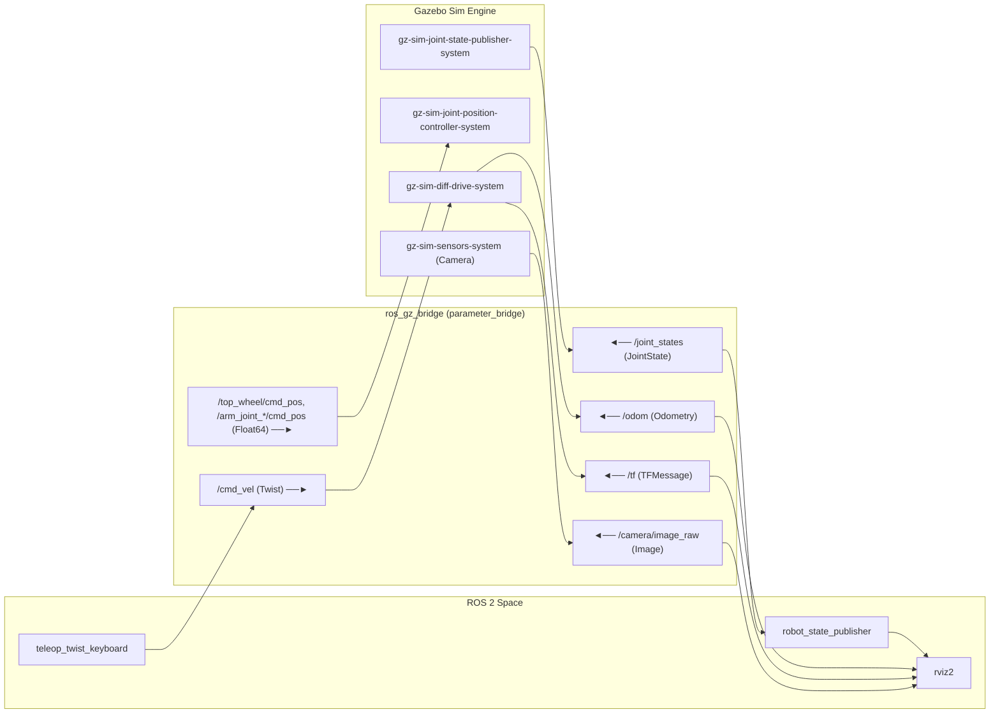
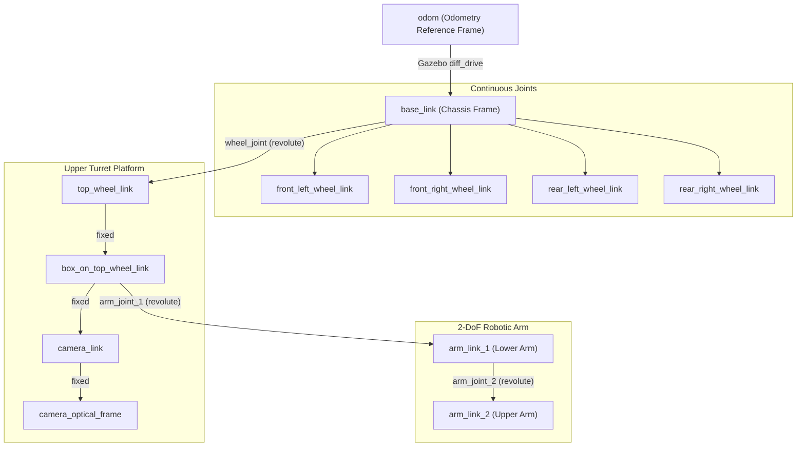

# URDF and Gazebo

**URDF (Unified Robot Description Format)** and **Gazebo Sim** (Harmonic / `ros_gz`) form the core foundation for robot kinematic modeling, 3D visualization in RViz2, and physics-based dynamics simulation in ROS 2.

https://github.com/jinyongnan810/ros-practice/tree/main/5.urdf



---

## 1. Robot Modeling with URDF & Xacro

### Core Link Elements

A URDF model consists of rigid **links** connected by **joints**. Each `<link>` defines three primary aspects:

```xml
<link name="chassis_link">
    <!-- 1. Visual: Graphical rendering in RViz & Gazebo -->
    <visual>
        <geometry>
            <mesh filename="package://simple_car_description/meshes/visual/waffle_base.stl" scale="1 1 1"/>
        </geometry>
        <origin xyz="0 0 0" rpy="0 0 0"/>
        <material name="blue"/>
    </visual>

    <!-- 2. Collision: Simplified bounding geometry for physics computation -->
    <collision>
        <geometry>
            <box size="0.6 0.4 0.2"/>
        </geometry>
        <origin xyz="0 0 0.1" rpy="0 0 0"/>
    </collision>

    <!-- 3. Inertial: Mass distribution (Mandatory for dynamic Gazebo simulation) -->
    <inertial>
        <mass value="5.0"/>
        <origin xyz="0 0 0.1" rpy="0 0 0"/>
        <inertia ixx="0.0833" ixy="0" ixz="0" iyy="0.1667" iyz="0" izz="0.2167"/>
    </inertial>
</link>
```

- **`<visual>`**: Visual appearance using primitive shapes (`<box>`, `<cylinder>`, `<sphere>`) or external 3D meshes (`.stl`, `.dae`).
- **`<collision>`**: Geometry used by the physics engine for contact detection. Using simplified primitives instead of complex meshes significantly optimizes physics solver performance.
- **`<inertial>`**: Defines the link's mass ($kg$), Center of Mass (COM) origin, and $3 \times 3$ rotational moment of inertia matrix ($kg \cdot m^2$). **Required for Gazebo dynamic simulation**; links without inertia are treated as static or ignored by the physics solver.

---

### Moment of Inertia Formulas

Standard formulas for uniform geometric solids:

| Geometry           | Dimensions                                        | Moment of Inertia Tensor                                                                                                |
| :----------------- | :------------------------------------------------ | :---------------------------------------------------------------------------------------------------------------------- |
| **Solid Box**      | Width $x$, Depth $y$, Height $z$, Mass $m$        | $$I_{xx} = \frac{1}{12}m(y^2 + z^2), \quad I_{yy} = \frac{1}{12}m(x^2 + z^2), \quad I_{zz} = \frac{1}{12}m(x^2 + y^2)$$ |
| **Solid Cylinder** | Radius $r$, Height $h$ (along $z$-axis), Mass $m$ | $$I_{xx} = I_{yy} = \frac{1}{12}m(3r^2 + h^2), \quad I_{zz} = \frac{1}{2}m r^2$$                                        |
| **Solid Sphere**   | Radius $r$, Mass $m$                              | $$I_{xx} = I_{yy} = I_{zz} = \frac{2}{5}m r^2$$                                                                         |

For additional geometric shapes and formulas, refer to the [Wikipedia: List of moments of inertia](https://en.wikipedia.org/wiki/List_of_moments_of_inertia#List_of_3D_inertia_tensors).

> [!NOTE]
> Gazebo visualizes inertia tensors as _equivalent uniform inertia boxes_. For radially symmetric cylinders ($I_{xx} = I_{yy}$), this equivalent box appears as a square cross-section ($\sqrt{3}r \times \sqrt{3}r$).

---

### Joint Types & Kinematics

Joints establish the physical constraints and degrees of freedom (DoF) between parent and child links:

| Joint Type       | DoF | Motion Description                                                        | Common Usage                                          |
| :--------------- | :-: | :------------------------------------------------------------------------ | :---------------------------------------------------- |
| **`continuous`** |  1  | Continuous rotation with no angle bounds                                  | Drive wheels, propellers                              |
| **`revolute`**   |  1  | Rotational motion bounded by `<limit>` ($[\theta_{\min}, \theta_{\max}]$) | Robotic arm joints, steering hinges, pan-tilt turrets |
| **`prismatic`**  |  1  | Linear sliding motion bounded by `<limit>`                                | Linear actuators, elevator lifts                      |
| **`fixed`**      |  0  | Rigid attachment (0 DoF)                                                  | Sensor mounts, static brackets                        |
| **`planar`**     |  3  | 2D translation $(x, y)$ and rotation $(\theta)$ in a plane                | Planar mobile platforms                               |
| **`floating`**   |  6  | Unconstrained 3D motion                                                   | Aerial drones, underwater vehicles                    |

#### Origin Best Practice

When chaining links and joints:

1. **Joint Origin First:** Place `<origin xyz="..." rpy="..."/>` on the `<joint>` to anchor the joint pivot relative to the parent frame.
2. **Child Geometry/Inertial Relative Second:** Position the child link's `<visual>`, `<collision>`, and `<inertial>` relative to the newly defined joint pivot frame.

---

### Xacro Modularity

**Xacro (XML Macros)** eliminates redundant code and parameterizes robot definitions:

- **Properties:** Define constants once:
  ```xml
  <xacro:property name="wheel_radius" value="0.05"/>
  ```
- **Math Expressions:** Compute expressions dynamically:
  ```xml
  <origin xyz="${chassis_length / 2} ${chassis_width / 2} 0"/>
  ```
- **Reusable Macros:** Instantiate repetitive components (e.g., wheels, sensors):
  ```xml
  <xacro:wheel prefix="front_left" x="${wheel_x_offset}" y="${wheel_y_offset}"/>
  ```
- **Modular Includes:** Separate large definitions into dedicated files (`*.properties.xacro`, `*.materials.xacro`, `*.inertias.xacro`, `*.arm.xacro`, `*.gazebo.xacro`).

---

## 2. Coordinate Conventions & TF Tree

### REP-103 Coordinate Standard

ROS adheres to **REP-103 Standard Units & Coordinate Conventions** using the **Right-Hand Rule**:

- **+X (Red):** Forward
- **+Y (Green):** Left
- **+Z (Blue):** Up

```text
       +Z (Blue) [Up]
        ^
        |
        |
        +----> +Y (Green) [Left]
       /
      /
     v
   +X (Red) [Forward]
```

---

### Kinematic TF Tree



- **`robot_state_publisher`:** Ingests the URDF from `robot_description` and live angles from `/joint_states`, computes forward kinematics, and broadcasts dynamic `/tf` and static `/tf_static` transforms.
- **`joint_state_publisher_gui`:** Standalone GUI providing interactive joint sliders for kinematic debugging in RViz before launching physical simulation.

---

## 3. Gazebo Sim Integration & ROS-Gz Bridge

**Gazebo Sim** provides dynamic physics simulation, ground friction, collision reactions, and sensor rendering.

### Key Simulation Plugins

1. **`gz-sim-diff-drive-system`**: Computes differential drive kinematics from `/cmd_vel`, updates wheel rotations, and publishes dead-reckoning odometry (`/odom`) and TF transforms (`odom -> base_link`).
2. **`gz-sim-joint-position-controller-system`**: Implements closed-loop PID control for revolute joints (`top_wheel`, `arm_joint_1`, `arm_joint_2`), receiving target angles via topic messages.
3. **`gz-sim-joint-state-publisher-system`**: Reads moving joint positions and publishes states to `/joint_states`.
4. **`gz-sim-sensors-system`**: Renders camera image streams and point clouds using OGRE 2.

---

### ROS-Gz Bridge Topic Mapping

The `ros_gz_bridge` translates messages between Gazebo's native Protobuf protocol and ROS 2 topics:

| ROS 2 Topic            | ROS 2 Type                   | Gazebo Protobuf Type |  Direction  | Purpose                                         |
| :--------------------- | :--------------------------- | :------------------- | :---------: | :---------------------------------------------- |
| `/clock`               | `rosgraph_msgs/msg/Clock`    | `gz.msgs.Clock`      | `GZ -> ROS` | Sim-time synchronization (`use_sim_time:=true`) |
| `/joint_states`        | `sensor_msgs/msg/JointState` | `gz.msgs.Model`      | `GZ -> ROS` | Feeds joint angles to `robot_state_publisher`   |
| `/cmd_vel`             | `geometry_msgs/msg/Twist`    | `gz.msgs.Twist`      | `ROS -> GZ` | Velocity drive commands to differential drive   |
| `/odom`                | `nav_msgs/msg/Odometry`      | `gz.msgs.Odometry`   | `GZ -> ROS` | Wheel odometry state estimate                   |
| `/tf`                  | `tf2_msgs/msg/TFMessage`     | `gz.msgs.Pose_V`     | `GZ -> ROS` | Dynamic `odom -> base_link` transform           |
| `/camera/image_raw`    | `sensor_msgs/msg/Image`      | `gz.msgs.Image`      | `GZ -> ROS` | Synthetic camera RGB image stream               |
| `/top_wheel/cmd_pos`   | `std_msgs/msg/Float64`       | `gz.msgs.Double`     | `ROS -> GZ` | Target angle command for top turret joint       |
| `/arm_joint_1/cmd_pos` | `std_msgs/msg/Float64`       | `gz.msgs.Double`     | `ROS -> GZ` | Target angle command for lower arm joint        |
| `/arm_joint_2/cmd_pos` | `std_msgs/msg/Float64`       | `gz.msgs.Double`     | `ROS -> GZ` | Target angle command for upper arm joint        |

---

### Gazebo Fuel Cloud Assets

Gazebo Sim supports streaming 3D assets directly from [Gazebo Fuel](https://app.gazebosim.org):

- World files (`.sdf`) declare cloud models via URI:
  ```xml
  <uri>https://fuel.gazebosim.org/1.0/OpenRobotics/models/Pine Tree</uri>
  ```
- Assets are automatically fetched and cached locally in `~/.gz/fuel/` on first launch for offline reuse.

---

## 4. Odometry & Frame Conventions (REP-105)

**Odometry (`nav_msgs/msg/Odometry`)** estimates position and orientation by integrating wheel encoder rotations over time.

### Frame Hierarchy

```text
map (Global fixed frame, drift-free, discontinuous during SLAM loop closures)
 └── odom (World-fixed frame, smooth & continuous, accumulates dead-reckoning drift)
      └── base_link (Robot body origin, rigidly attached to mobile chassis)
```

- **`odom -> base_link`**: Broadcast continuously by the odometry driver. Smooth and responsive for high-rate local control, but accumulates dead-reckoning drift from wheel slip and integration errors.
- **`map -> odom`**: Broadcast by global localization (SLAM / AMCL) to correct accumulated odometry drift against global landmarks.

---

## 5. Quickstart & Command Reference

### Build & Setup

```bash
# Build the robot description package with symlink install
colcon build --packages-select simple_car_description --symlink-install
source install/setup.bash
```

> [!TIP]
> `--symlink-install` links Xacro, URDF, and mesh assets directly from `src/`. Any modifications to `.xacro` files take effect immediately on next launch without rebuilding.

---

### Launching Visualization & Simulation

```bash
# 1. Inspect kinematics & joints in RViz2
ros2 launch simple_car_description display.launch.py

# 2. Run physics simulation in Gazebo Sim (Forest World)
ros2 launch simple_car_description gazebo.launch.py

# 3. Launch Gazebo Sim with RViz2 synchronized
ros2 launch simple_car_description gazebo.launch.py rviz:=true
```

---

### Keyboard Teleoperation

In a separate terminal, drive the mobile robot using `teleop_twist_keyboard`:

```bash
ros2 run teleop_twist_keyboard teleop_twist_keyboard
```

```text
    u   i   o       (↖  ↑  ↗)
    j   k   l       (← stop →)
    m   ,   .       (↙  ↓  ↘)
```

- **`i` / `,`**: Move forward / backward
- **`j` / `l`**: Rotate left / right in place
- **`k`**: Stop all motion
- **`w` / `x`**: Increase / decrease linear speed by 10%
- **`e` / `c`**: Increase / decrease angular speed by 10%

---

### Joint Position Commands

Command target angles (in radians, $[-\pi/2, +\pi/2]$) to rotate the top turret platform or arm segments:

```bash
# Rotate top platform to 45 deg (+pi/4 rad)
ros2 topic pub --once /top_wheel/cmd_pos std_msgs/msg/Float64 "{data: 0.785}"

# Bend lower arm to 90 deg (+pi/2 rad)
ros2 topic pub --once /arm_joint_1/cmd_pos std_msgs/msg/Float64 "{data: 1.5708}"

# Bend upper arm to -45 deg (-pi/4 rad)
ros2 topic pub --once /arm_joint_2/cmd_pos std_msgs/msg/Float64 "{data: -0.785}"

# Reset joints to neutral home position (0 rad)
ros2 topic pub --once /top_wheel/cmd_pos std_msgs/msg/Float64 "{data: 0.0}"
ros2 topic pub --once /arm_joint_1/cmd_pos std_msgs/msg/Float64 "{data: 0.0}"
ros2 topic pub --once /arm_joint_2/cmd_pos std_msgs/msg/Float64 "{data: 0.0}"
```

---

### Useful Diagnostic CLI Tools

```bash
# Compile Xacro to raw URDF and validate structure
xacro src/simple_car_description/urdf/simple_car.urdf.xacro -o /tmp/robot.urdf
check_urdf /tmp/robot.urdf

# Inspect live transform between odom and base_link
ros2 run tf2_ros tf2_echo odom base_link

# Generate a PDF of the active TF tree
ros2 run tf2_tools view_frames

# Direct Gazebo Sim CLI commands
gz topic -l
gz topic -e -t /odom
```

---

## 6. Control & Physics Simulation Insights

### Gazebo Joint Dynamics & `implicitSpringDamper`

When adding joint damping or friction (`<dynamics damping="..." friction="..."/>`), standard physics solvers use explicit Euler integration. With discrete time steps ($1\text{ ms}$), high damping values can cause high-frequency numerical oscillations and jitter.

**Best Practice:** Add `<implicitSpringDamper>true</implicitSpringDamper>` in the `<gazebo>` extension for revolute arm joints and suspension systems to solve damping inside the constraint matrix:

```xml
<gazebo reference="arm_joint_1">
    <implicitSpringDamper>true</implicitSpringDamper>
</gazebo>
```

---

### PID Controller Gains Intuition

Joint position controllers calculate control torque based on tracking error $e(t) = \theta_{\text{target}} - \theta_{\text{actual}}$:

$$\tau(t) = \underbrace{K_p \cdot e(t)}_{\text{Proportional (Present)}} + \underbrace{K_i \int_0^t e(\tau)\,d\tau}_{\text{Integral (Past)}} + \underbrace{K_d \cdot \frac{de(t)}{dt}}_{\text{Derivative (Future)}}$$

| Parameter                 | Term          | Role & Physical Meaning                                                                                | Mechanical Analogy                        |
| :------------------------ | :------------ | :----------------------------------------------------------------------------------------------------- | :---------------------------------------- |
| **`p_gain`** ($K_p$)      | Proportional  | Amplifies **current error**. Controls how aggressively the motor moves towards the target.             | **Spring stiffness** ($F = -k x$)         |
| **`i_gain`** ($K_i$)      | Integral      | Accumulates **past error**. Overcomes steady-state offsets such as gravity loading or static friction. | **Pressure build-up**                     |
| **`d_gain`** ($K_d$)      | Derivative    | Multiplies **error rate of change**. Dampens motion to prevent overshoot and oscillations.             | **Shock absorber / Dashpot** ($F = -c v$) |
| **`i_max` / `i_min`**     | Anti-Windup   | Clamps maximum accumulated integral torque to avoid integrator windup.                                 | **Pressure relief valve**                 |
| **`cmd_max` / `cmd_min`** | Torque Limits | Sets saturation limit on total motor torque output ($\text{Nm}$).                                      | **Motor power ceiling**                   |
