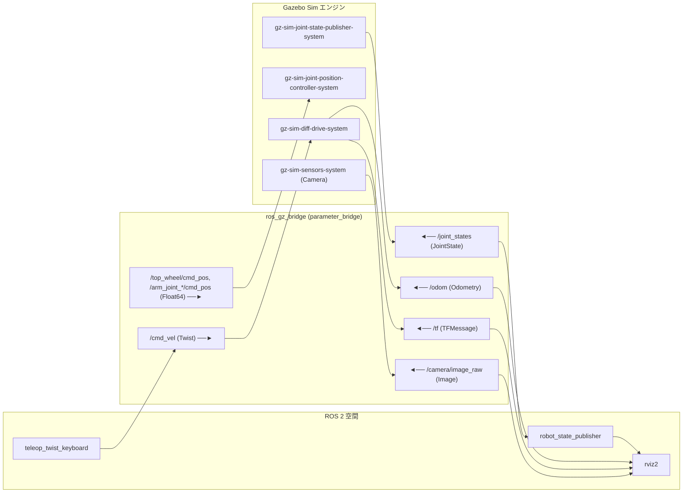
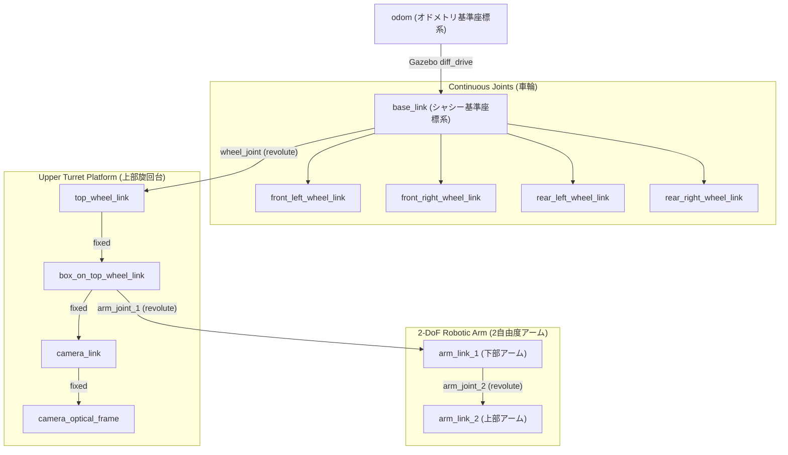

# URDF と Gazebo

**URDF (Unified Robot Description Format)** と **Gazebo Sim** (Harmonic / `ros_gz`) は、ロボットのキネマティクス（運動学）モデリング、RViz2での3D可視化、および ROS 2 における物理ベースの動力学シミュレーションの中核基盤を形成します。

https://github.com/jinyongnan810/ros-practice/tree/main/5.urdf



---

## 1. URDF と Xacro によるロボットモデリング

### コアとなるリンク要素

URDF モデルは、**ジョイント (Joint)** で接続された剛体 **リンク (Link)** で構成されます。各 `<link>` は主に以下の3つの要素を定義します:

```xml
<link name="chassis_link">
    <!-- 1. Visual: RViz & Gazebo でのグラフィカル表示 -->
    <visual>
        <geometry>
            <mesh filename="package://simple_car_description/meshes/visual/waffle_base.stl" scale="1 1 1"/>
        </geometry>
        <origin xyz="0 0 0" rpy="0 0 0"/>
        <material name="blue"/>
    </visual>

    <!-- 2. Collision: 物理演算のための簡略化された境界形状 -->
    <collision>
        <geometry>
            <box size="0.6 0.4 0.2"/>
        </geometry>
        <origin xyz="0 0 0.1" rpy="0 0 0"/>
    </collision>

    <!-- 3. Inertial: 質量分布（Gazeboでの動的シミュレーションに必須） -->
    <inertial>
        <mass value="5.0"/>
        <origin xyz="0 0 0.1" rpy="0 0 0"/>
        <inertia ixx="0.0833" ixy="0" ixz="0" iyy="0.1667" iyz="0" izz="0.2167"/>
    </inertial>
</link>
```

- **`<visual>`**: 基本形状（`<box>`, `<cylinder>`, `<sphere>`）や外部3Dメッシュ（`.stl`, `.dae`）を用いた外観の定義。
- **`<collision>`**: 接触判定のために物理エンジンが使用するジオメトリ。複雑なメッシュの代わりに簡略化されたプリミティブ形状を使用することで、物理ソルバーのパフォーマンスが大幅に向上します。
- **`<inertial>`**: リンクの質量 ($kg$)、重心 (COM) の原点、および $3 \times 3$ の回転慣性モーメント行列 ($kg \cdot m^2$) を定義します。**Gazebo による動的シミュレーションには必須**であり、慣性定義のないリンクは静的オブジェクトとして扱われるか、物理ソルバーによって無視されます。

---

### 慣性モーメントの計算式

均質幾何学固体の標準的な計算式:

| 形状                | 寸法パラメータ                           | 慣性モーメントテンソル                                                                                                  |
| :------------------ | :--------------------------------------- | :---------------------------------------------------------------------------------------------------------------------- |
| **直方体 (Box)**    | 幅 $x$, 奥行き $y$, 高さ $z$, 質量 $m$   | $$I_{xx} = \frac{1}{12}m(y^2 + z^2), \quad I_{yy} = \frac{1}{12}m(x^2 + z^2), \quad I_{zz} = \frac{1}{12}m(x^2 + y^2)$$ |
| **円柱 (Cylinder)** | 半径 $r$, 高さ $h$ ($z$軸方向), 質量 $m$ | $$I_{xx} = I_{yy} = \frac{1}{12}m(3r^2 + h^2), \quad I_{zz} = \frac{1}{2}m r^2$$                                        |
| **球体 (Sphere)**   | 半径 $r$, 質量 $m$                       | $$I_{xx} = I_{yy} = I_{zz} = \frac{2}{5}m r^2$$                                                                         |

その他の幾何学的形状と計算式については、[Wikipedia: List of moments of inertia](https://en.wikipedia.org/wiki/List_of_moments_of_inertia#List_of_3D_inertia_tensors) を参照してください。

> [!NOTE]
> Gazebo は慣性テンソルを*等価均質慣性ボックス*として視覚化します。回転対称な円柱（$I_{xx} = I_{yy}$）の場合、この等価ボックスは正方形の断面（$\sqrt{3}r \times \sqrt{3}r$）として表示されます。

---

### ジョイントの種類とキネマティクス

ジョイントは親リンクと子リンクの間の物理的拘束と自由度 (DoF) を設定します:

| ジョイント種別   | 自由度 (DoF) | 動作の説明                                                          | 一般的な用途                                           |
| :--------------- | :----------: | :------------------------------------------------------------------ | :----------------------------------------------------- |
| **`continuous`** |      1       | 角度制限のない連続回転                                              | 駆動輪、プロペラ                                       |
| **`revolute`**   |      1       | `<limit>` ($[\theta_{\min}, \theta_{\max}]$) による回転制限付き動作 | ロボットアームの関節、ステアリングヒンジ、旋回タレット |
| **`prismatic`**  |      1       | `<limit>` による直動スライド動作                                    | リニアアクチュエータ、エレベーター昇降部               |
| **`fixed`**      |      0       | 完全に固定された結合（自由度0）                                     | センサーマウント、固定ブラケット                       |
| **`planar`**     |      3       | 平面内の2次元並進 $(x, y)$ と回転 $(\theta)$                        | 平面移動プラットフォーム                               |
| **`floating`**   |      6       | 拘束のない3次元空間動作                                             | ドローン、水中航走体                                   |

#### 原点設定のベストプラクティス

リンクとジョイントを接続する際の推奨手順:

1. **ジョイント原点を先に配置:** `<joint>` 内に `<origin xyz="..." rpy="..."/>` を定義し、親フレームを基準とした回転軸の位置を固定します。
2. **子リンクの形状・慣性を相対配置:** 定義されたジョイント回転軸のフレームを基準として、子リンクの `<visual>`, `<collision>`, `<inertial>` を配置します。

---

### Xacro によるモジュール化

**Xacro (XML Macros)** を使用することで、冗長なコードを削減し、ロボット定義をパラメータ化できます:

- **プロパティ (変数):** 定数を一度定義して使い回す:
  ```xml
  <xacro:property name="wheel_radius" value="0.05"/>
  ```
- **数式表現:** 動的に計算を行う:
  ```xml
  <origin xyz="${chassis_length / 2} ${chassis_width / 2} 0"/>
  ```
- **再利用可能なマクロ:** 車輪やセンサーなどの繰り返しコンポーネントを共通化:
  ```xml
  <xacro:wheel prefix="front_left" x="${wheel_x_offset}" y="${wheel_y_offset}"/>
  ```
- **モジュール別分割インクルード:** 大規模な定義をファイルごとに分割管理 (`*.properties.xacro`, `*.materials.xacro`, `*.inertias.xacro`, `*.arm.xacro`, `*.gazebo.xacro`)。

---

## 2. 座標系の慣例と TF ツリー

### REP-103 座標系標準

ROS は **右手座標系** を採用した **REP-103 標準単位および座標規約** に準拠しています:

- **+X (赤):** 前方 (Forward)
- **+Y (緑):** 左 (Left)
- **+Z (青):** 上方 (Up)

```text
       +Z (青) [上]
        ^
        |
        |
        +----> +Y (緑) [左]
       /
      /
     v
   +X (赤) [前]
```

---

### キネマティック TF ツリー



- **`robot_state_publisher`:** `robot_description` から URDF を読み込み、`/joint_states` から現在の関節角度を取得して順運動学（フォワードキネマティクス）を計算し、動的な `/tf` と静的な `/tf_static` を配信します。
- **`joint_state_publisher_gui`:** 物理シミュレーションを起動する前に、スライダーを用いて RViz 上で関節動作をデバッグできる GUI ツールです。

---

## 3. Gazebo Sim の統合と ROS-Gz Bridge

**Gazebo Sim** は、動力学物理シミュレーション、接地摩擦、衝突応答、センサーレンダリングなどを提供します。

### 主要なシミュレーションプラグイン

1. **`gz-sim-diff-drive-system`**: `/cmd_vel` から差動駆動運動学を計算し、車輪回転を更新し、デッドレコニングオドメトリ（`/odom`）と TF 変換（`odom -> base_link`）をパブリッシュします。
2. **`gz-sim-joint-position-controller-system`**: トピック経由で目標角度を受け取り、回転関節（`top_wheel`, `arm_joint_1`, `arm_joint_2`）の閉ループ PID 制御を実行します。
3. **`gz-sim-joint-state-publisher-system`**: 動作中の関節位置を読み取り、状態を `/joint_states` にパブリッシュします。
4. **`gz-sim-sensors-system`**: OGRE 2 を用いてカメラ画像や点群データをレンダリングします。

---

### ROS-Gz Bridge トピックマッピング

`ros_gz_bridge` は Gazebo ネイティブの Protobuf プロトコルと ROS 2 トピック間でメッセージを変換・中継します:

| ROS 2 トピック         | ROS 2 型                     | Gazebo Protobuf 型 |    方向     | 用途                                              |
| :--------------------- | :--------------------------- | :----------------- | :---------: | :------------------------------------------------ |
| `/clock`               | `rosgraph_msgs/msg/Clock`    | `gz.msgs.Clock`    | `GZ -> ROS` | シミュレーション時刻の同期 (`use_sim_time:=true`) |
| `/joint_states`        | `sensor_msgs/msg/JointState` | `gz.msgs.Model`    | `GZ -> ROS` | `robot_state_publisher` に対する関節角度の供給    |
| `/cmd_vel`             | `geometry_msgs/msg/Twist`    | `gz.msgs.Twist`    | `ROS -> GZ` | 差動駆動システムへの速度指令                      |
| `/odom`                | `nav_msgs/msg/Odometry`      | `gz.msgs.Odometry` | `GZ -> ROS` | 車輪オドメトリの状態推定値                        |
| `/tf`                  | `tf2_msgs/msg/TFMessage`     | `gz.msgs.Pose_V`   | `GZ -> ROS` | 動的な `odom -> base_link` 変換                   |
| `/camera/image_raw`    | `sensor_msgs/msg/Image`      | `gz.msgs.Image`    | `GZ -> ROS` | カメラの合成RGB画像ストリーム                     |
| `/top_wheel/cmd_pos`   | `std_msgs/msg/Float64`       | `gz.msgs.Double`   | `ROS -> GZ` | 上部タレット関節の目標角度指令                    |
| `/arm_joint_1/cmd_pos` | `std_msgs/msg/Float64`       | `gz.msgs.Double`   | `ROS -> GZ` | 下部アーム関節の目標角度指令                      |
| `/arm_joint_2/cmd_pos` | `std_msgs/msg/Float64`       | `gz.msgs.Double`   | `ROS -> GZ` | 上部アーム関節の目標角度指令                      |

---

### Gazebo Fuel クラウドアセット

Gazebo Sim は [Gazebo Fuel](https://app.gazebosim.org) から直接 3D モデルを取得してロードできます:

- ワールドファイル（`.sdf`）内で URI を宣言:
  ```xml
  <uri>https://fuel.gazebosim.org/1.0/OpenRobotics/models/Pine Tree</uri>
  ```
- アセットは初回起動時に自動ダウンロードされ、`~/.gz/fuel/` にキャッシュされるため、オフラインでも再利用可能です。

---

## 4. オドメトリと座標系の規約 (REP-105)

**オドメトリ (`nav_msgs/msg/Odometry`)** は、車輪エンコーダの回転量を時間積分して位置と姿勢を推定します。

### 座標系の階層構造

```text
map (グローバル固定フレーム。ドリフトなし、SLAMのループクローズ時に不連続に補正)
 └── odom (ワールド固定フレーム。滑らかで連続的だがデッドレコニングによるドリフトが蓄積)
      └── base_link (ロボット本体の原点。台車シャシーに固定)
```

- **`odom -> base_link`**: オドメトリドライバから高レートで配信されます。局所的な高速制御に適した滑らかで連続的なデータですが、車輪のスリップや積分誤差によって長期的にドリフトが蓄積します。
- **`map -> odom`**: グローバル自己位置推定（SLAM / AMCL）によって配信され、環境地図の特徴点と照合して蓄積したオドメトリドリフトを補正します。

---

## 5. クイックスタートとコマンドリファレンス

### ビルドとセットアップ

```bash
# symlink-install を有効にしてパッケージをビルド
colcon build --packages-select simple_car_description --symlink-install
source install/setup.bash
```

> [!TIP]
> `--symlink-install` を指定すると、`src/` 配下の Xacro、URDF、メッシュファイルが直接リンクされます。`.xacro` ファイルの編集内容が再ビルドなしで次回の起動時に即座に反映されます。

---

### 可視化とシミュレーションの起動

```bash
# 1. RViz2 でキネマティクスと関節動作を確認
ros2 launch simple_car_description display.launch.py

# 2. Gazebo Sim で物理シミュレーションを実行（Forest World）
ros2 launch simple_car_description gazebo.launch.py

# 3. Gazebo Sim と RViz2 を同期して起動
ros2 launch simple_car_description gazebo.launch.py rviz:=true
```

---

### キーボード操作（テレオペレーション）

別ターミナルで `teleop_twist_keyboard` を起動し、車両を操縦します:

```bash
ros2 run teleop_twist_keyboard teleop_twist_keyboard
```

```text
    u   i   o       (↖  ↑  ↗)
    j   k   l       (← stop →)
    m   ,   .       (↙  ↓  ↘)
```

- **`i` / `,`**: 前進 / 後退
- **`j` / `l`**: その場で左旋回 / 右旋回
- **`k`**: 停止
- **`w` / `x`**: 並進速度を10%加速 / 減速
- **`e` / `c`**: 旋回角速度を10%加速 / 減速

---

### 関節位置指令

上部旋回台やアームの関節に目標角度（ラジアン、$[-\pi/2, +\pi/2]$）を指示します:

```bash
# 上部プラットフォームを45度 (+pi/4 rad) 回転
ros2 topic pub --once /top_wheel/cmd_pos std_msgs/msg/Float64 "{data: 0.785}"

# 下部アームを90度 (+pi/2 rad) 曲げる
ros2 topic pub --once /arm_joint_1/cmd_pos std_msgs/msg/Float64 "{data: 1.5708}"

# 上部アームを-45度 (-pi/4 rad) 曲げる
ros2 topic pub --once /arm_joint_2/cmd_pos std_msgs/msg/Float64 "{data: -0.785}"

# 関節を原点位置（0 rad）に戻す
ros2 topic pub --once /top_wheel/cmd_pos std_msgs/msg/Float64 "{data: 0.0}"
ros2 topic pub --once /arm_joint_1/cmd_pos std_msgs/msg/Float64 "{data: 0.0}"
ros2 topic pub --once /arm_joint_2/cmd_pos std_msgs/msg/Float64 "{data: 0.0}"
```

---

### 便利な診断用 CLI ツール

```bash
# Xacro を URDF に変換して構造を検証
xacro src/simple_car_description/urdf/simple_car.urdf.xacro -o /tmp/robot.urdf
check_urdf /tmp/robot.urdf

# odom と base_link 間のリアルタイム座標変換を表示
ros2 run tf2_ros tf2_echo odom base_link

# 現在の TF ツリーを PDF として出力
ros2 run tf2_tools view_frames

# Gazebo Sim の直接 CLI コマンド
gz topic -l
gz topic -e -t /odom
```

---

## 6. 制御と物理シミュレーションの知見

### Gazebo の関節ダイナミクスと `implicitSpringDamper`

関節のダンピングや摩擦（`<dynamics damping="..." friction="..."/>`）を設定する際、標準の物理ソルバーは明示的オイラー積分を使用します。離散時間ステップ（$1\text{ ms}$）では、高いダンピング値を設定すると高周波の数値的発散やジッター（振動）が発生することがあります。

**ベストプラクティス:** ロボットアームの回転関節やサスペンションシステムでは、`<gazebo>` 拡張要素内に `<implicitSpringDamper>true</implicitSpringDamper>` を追加し、拘束行列の内部で陰的にダンピングを解くようにします:

```xml
<gazebo reference="arm_joint_1">
    <implicitSpringDamper>true</implicitSpringDamper>
</gazebo>
```

---

### PID コントローラーゲインの直感的意味

関節位置コントローラーは、目標との追従誤差 $e(t) = \theta_{\text{target}} - \theta_{\text{actual}}$ に基づいて制御トルクを計算します:

$$\tau(t) = \underbrace{K_p \cdot e(t)}_{\text{比例項 (現在)}} + \underbrace{K_i \int_0^t e(\tau)\,d\tau}_{\text{積分項 (過去)}} + \underbrace{K_d \cdot \frac{de(t)}{dt}}_{\text{微分項 (未来)}}$$

| パラメータ                | 項目                 | 役割と物理的意味                                                              | 機械的なアナロジー                               |
| :------------------------ | :------------------- | :---------------------------------------------------------------------------- | :----------------------------------------------- |
| **`p_gain`** ($K_p$)      | 比例 (P)             | **現在の誤差** を増幅。目標に向かってどれだけ強くモーターを駆動するかを制御。 | **バネの硬さ (ばね定数)** ($F = -k x$)           |
| **`i_gain`** ($K_i$)      | 積分 (I)             | **過去の誤差の累積**。重力負荷や静止摩擦などの定常偏差を解消する。            | **圧力の蓄積**                                   |
| **`d_gain`** ($K_d$)      | 微分 (D)             | **誤差の変化率** に比例。オーバーシュートや振動を抑制し動作を減衰させる。     | **ショックアブソーバー / ダンパー** ($F = -c v$) |
| **`i_max` / `i_min`**     | アンチワインドアップ | 積分トルクの最大累積値を制限し、ワインドアップ現象を防止。                    | **圧力リリーフバルブ**                           |
| **`cmd_max` / `cmd_min`** | トルクリミット       | モーターの総出力トルクの上限飽和値 ($\text{Nm}$) を設定。                     | **モーターの出力限界**                           |
